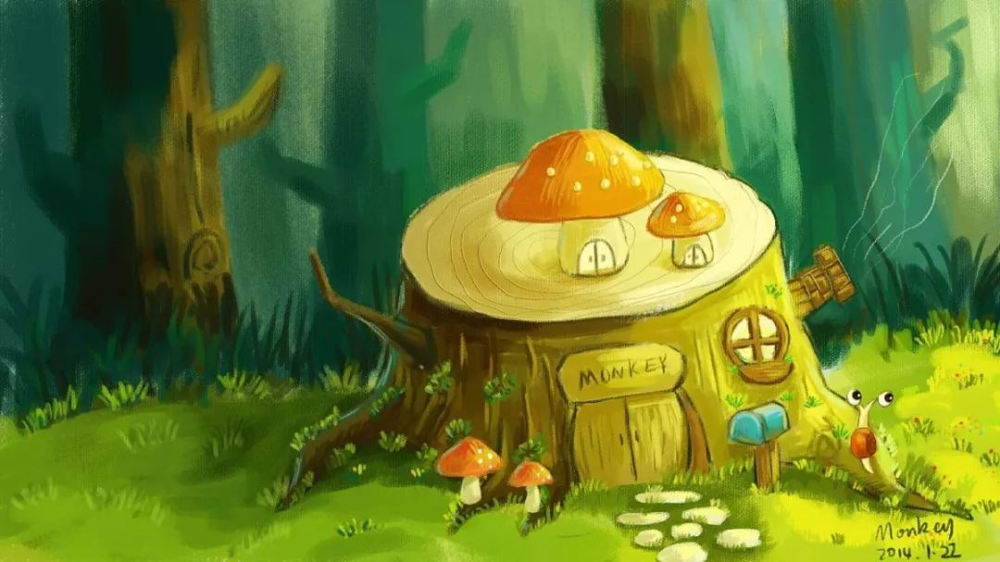

### 走到人生半山腰——35 岁懂得的那些小事

25 岁，开始无法熬夜，感受到身体在走下坡路；

30 岁，跳槽还是深造，第一次迷茫人生的方向；

35 岁，大道理懂得差不多了，在坚定和妥协中一步步实践。

——写在 35 岁生日

标题来自杨绛先生的《走在人生边上》，那是她在 96 岁高龄时写就的著作，探究的是命运、人性、鬼神等大命题。林阿姨走到了对很多人来说已是生命半程的 35 岁，远不能参透人生大命题，只能写写这个年龄段懂得的那些小事。

1. 把身体搞好，是一切的大前提

35 岁，多数人已上有老下有小，生老病死成为不得不面对的课题，再加上房贷车贷，要背负的责任很多。

对别人负责，首先是对自己负责，减缓生理衰减的速度——不熬夜，不抽烟，少喝酒，每周运动，没事少生气。

运动是林阿姨最推崇的生活内容之一。如果把变瘦作为运动的理由，坚持的难度会很大，它最大的价值，是维持好的身体能量和精神状态。那些说没有时间运动的人，却总有时间玩 Dota、看剧、逛街、做美容、睡懒觉。看看华尔街那些脱下西装之后身形健硕的金融精英，你就知道“忙”从来不应该是不运动的借口。

2. 经济独立，更要精神独立

我身边的一个姐们儿，创业做了很多产业，给全家打下的江山不计其数，可惜几年内就做了四五次人流。

女权主义让女人为经济独立而拼尽全力的同时，却常常忘记告诉她们精神独立的重要性。精神独立的层次很多，比如有能力控制自己的情绪、坚持自己认可的生活方式不被他人动摇、能够不依靠他人自己做出重大决定等等。但最起码的，我认为是要懂得保护自己。

3. 有一个快速回归安宁的良方

不要指望在 35 岁的年龄就做到心如止水、处变不惊，有喜怒哀乐的人真实得可爱。

但是，不必要的负面情绪不仅会造成严重的内耗，还会破坏身边的正面气场，形成恶性循环。在你被气到捶胸顿足的时候，在你难过到想要一醉方休的时候，在你焦虑到茶饭不思的时候，应当有那么一个能帮你卸下重负、回归常态的“速效药方”，它可以是一个树洞，或是一个值得托付的朋友，也可以是一件健康的小事——比如打拳、读书、煮茶、焚香……

4. 社交有上限，关心有边界

有那么一段时间，为了工作需要也好、填补内心的空虚也罢，我们曾希望身边的朋友多一些、再多一些。到了 35 岁，核心社交圈已相对固定，甚至会逐渐缩小，微信联系人大几千个，周末聚会却总是发生在那么一两个小群里。

有一本概念好过内容的心理学图书《不要用爱控制我》提醒我，很多时候你所以为的“爱”，其实是一种控制欲。不论对任何人，即使是面对至亲，关心都应有边界，放弃左右或者扭转他人观念的不切实际的努力，在他人需要时给出善意的建议，但不指手画脚、以“爱”的名义随意侵犯他人的精神和生活界线。如果无法尊重他人的自由，自己也无法获得真正的自由。

5. 努力优秀却承认自己平凡

职场人的 35 岁，是个极为尴尬的年龄。勤勤恳恳十数年，从“小 X”拼到了“X 老师”，也来到了被剔除出大多数非管理岗候选人的分水岭。

30 岁的时候，暗暗发誓此生要干出一番大作为，凭一己之力创造不平凡的价值，相信笨鸟只要先飞也能上枝头。到了 35 岁，赶上了行业最差的年景，背着如山的房贷，数着卡里持续减少的存款，每天起早贪黑不敢松懈，终于肯承认自己始终只是个平凡人。对于工作，偶尔需要妥协，但有些底线必须坚持，比如正直诚信，以及无愧无心的投入。

35 岁，不年轻，也未老。很开心在一次次的碰壁中，终与自己和解，能够坦然面对突如其来的风雨。希望到了 40 岁的时候，还能把人老珠黄活成人淡如菊。

**经作者许可本文摘自**：魔都林阿姨的公众号 [走到人生半山腰——35 岁懂得的那些小事](https://mp.weixin.qq.com/s/2YaM8RCTFhJK1NSdYTZu3A)

小编：老豆说

小编读后感：

林阿姨的这篇文章我读后感慨颇深，我当下正处于她前面说的 30 岁的焦虑。我的焦虑始于 2 年前，我无数次想去做点自己感兴趣的事，而不是如今糊口的工作。但是我始终无法摆脱责任的桎梏，我不能只考虑我自己，我有女儿，有家庭。我这种车贷房贷一身扛，孩子家庭全都有的，我不敢把家人暴露于可能到来的危机中，所以我只能在尽量去挤时间完成自己的爱好 ，以及转型的准备。

但这就随之而来的导致睡眠和运动时间的减少，因为只有孩子睡了，我才能真正的安静的看会书，时间久了就会气势衰竭，偶尔还会怀疑这样是否真的正确？焦虑的近 2 年，回头想还是觉得健康很重要，自己身体搞垮了，也是对家人的不负责任。

林阿姨说的还有一点我也很认同：要有一个让自己回归常态的兴趣爱好。比如我家里就有个鱼缸，里面有水草、虾、鱼，周末回整理下，晚上加班回来看着这些小生命在绿绿的水草间游动时，感觉世界还是很美好的。

当然以上那些所谓的责任不应该是你安于现状的借口，人还是需要不断进步和成长的，健康生活、运动修身，做一个积极向上的人。
