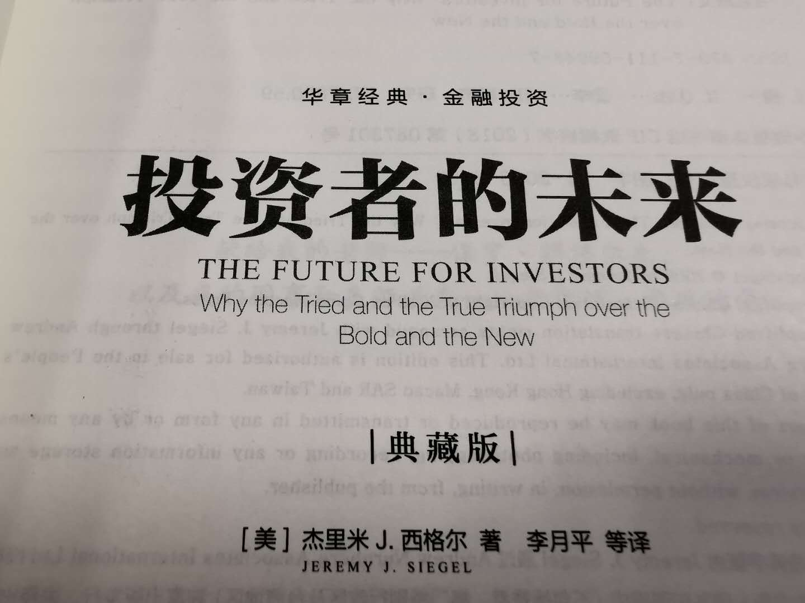
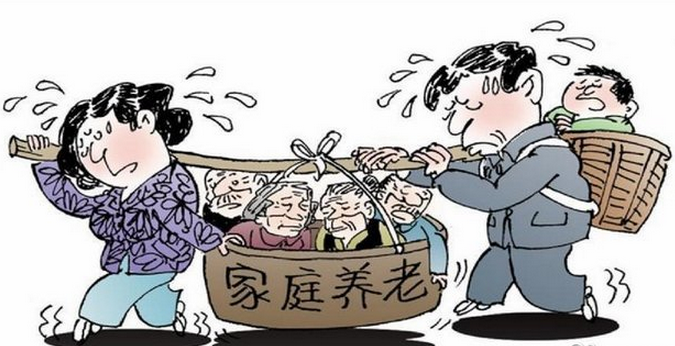

### 长寿、低生育、智力劳动

过完年都还没回去过，趁着周末送老人回去了趟，想着速去速来就没带电脑，包里放了本《投资者的未来》。上周末有点阴冷，偶尔还飘着几滴雨就更显得刺骨，回到老家女儿也有了玩伴，自然没人来打扰我了，索性就窝在书房看书了。

《投资者的未来》主要讲了两个板块：**避免增长率陷阱、即将到来的老龄化**。今天要和大家分享的是本书的第13章：**不能被改变的未来** -- 即将到来的老龄化浪潮。

虽然本章的副标题是‘即将到来的老龄化浪潮’，但我认为老龄化已经到来，且成了全球性的难题。我们当下的中国也已经不得不去面对这个‘灾难性’的问题，因此我就摘选了本章和大家简单的聊一聊。

我们所说的老龄化标准不是老年人变多了，而是工作人口与退休人员的比例急速下降，下表就可以很直观的看到发达国家老龄化的形势已经很严峻了。

国家 | 年份 | 劳/退
---|---|---
美国 | 1950 | 7
美国 | 2005 | 4.9
美国 | 2050 | 2.6
日本 | 1950 | 10
日本 | 2005 | 3.1
日本 | 2050 | 1.3

作者认为人口统计学家的预测效果要比经济学家好的多，因为人口的变化是相对有序且可推演的。所以我们不难总结出为什么会经历这样极端的变化？

- **长寿**

人均寿命大幅提升。随着生育医疗的改善，婴儿出生后死亡率大幅降低（20世纪中期），在1901~1961年新手儿男性寿命增加了20岁，但同期60岁的男性寿命仅增加了不到2年；再后来是老年人医疗水平的提高，通过先进的医疗手段治疗或缓解老人的病痛，从1961年起60岁老人寿命增加是之前60年的3倍，随着生物医疗技术的进步，长寿的趋势还会延续。

- **低生育**

为了让孩子们适应如今高技术工作，必须进行昂贵的全面教育。即便国家对教育的补贴也在增多，但大头还在家庭端负担着，孩子在某种程度上成为了“负担”，这也使得生育欲望降低了很多。我们国家沿海地区的生育率明显要低于中西部地区，有一个主要原因就是孩子养育的成本高很多。

- **智力劳动**

人类社会的标准发生了变化，大部分人从体力劳动转向了智力劳动，这也使得妇女有了更多平等的就业机会。那么相对应的女性待在家里的机会成本和生育抚养孩子的成本也得以上升，所以这也成了低生育的一个大原因。**老龄化 = 劳动人口数/退休人口数** ，我们看到分子在变小，分母在变大，生育率在降低、老人却更长寿，这两把利剑把老龄化凸显的更为极致，且毫无逆转的迹象。

作者强调老龄化对公共养老金的影响是最大的，这不仅对退休而言是一场灾难，对整个人口经济福利来说亦是灾难。**社保的本意是通过财富再分配使得大家退休后继续可以保证最基本的生活质量**，但实际情况是退休工人得到的福利通常高于其年轻时候的税收贡献，你可以理解为他投到了社保体系，在年老的时候获得了一个极高的收益率。

这就意味着必须让社会保障像一个永动机，年复一年的向退休者支付着收益，这个收益又要远高于他们在私人市场上可以获得的水平。而大家困惑的是这样的**“庞氏骗局”**能否无限制的进行下去？这个能否延续的根本在于上面说的工作人数与退休人数的比例，只要工作的年轻人不再那么多了，且仅提升社会的生产力无法弥补这个高收益差价的时候，那么这个游戏也就结束了。

由于历史的原因，我们国家不少省市已经遇到养老金告急的情况了，国家也不断通过财政调度来缓解这个情况。并且延迟了大家的退休年龄，也鼓励大家到了退休年龄后继续发光发热，这是为了应对文中提到的“我们虽然变得长寿了，但是退休年龄反而更提前了”。

文末要感谢@上投摩根基金 把本书赠送了给我，让我有机会拜读此书。本书另一个大主题‘避免增长率陷阱’其章节较多，我粗读过后觉得一文难以概括之，故等后面有时间再和大家分享吧。
