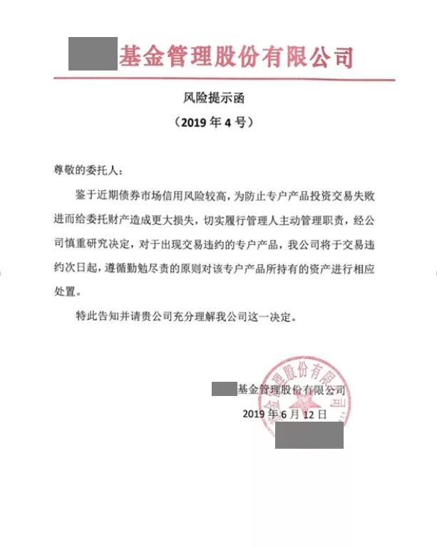
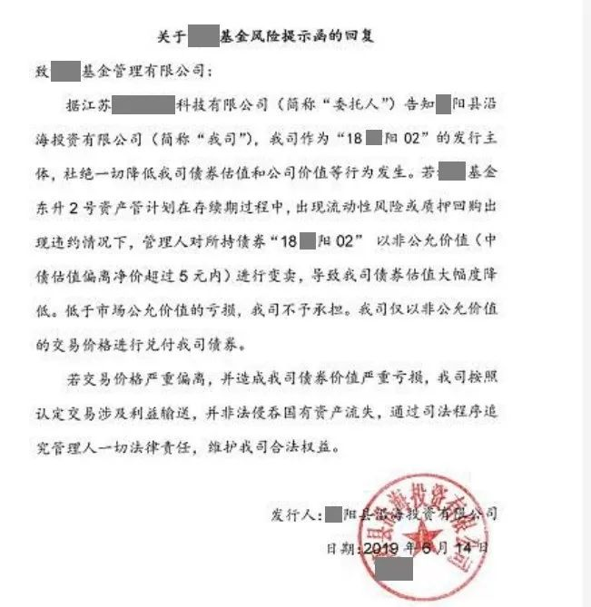

### 杠杆发债的鸡毛

最近流传的一个段子：

一颗树上有 10 家银行，打掉一家银行，请问还剩几家？

答案是还剩 10 家银行，但是地上的非银都死光了。

段子说的是 BS 银行被接管后，银行们没太大动静，非银机构倒反而开始爆发严重的流动性危机。作为事后诸葛亮，我们可以看到这次危机的根源早就埋下，也就是本文标题所说的“杠杆发债”。

**什么是杠杆发债？** 举个栗子。

某城投企业 S，想发债借钱，但在公开市场正常发债已经没人愿意买了，根本发不出去。这个时候它就想到了一个好办法，上演一场“杠杆发债”，步骤如下：

1. 企业 S 找到基金公司 X，先安排一家手套公司作为委托人出资 10 亿，成立由 X 管理的资管计划。（恩，基本的“合规意识”大家还都是有的，找个“手套”避免太过明显的关联交易）
2. 企业 S 发行 19 亿债券，由上述资管计划认购 10 亿，另外 9 亿找个第三方短暂代持几天。
3. 资管计划认购 10 亿的债之后，通过质押式正回购把 10 亿债质押出去，融到 9 亿现金，再把之前第三方代持的那 9 亿债券接过来，长期持有。
   这样，企业 S 掏出 10 亿的现金，撬动了 19 亿的债券发行，净借得 9 亿现金。基金公司 X 也收了一笔“通道费”，似乎皆大欢喜。

这个杠杆发债的“魔术”，核心点是什么呢？

资管计划加杠杆借到的 9 亿现金，是基金公司从同业市场借来的，本质上是基金公司用自身金融机构的信用，帮企业融资，玩起了“信用借贷”业务。

可是问题来了——债券的期限可能是 5 年、10 年，而正回购理论上最多一年一借，通常能借到 3 个月、半年期限的正回购已经很不容易了，必须分批持续滚动；那么，当基金公司也借不到钱（可能的原因包括市场流动性紧张、基金公司自身信用不再被市场认可、质押债券资质下降等），续不上正回购的时候，杠杆发债就变成杠杆地雷了。

以上栗子纯属虚构，如有雷同纯属巧合。

来看近期传遍同业圈的一纸公告——

这份公告翻译成“人话”就是：“BS 银行被接管之后，市场钱紧，我借不到钱，正回购续不上，已经在同业市场违约，如果委托人你自己不想办法，我只能挥刀大幅折价卖债券还正回购了。”

更有意思的是，委托人背后的发债城投公司居然还回帖了——

城投公司作为地方上说一不二的主，回帖也是毫不含糊。翻译成“人话”如下：
“我杠杆发行的债券，放在你基金公司这里好好的，你胆敢打折卖，我资管计划里的钱可就是真金白银地亏，那可是国有资产流失啊。另外，奉劝准备买这个打折债券的朋友打消念头，你用什么价格买，到期我也最多按这个价还你，可不会按面值兑付，你可想好了！”
城投公司计划中的这一波操作，可以说是“前无古人”了。这样一来，即使这只券打折打到地板价，有谁敢接？

最近市场钱紧，杠杆发债的雷又吃不准，非银们相互间的信任跌至冰点——你说你的资管计划不是一颗杠杆发债的雷，我也没法调查啊，索性一刀切，除非押国债或者 AAA 大央企债券，否则不借钱了。
又听闻最近监管机构有窗口指导，不允许券商、基金公司的回购再出现违约，否则直接暂停业务 3 年。对于上面发公告的这家基金公司来说，借不到钱，卖不了债，正回购还不允许违约，这时候，只能召唤奇迹了。
所以，出来混，总是要还的。再高明的魔术，终有一天也会落幕的。

**经作者许可本文摘自**：魔都林阿姨的公众号 [杠杆发债的鸡毛](https://mp.weixin.qq.com/s?__biz=MzU2MzgzODkyMA==&mid=2247483789&idx=1&sn=20f7ecd7e378edf6adc1c6c2e40c53ce&chksm=fc556b2acb22e23c0da52a241c75714f0ba19c073192302084e347e4f480ae538be8ecc85fef&scene=38#wechat_redirect)

小编：老豆说

小编注释：

BS 银行：包商银行
