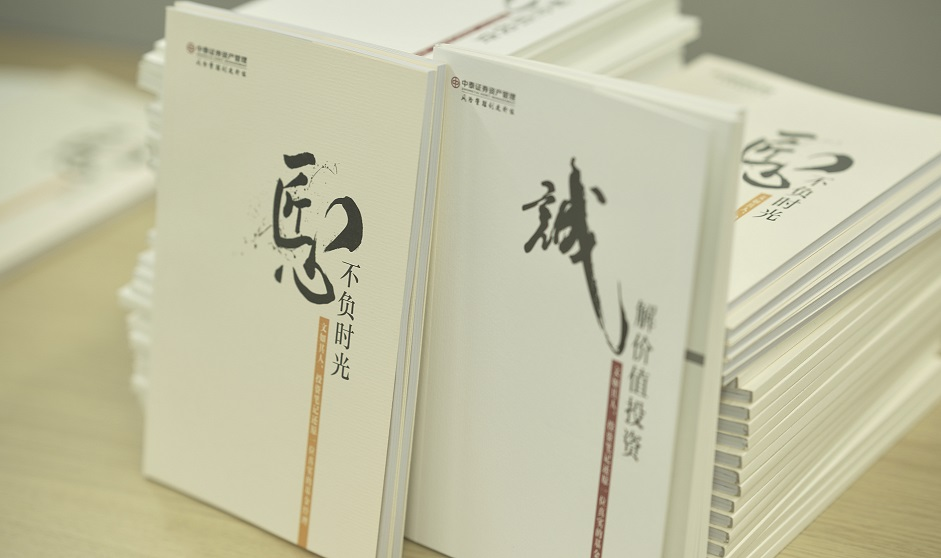

### 给大家送2本投资笔记

> 摘抄

1、“传授成功投资方法的书籍汗牛充栋，但绝大部分是害人的后见之明，带有深刻的幸存者偏差。心理上的简单归因和叙事谬误频频作祟，使我们倾向于为好结果寻找生动易懂且可复制的原因，这是‘成功学’的生存土壤”。

2、践行价值投资的基金经理，长期业绩目标应该且只应该是战胜指数。盯着相对排名不太对味儿，但如果长期战胜了指数，那排名也差不到哪儿去。

3、拒绝了一家真正的好公司会错失收益，接受了一家冒牌的好公司会损失本金。保守型投资者更愿意承担第一种风险，当别人都在玩“选美”游戏时，你可以躲在角落里安心的“称重”，做自己认为正确的事儿，而非别人都在做的事儿，不失为明智。

4、研究和投资特别需要认知力，但无需高智商。这个认知能力是指你要有一个很长的历史视角，有一个基本端正的世界观。这需要持续的观察和阅读，以及从自己的经验教训去总结。许多工作都是体力活，比如实际调研公司，拆解公司的财务模型，看公司不同时期的公告，以及研究竞争对手。大量的工作其实是枯燥的，所以这个工作看上去更像一个工匠做的手艺活，并不高大上。核心是“事实比观点更重要”。

5、投资行业最昂贵的几个字是：这次不一样。如果你选择站在历史这边，相信大多数进程都是不断重复，就会相信许多股票，即使明年业绩不行，也不影响今天的价值，短期结果受随机影响较大，长期来看，运气对业绩的影响会逐渐减小。

>笔记

1、价值投资听起来高大上、伟光正，可实践中的痛苦却往往不足为外人道。毕竟价值投资这个东西无论是证实还是证伪，都需要很长的反馈时间，这就意味着你有时候可能要抵抗别人的质疑，还要保持自我怀疑。这种赚钱模式是反人性的，所以我们会发现挂羊头的人多、卖羊肉的人少，如果你是那个卖羊肉的人，定要学会孤独和坚持。

2、做一件事如果需要较高的心理难度，就通常要求较低的技术难度。价值投资就是如此：你可以有普通人的智商，但必须有超越常人的耐力，要打心底里愿意相信常识。

3、保持开放的心态和饥渴的学习欲望很重要，这是我们提升自我认知的重要前提。在投资体系或策略上有自己的坚持和偏好是可以的，但我们不能非黑即白，要尝试着看看另外一些赚钱投资者的优点是否可以借鉴到自己的投资体系中来。

4、为什么不同人对同一只股票会有不同的看法？①：理念不同（价值投资和趋势投资的投资者对同样的股票往往会采取截然不同的态度）；②：信念不同（对于同一个信息或者说事实，悲观之人和乐观之人对其看法又会是截然相反的）；③：认知不同（大家的能力圈往往有差异，再加上认知水平的差异，这些决定了我们看待事物的时候也会不尽相同）。

5、穿越周期去看周期，周期就不再是风险。但任何一种方法都是有利弊的，拉长的投资周期提供了长期的确定性，同时也回避了短期的不确定性。以长期视角看股票，需要放弃“买入及步入上涨通道”的执念，甚至要敢于去接“正在下落的刀子”，而这个过程可能会有一点疼。

> 杂感

以上这些都摘录（或读后感）于中泰资管基金经理姜诚的两本投资笔记内，不得不说姜诚真的是一个读了很多书的人。跨学科的阅读，有助于我们形成正确的世界观和市场观，也有助于我们发现自己的局限性。他对价值投资有着很深刻的理解，而且在他的基金投资中体现出了“知行合一”，这些都非常棒。之前看过几场他的直播，看得出他读的书不仅限于投资类，而且他也建议大家可以读一些不那么功利的书。

有一次我在中泰资管比较固定的工作餐餐厅无意间碰到了来吃午饭的姜诚，穿着打扮极度亲民，身为程序员的我都不一定有他穿得休闲（走在陆家嘴天桥上你完全不敢信这是位基金经理），打过照面后他和另外两位研究员同事坐我们隔壁桌。期间我也留意了下姜诚在非办公状态下的交流言谈，给人很可靠的感觉，有学识、能坚守。这样的基金经理所管理的产品，我不敢说一定是大赚，但买后肯定是比较放心的（一位注重安全边际的基金经理），那天回去后我又追加了一点他的那只一年期持有的产品。

当然对于一个产品的观察是需要持续的，对于一位基金经理的了解也是需要更多维的，同样对于一本好的书籍也是值得反复阅读的。因为篇幅的限制我只是摘录了上面的一小部分，这两本小册子都不算很厚，但觉得值得大家去看一看，我相信应该是能所收获的。

