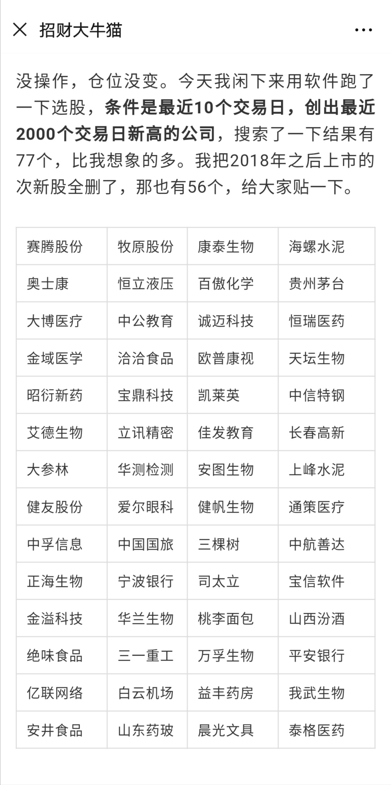
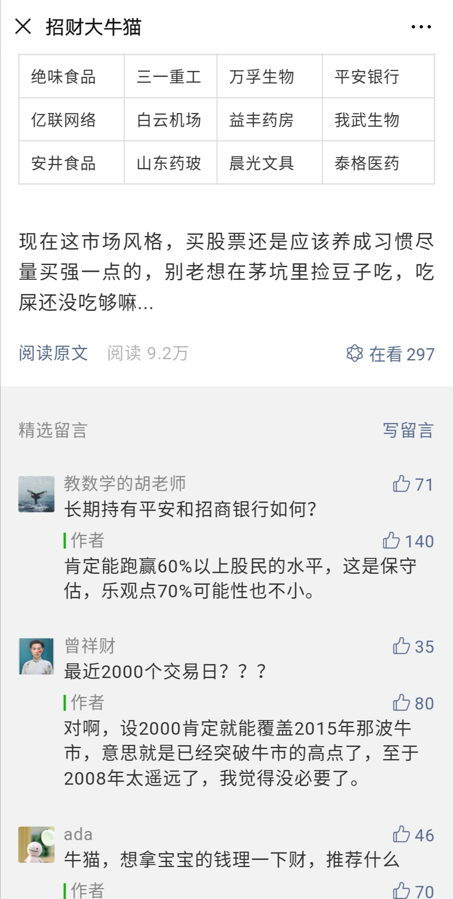
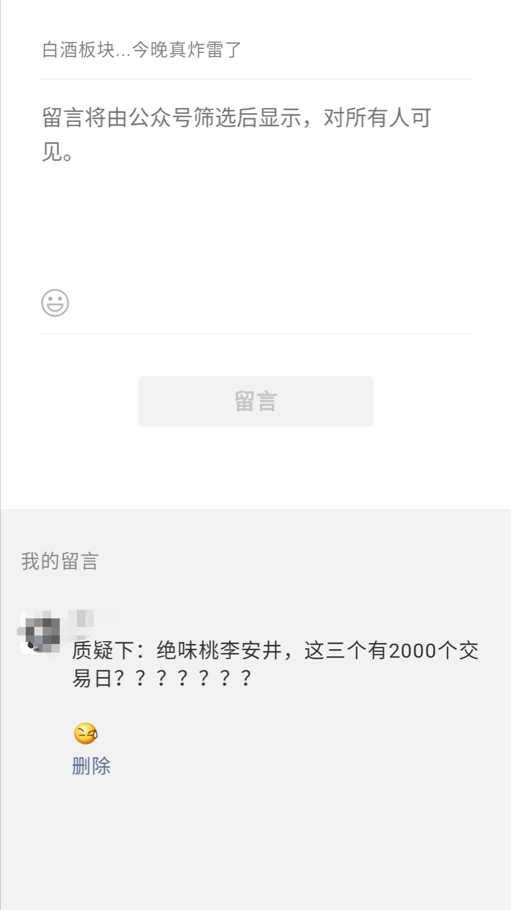

### 招财大牛猫也有‘失蹄’的时候

昨晚@股社区，公众号：招财大牛猫。

发了一篇文章，公号链接：[《白酒板块...今晚真炸雷了》](https://mp.weixin.qq.com/s/qCbgggX3uBHsKCWJZEAocg)

牛猫老师也一直是我学习的对象之一，他写的文章我基本每篇都会看下。昨晚像往常一样看完了他开头的一大段复盘闲聊后，他做了一个近期创新高的个股筛选，先贴图下：

他筛选的是：【最近10个交易日，创出最近2000个交易日新高的公司】。然后我去看了下他罗列的个股，脑海里还在盘算着这2000个交易日的时候，眼前扫过了几个熟悉而又刺眼的名字。

$绝味食品(SH603517)$  
$安井食品(SH603345)$  
$桃李面包(SH603866)$  

作为一个吃货我对这三只股票还算熟悉；

对于关注可转债的我恰好对这三只有可转债的正股也很熟悉。

我第一反应是这三个股票有2000个交易日吗？但是人家毕竟是前辈大佬，我本能的去查了下这三只股票的上市时间：

- 绝味食品：2017年3月17日

- 安井食品：2017年2月22日

- 桃李面包：2015年12月22日

很显然这三个股票是不符合条件的。即便如此，我还是以为大牛猫是笔误，可能不小心多打了一个0？虽然我看到他已经把筛选条件加粗了。

但在我看他翻出来的留言回复帖后，我确认是他错了，至少他没有认真核对筛选条件或者筛选公式。留言部分如下图：

在有人质疑其2000个交易日后， 他给予了确认，并说其目的就是为了覆盖2015年的那波牛市。我在第一时间给股大留言，可惜至今没得到他的回复，所以就有了这篇文章：

其实经过这个事情更让我意识到：我们在看待别人给出的数据的时候，要时刻保持一份警醒，尽量要多打个问号，要问问自己是真的这样吗？

我认为投资是一件严谨的事，我们该为自己的钱包负责。

哪怕这数据或结论是出自几乎每篇都有10万+阅读量的巨V，又或者是各种高大上的权威。**在投资的道路上多一点质疑，多一点讨论是好事情，这也是为了更好的习得技能，获取财富。**

