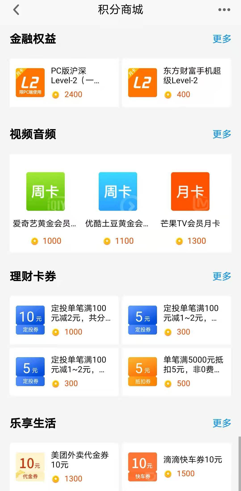
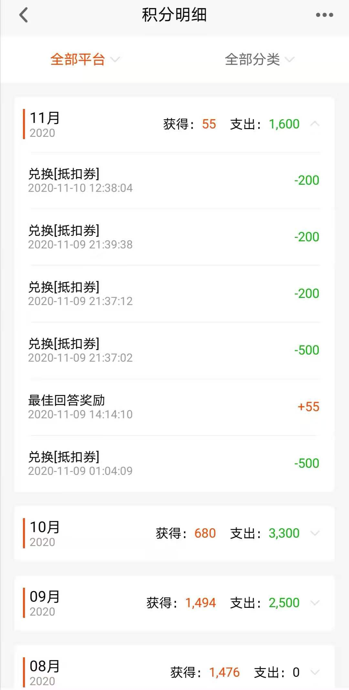

### 给自己的投资生活多一点记录

天天基金作为国内顶尖的基金销售平台，聚集着一大批有经验的基民，大家在这里不仅可以便利的买卖基金，还能与不同的投资人沟通交流，还有很多大佬带队。

我自己高中那会就开始接触基金了，可那时候基金的购买没如今那么便利，几乎所有的操作都要去柜台办理（还必须是交易时间段），不像现在点开天天基金APP操作下即可，也没啥空间和时间的限制。那时候获取基金信息的渠道也很有限，最基本的基金净值也得等到第二天到手的财经报纸上才能看到，现在点开天天基金可以获得非常全面的基金各类信息，我身边很多资深的基金投资人，在查询基金相关信息的时候，也是第一想到的就是点开天天基金APP，就是如此的便捷可靠。

我们常说投资的道路有时候挺寂寞，所以基金吧就把买了同一只基金的小伙伴给聚集在了一起，在对应的吧下面各抒己见。即便我这样自认为对于基金投资已经初入门道的老基民，我也经常去自己持有或者感兴趣的基金吧下面去刷刷帖子，听听不同的声音。投资也是很忌讳闭门造车的，常看看不同的想法，听听不同的思路有利于自己的投资体系更健壮。基金吧里很多菜鸟小白渐渐成长成了老司基，而我们在基金吧里不仅有投资、也有生活，这个和我一直主张的“投资只是生活的调味剂”所吻合，我想这也是天天基金吧更具人情味的原因之一吧。

在基金吧里发帖参加各种大小的活动都能得到一些积分的奖励，我经常会去社区的‘问题大厅’找高悬赏的问题参与下。不仅帮助了一些迷茫的新手，也让自己对新的投资热点多了一些敏感度。积分可以兑换东方财富的一些付费服务，爱奇艺、优酷等视频会员，美团、滴滴代金券，还有我最喜欢的理财抵扣券。500积分就能换5元抵用券，买非0费率基金的时候就能直接抵扣，我自己的积分清单显示：11月我换了2张5元抵扣券、3张2元抵扣券。

今年开始 @天天精华君 又新增了一个 #优质原创帖评选# 的活动，这个活动进一步激发了大家投资交流的热情，使得社区讨论的氛围更为热烈了，也涌现了一大批优秀的文稿。我即便有时候公司工作再忙，但精华君整理出来的优质原创帖的清单我都会仔细的看看，遇到平时关注的大V写的稿子看起来会更认真，简单说就是干货满满、受益良多。

我建议大家不仅要做一个读者，还要尽量参与进来，把自己对投资的思考及时记录下来、分享出来。**可以是当下热点板块的投资解读；可以是实盘交易的一些成功总结亦或是失误整理；可以是科普类的基金操作或规则解读；当然如果与投资相关的生活记趣也是可以的。**同时我也讲下我自己在基金吧发帖的一些小经验吧：**数据要详实可考、文字要客观公正、思考要深刻独到**。

于此同时我也建议无论老司机还是新小白，都应该多在帖子下面评论交流，思维的碰撞能巩固自己的认知，健壮自己的投资体系，对我们后续的投资定是大有裨益的。**我自己是程序员，所以深知开源分享的重要性，投资生活里多分享、多交流肯定是利远大于弊的，也能让自己更快的成长。**

最后还是希望大家可以多多参与进来，希望下一次精华君整理的榜单上有你们的名字和佳作，我也一定会认真阅读大家的文章，认真留言交流。（下面几句是我在一位前辈那看的，我觉得这小词整得不错！）

**读好帖受益匪浅，买基多赚更加甜；**

**小白看了受指点，快速成长少磨炼。**

**发好帖也可赚钱，优质原创是经典；**

**拿大奖更加鲜艳，大家受益走向前！**

活动详情：#优质原创帖评选#单篇最高得100元，数量不限​！ http://guba.eastmoney.com/news,of110022,918614833.html