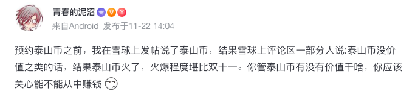
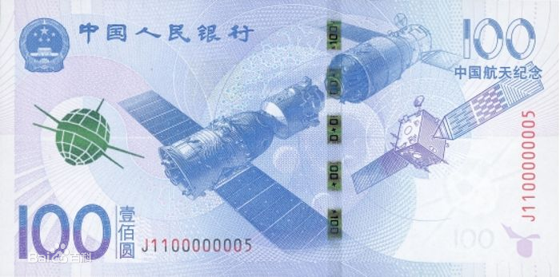
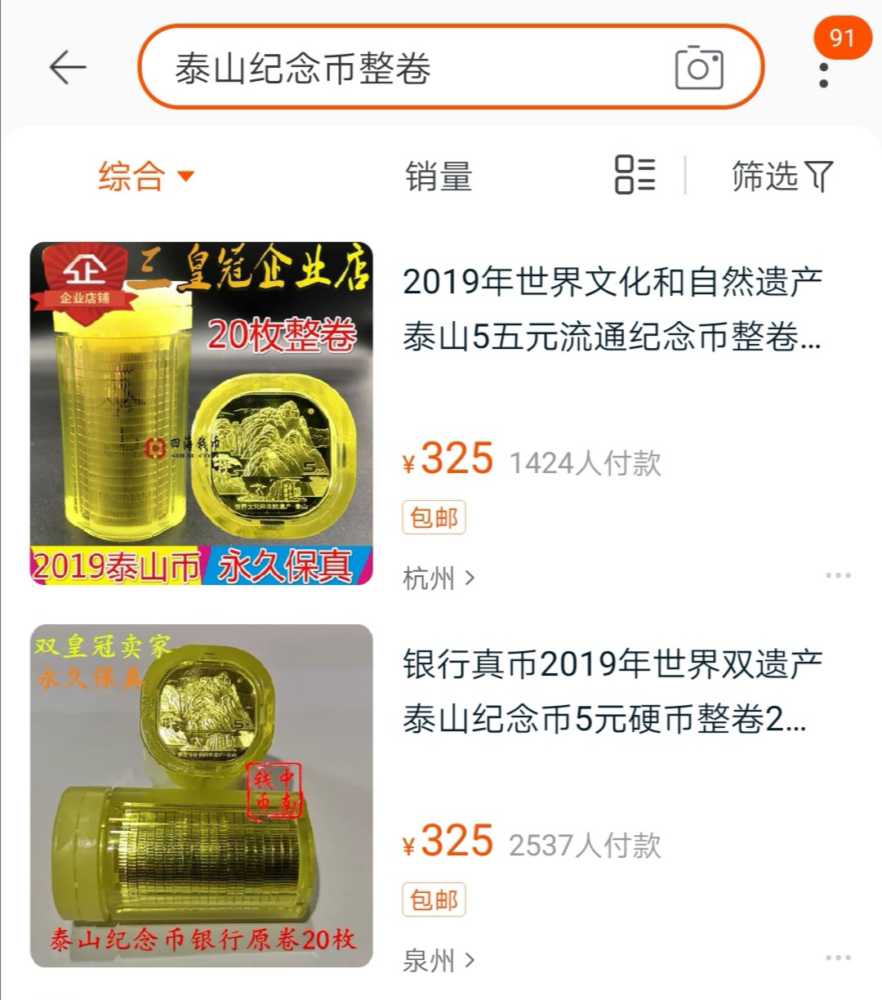
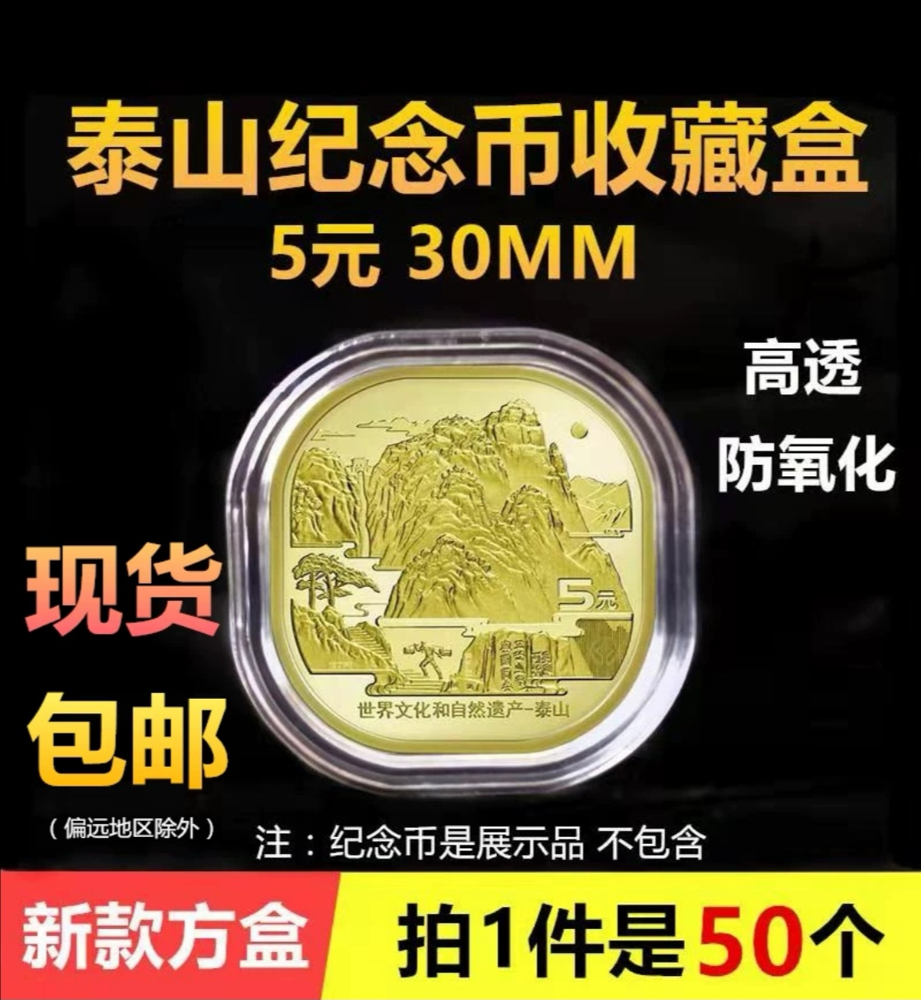

### 你更应该关心能不能从中赚钱？

本文的题目来自于@青春的泥沼 在11月22日发的一个帖子：【你管泰山币有没有价值干啥，你应该关心能不能从中赚钱？】

这个帖子我起初没在意，因为我也是他口中那种认为泰山币没有投资价值的那类人。但是他后来再次转发的时候我意识到我犯了一个错误，不是说没参与到泰山币的套利而可惜，而是我发现了自己在投资思维上的一个局限。这个情况让我细思极恐，也促使我决定把对这个事情的反思写下来，以此来告诫我自己：今后的投资生涯不该再如此。

> 泰山币本身没啥超额价值

央行决定在11月28日发行泰山普通纪念币，面值5元，圆角正方形，黄铜材质，总计发行1.2亿枚。国家近5年非常热衷于发行各种纪念币（比如每年的生肖币），甚至还有纪念纸币（比如航天纪念钞），但是‘二级市场‘总能找到热点，每次都有一波炒作。

就以航天纪念钞为例，面值100元，总计发行3亿张。平时央妈印钞会增加流通货币的量，但发行纪念钞可以帮助国家把热钱吸收回来，因为纪念钞兑换后绝大部分人是不会拿出来流通的，这个就很好的做到既发行了货币，又不会增加额外的流动性。显然航天纪念钞一下子就回收了300亿的热钱，虽然这个金额对于总的货币量是微不足道，但频繁的发行，多少还是能稍微缓解下这个问题的。

这件事本质上需要让人们觉得这东西有收藏纪念意义，只要有超额的纪念价值，就可以让大家留在手上不拿出来流通。那如何让大家愿意兑换呢？就是要有吸引人的概念（这个是不是有点像上市公司发行股票），正如纪念币肯定要基于一个重大事件或值得纪念的事情。比如每年的生肖币，比如我们的大好河山，又比如航天航空的丰功伟绩。。。但是几次下来发现大家激情开始没以前那么高涨了，那就搞个异形币吧，也就有了这次的泰山纪念币。

收藏价值很大程度取决于发行量，这种动不动就几个亿发行的，能有啥价值？这就是我为什么坚定的认为这些纪念币和纪念钞都没啥超额价值。

> 但这不影响炒作泰山币

泥沼老哥的话让我惊醒，我的‘自以为是’让我固执地认定泰山币没有啥投资价值，可是这又如何呢？我的固执让我忘了，**一个东西的价格取决于愿意成交的双方**，我不相信这个价值，所以我不会去参与，所以也不能左右其价格。真正能左右泰山币价格的是觉得这个有意义，觉得这个能赚钱，觉得会有人出更高价接盘，这些人才是交易的参与者，他们才是决定价格的人。

事实证明**我的偏执让我忽略了常识**，而泰山币也被一顿爆炒，一卷泰山币的收益比打新一次可转债收益还要高。一卷面值100元的纪念币淘宝上可以卖到325元，而且我看到了成交量还不错。炒泰山币是一个真正近乎零风险的操作，因为至少还有等面值的货币价值，大不了我们可以直接去超市或菜场消费掉，去银行换回正常的人民币也是可以的。

在查证泰山币当前市场价格的时候我发现了另外一个点。这个也是缘由泥沼老哥的启发，他总说中国投资市场赚钱的方式很多，但炒股、买基金绝对不是最好的方式。大家去挖金矿不一定赚钱，但是卖牛仔裤的都赚钱了，炒泰山币不一定能赚多少钱，但是卖纪念币外包装壳的肯定赚钱。下图就是我在淘宝上顺带看到的卖纪念币收藏盒的，万能淘宝永远不缺商机。

> 小结

1、不要被自己的固执遮挡了对常识的认知。

2、一个东西的价格取决于愿意成交的双方，而不是那些认为他没价值的人。

3、有时候这个事本身不一定赚钱，但做其周边很可能赚到钱。