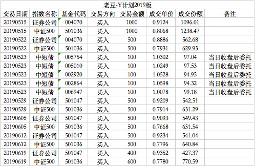

### 老豆-Y计划2019版（常规汇报 002）

经过了前面的简介，现在终于要开始具体讲讲每次投资的逻辑。在写这个系列前我是犹豫过的，具体可以表现为我每次在天天基金发车的时候，发车理由都空白。如果说个真诚点的理由就是怕被打脸，但是投资者不要怕被打脸，要不断的优化自己的投资策略。定期的记录也有利于回头看看自己的投资行为是否存在不足，**不断进化的投资策略**才是健壮的、可适应更复杂的市场环境的好策略。

我们的组合已经公开了一百多天，之前也没一个很好的、系统的讲解，所以后续会慢慢给大家一一复盘。以后我们一般会在30天左右发一次常规汇报，如果遇到极端行情的极端操作，我也会临时加一篇进行操作上的讲解。

组合创建于5月15日，5月20日开始对外公开实盘组合。那段时间证券指数再次进入低估区间，而中证500一直就是底部徘徊，所以建仓之初基本是这两个指数基金为主。

在证券基金选择方面我选择的是南方证券C，因为当时券商指数刚刚跌回低估区间，可能随时反弹，所以选择了适合短期交易的C类基金，而南方的券商C类是首选。但是在定投2周后发现券商继续下跌，短期不会立马反弹，且当时持有的C类已经足够支撑30天，所以在5月29日开始券商定投基金换成了汇添富证券A，一直延续至今。

中证500指数基金当时选的是汇添富500A，以中证500当时的估值短期内是无法达到卖出点位的，所以选择中长期费率优惠的基金，而且汇添富这款A类对短期赎回也很友好。那为什么不选择易方达500A这种管理费更便宜的呢？因为当时易方达的500联接A还没完成建仓，仓位不足，暂不考虑。

以上两个指数的基金可以看到初期买入很频繁：5月15日、5月22日、5月29日、6月5日、6月12日、6月19日，细心的朋友也发现了，就是每周三定投低估值指数，建仓期着重了这两个指数的配置。

建仓的第一个月，除了集中买入券商和中证500指数，还有一个部分就是中短债。这也是我第一次在公开组合里加入债券基金，连之前老版的Y计划也没有过。所以就选取了新发行的华宝中短债，以及近一年业绩最好的4只中短债，作为一个中短债组合进行了一个多月的业绩实战比拼，最后华宝中短债胜出。这个过程以前已经单独写文章讲过[《中短债基金不完全研究》](/financing/zdz-survey.md)

加入一定比例的债券，不但可以平缓组合的波动，还能均衡每周的定投额度。因为我尽量使得每周的定投金额为1000元，当可投标的不够时可以买入剩余的债券基金，相对的当该周低估指数较多，金额不够时可以适当赎回一部分债券基金以缓解资金问题。概括下来就是：加入债券后，既缓和了组合的波动，也平稳了现金流。

最后列下本期所涵盖的交易明细：

