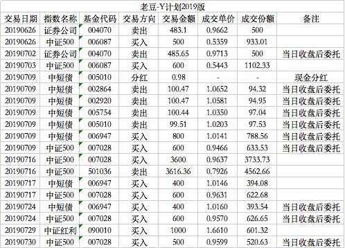

### 老豆-Y计划2019版（常规汇报 003）

6月底股市上涨了一波，所以对券商指数基金做了卖出操作，6月26日和7月2日分别卖出了500份。这两次操作是基于6月底券商指数的暴力拉升后适度的卖出获利，这个短期的券商指数上涨也使得二季度的总体收益压力缓和了很多。

同时买入的中证500指数基金换成了华泰柏瑞的中证500联接C。因为当时易方达500的仓位还是没有彻底建好，所以这个0.15%+0.05%+0.25%的C类指数基金就被作为过渡标的。而且30天后赎回免费，预计那时候易方达也已经建成完毕，届时可以顺利的过渡到易方达。

但在这个过程中所遇到问题也给我警醒了。我一直在追求低费率，却忽略了适度规模的基金积极参与科创板可以带来很好的增强的收益。比较典型的是天弘中证500指数基金积极参与后，在7月22日当天天弘增强收益明显优于易方达（多0.81%），这个现象值得反思。

7月9日除了第一次买入建仓完毕的易方达中证500联接指数基金外，还把中短债基金做了归并。以此来精简组合中基金的个数，置换成相对业绩最好的华宝中短债基金。后面只要华宝中短债业绩没有明显衰弱，会一直持有该单一债券基金。

7月16日置换了中证500指数，把汇添富中证500A清仓后买入了3600元的易方达中证500联接A。借此说下我在这方面的风格：对于刚进入低估阶段的指数，为了防止短期急速反弹，所以一开始通常选择C类基金买入。若一个月后还是低估，那么会开始买入A类基金，C类基金等翻红后也就立马置换成对应的A类。因为长期持有A类肯定更划算的，这么做就是为了充分利用了A/C类别各自的特性，**降低的每一分费用都是利润**。

7月中下旬因为券商指数不再低估，只能买入中证500指数。每周多余的额度就买入债券基金，用以均衡现金流，上一篇已经讲过这个思路了，所以7月17日和7月24日都是如此操作的。

需要特别讲下的是：7月29日临时买入的1000元中证红利指数基金。因为连续的下跌导致中证红利也出现了低估，那么对于优质指数突然进入低估，给予临时一次性买入了1000元的量。这次等于额外发车买入了一周的量，后面会在额度多余的时候会减少买入债券基金的量，这样也是一种总量的均衡。

买入中证红利除了因为低估外，也是因为当前组合里中证500指数占比过于大，急需一定的平衡，而当时券商指数还未低估，可供的选择不多。这个思路会延续到8月份买入的大香和油气，这部分等下一篇再展开。

