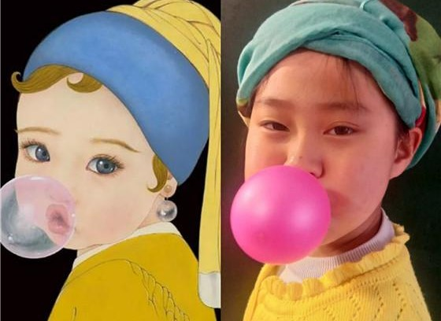
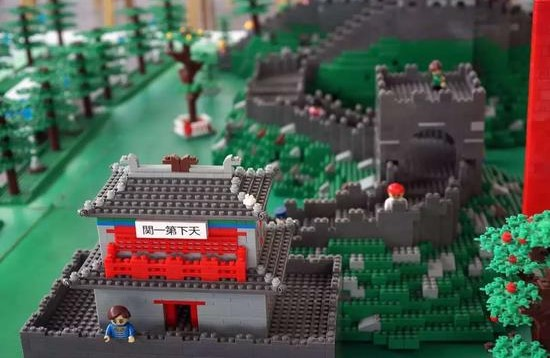

### 基金投资的三个阶段

本文是3月24日晚上和@基金复基金 的一场直播整理稿（主要是我讲的部分），我平时是蛮懒的，但范范提醒的对，最后觉得还是有必要整下文字版本。直播主要讲了我认为小白基民一步步成长过程中大概率会遇到的三个阶段，或者说结合我自己的投资经历觉得这么来可能会比较好。

在直播时范范也讲述了一个很普遍的现象：**小白投资人在市场很热的时候跑步入场，然后有没有一个很好的卖出逻辑，最终就是出现一年下来基金涨了一大截（甚至很多翻倍），而基金持有人很少能有钱赚（甚至还有亏了）**。我们的这场直播也就由这个点展开，简单聊聊为什么这种现象很普遍，而我们又该如何规避这些问题？

首先我不认为‘小白’是一个贬义词，因为这就像新生儿一样，每天都有婴儿在诞生，再说了谁还不是从小白这个阶段过来的呢。投资的过程是一个反人性的过程，经常伴随着枯燥与焦虑，偶尔的暴涨又容易让你失去本有的理性。最后依然能够留存在这个市场里的“老鸟”们，除了幸运以外多多少少也是习得了些投资技巧，但这不是我们可以嘲笑“小白”们的理由。所以‘小白’没啥不好的，慢慢来，只要你热爱又凑巧能领悟个一二，那么大概率是会变得更好的。

而且在投资这件事上“亏钱”也不是小白们的专属，不是说我们这种自诩为老司机的人就不会亏损。所谓的老司机就是能辨识一些基本的雷，且不会轻易让自己暴露在危险之下。**我相信投资就是一个概率的问题，你只要能避开一些很明显的坑，多赚几次、少亏几次，当牛市疯狂的时候你手里还有筹码可以卖出，那么你就赢过了大多数人。**

另外我要说的是，投资学习不仅是投资技巧与投资工具的学习，同时也是投资心理的学习。甚至我认为投资心态的训练对于初学者来说比前两者更需要注意，当然范范在直播中也提出了不同的意见，在她看来投资学习技巧与工具是优先于心态培养的。我为什么会提出初学者尤其需要注意投资心态的提升和训练，因为在投资中技巧与工具的学习认知是你避不开,也不会去轻易忽视的，但是投资心理上的训练就极其容易忽视，若你在初期阶段没有一个很好的认知与学习，到了后期会加倍的为之付出一些代价。

综上：**投资小白不丢人，老司机也有亏钱的时候，要学会避免明显的风险点，于新手而言投资心态的学习比技巧与工具的学习更需重视。**

> 不要怕做错、去尝试模仿

铺垫了那么多，我们现在聊聊处于初级阶段的投资人该如何买基金或组合？

我建议是新手买基金第一步就是模仿，不是什么基础知识和投资工具的学习（当然也需要一点，但不那么重要，你应该在模仿中学会这些）。我虽然高中就开始买基金了，但我是来了雪球才知道模仿大V的操作叫【抄作业】，仔细想想还是蛮形象的：一个学习不怎么样的学生在抄课代表的作业哈。

为什么说第一步是模仿？我认为只要你对钱是有渴望的，学习的动力不成问题，而**实战就是最有效的学习方式**。但是切记起初金额要足够的小，初始的模仿我们更注重的是身临其境的那种体验，在这种体验的过程中有意无意的去接触那些投资工具、学习那些投资技巧。与此同时你可以阅读一些自己认可的自媒体文章（不要怕被忽悠，这个本金很小的阶段不要怕被骗，此时不碰壁，后面本金大了更危险）老人们不也常说：吃亏要趁早。

这里需要说明的是，为什么不推荐特别小白的人去阅读一些很官方的书籍呢？虽然这些官方的书籍讲述一些基础的内容是非常的严谨的，但严谨的同时就伴随着枯燥，这个对于初学者是不太友好的，而自媒体的文章总体来说阅读性要好很多，在初始阶段我们还是以提升投资兴趣为主（但是有了一定的基础后我还是很希望大家能读一些正统出版书籍的）。

那对于一些初学者来说，我们看自媒体的文章要关注些什么呢？看看人家是怎么查询基金资料的、是如何分析这些基金的、又会注重哪些指标的？而且关注自媒体要做到多关注几个，因为有些自媒体可能是他自己也一知半解，当然更多的是他故意从一些特有的角度或者立场去讲述这些事情。所以我们要听听不同的声音，要做到兼听则明，在‘兼听’的过程中学会辨识，最后做到‘则明’。其实到后面你会发现，**投资某种意义上就是搜集信息、分析信息、做出决策的过程，所以你必须要养成一个好的信息辨识的能力。**

这是第一阶段要做的事情，概括下就是不要慌，也不要怕吃亏被骗，只要你把本金控制好，然后真真切切的参与进去，这种方式会给你后面的投资生活带来很多好的基础积累。【**不怕被骗、以考代练、控制本金、兼听则明**】

> 实战中多问为什么，学会吸收、整理、复述

在有了一些跟车经验进入第二阶段后，我们要开始学着去问为什么。**为什么这个大V的这个组合在这个时候买这个基金？看看他的操作是否合理，逻辑是否自洽，一段时间后该操作效果如何？**

一边跟车操作、一边阅读文章，然后不断地发问、不断地对比，对比不同大V、不同组合，甚至可以的话多学几个组合风格。当这些疑惑在你的脑海里不断碰撞后会有一个混沌的时期，你会发现好多冲突的观点在纠缠，而你也不知道该信哪个？这时候不要慌，也不要觉得投资怎么那么麻烦，可以试着把一些你思考的过程写下来，写成文章的过程就是一个很好的归纳吸收的过程。**随着思考的进行，你会发觉有些东西慢慢在眼前清晰了，混沌的消失就是你逐渐进入下一阶段的标志。**

这方面我觉得范范写了一些分析大V或基金公司组合的文章就很好，她以普通投资人的视角给大家讲解这些个组合，大家有兴趣可以看看。可以学习下范范是如何切入这些组合的，她研究过程中发现些什么，又对什么产生的怀疑，这个吸收、整理、复述的过程很重要，也会让你往后的投资很受益。

> 构建适合自己的投资体系

进入第三阶段你就可以算得上一个有经验的投资者了，这时候你就不能再毫无章法的操作了。要学着把自己的投资体系给搭建起来，这个过程也是基于前面两个阶段的积累，特别是第二阶段对他人组合投资的吸收和反思。在不断的质疑和询问中看清人家这么操作的本质是什么？这种方式方法自己是否认可，更重要的是有些策略即便你认可也不一定适合你。毕竟我们**每个人的财力本金不同、风险承受能力不同、预期投资周期不同，面对这些差异必然要有所取舍和改良，这个不断改良适应自己的过程就是搭建适合自己投资体系的过程。**

构建适合自己的投资体系有什么好处呢？可以很好的避免情绪波动带来的非理性操作，而且即便出现了一些一反常态的操作，在事后复盘时也能很快得以纠正。另外需要注意的是我们的投资体系也不是一成不变的，因为我们的财力本金、风险承受、投资周期等因素都会变化，当变化很大时这个体系就很可能不适合我们了，那就需要对投资体系进行再一次的调整，以此来适合我们。

当然有人问那再之后呢？其实后面肯定还是有的阶段的，只是那时候本文的内容对你已经没啥大用处了，而且在形成特有的体系后投资就是百家争鸣了。我相信每一个成熟的投资者都有自己偏好的认知，平时的沟通中我们也发现很难说服对方，但这也都不是太重要了，如人饮水、冷暖自知，适合你自己的就行。

---

> 小结

其实那天直播和范范聊得还是蛮多的，这篇虽说是直播整理稿，但还是删减修改了很多，措词上也尽量改得更适合阅读一些，有兴趣想看完整版的朋友也可以去看下直播回放。最后还是感谢大家对我直播的支持，我也很开心能和大家分享我对基金投资的一些拙见。

	
