### 那些“碳中和”系列指数基金们

今年你要问我哪个概念最火，我肯定会脱口而出“碳中和”。“碳中和”其实是一个非常宏伟的事物，我们今天就试图讲讲：**什么是“碳中和”？为什么要“碳中和”？如何“碳中和”？“碳中和”相关的指数基金有哪些？**这篇文章可能略长，赶时间的朋友可以直接滑到底部阅读小结部分，如有讲得不好的地方欢迎大家多指正、多交流。

> 突然间好像人人都在谈“碳中和”

工业革命后传统化石能源（石油、煤炭、天然气等），在人类经济社会发展中起了相当大的作用，全球经济的高速发展也依赖于这些能源的支撑。但相应的代价就是，在消耗化石能源的同时会排放出大量二氧化碳等温室气体，这就使得全球气温不断攀升，若不加以控制必将造成灾难性后果。本文所探讨的“碳中和”概念里的碳就是消耗化石能源所产生的二氧化碳，联合国近年来也不断的督促各国要采取有效措施，以减少温室气体的排放。截止今年5月，全球已有约130个国家，把21世纪中叶实现“碳中和”作为目标。

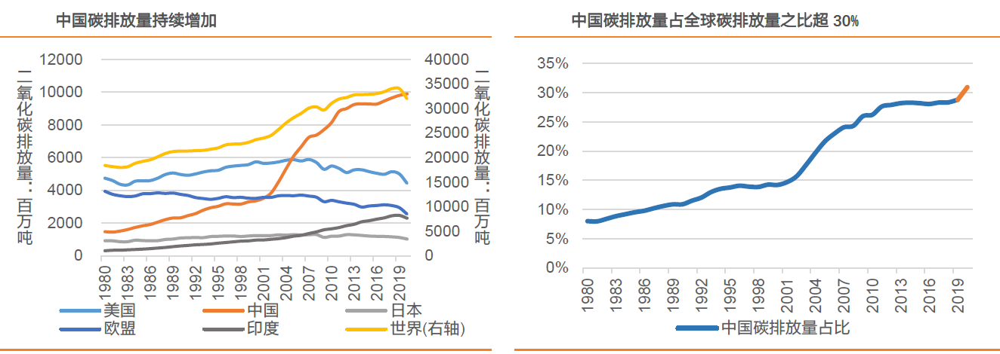

常与“碳中和”一起被提及的另外一个概念叫“碳达峰”，我们走到了“碳达峰”这一步后国内碳排放总量会持续下行。近20年中国逆天般的高速成长背后，是中国自2005年起一直处于碳排放的第一位。去年中国碳排放总量是99亿吨，在全球碳排放量占比也已高达31%，形势非常严峻。

去年9月国家领导人在联合国大会上承诺：“中国将提高国家自主贡献力度，采取更加有力的政策和措施，二氧化碳排放力争于2030年前达到峰值，努力争取2060年前实现碳中和。”随后在12月的气候峰会上又提出到2030年中国单位国内生产总值二氧化碳排放将比2005年下降65%以上，非化石能源占一次能源消费比重将达到25%左右。在2021年全国两会期间，“碳达峰”和“碳中和”被首次写入政府工作报告。

> 中国一定要实行“碳中和”吗？

在谈官方的解释前，我先说一种比较阴谋论的说法：**“碳中和”是欧美抑制中国发展的战略之一**。中国近40年的飞速发展已经让欧美发达国家意识到抑制中国进一步强大的严峻性，而“碳中和”的博弈就是他们的抑制策略之一。一方面，没有中国的参与根本不可能实现全球的碳中和；另一方面，欧美将制定一系列政策过多、过早地要求中国实现碳中和，并要求中国与他们一样完全退出煤和化石能源的使用等。

这就是典型的你们先上桌吃饱了，我刚吃几口你们就急吼吼说要整理桌子了！工业革命是从1870年开始的，38个OECD经合组织国家累计排放了9500亿吨CO2，中国累计排放了2200亿吨CO2。中国比他们少排7100亿吨，算上咱们现在一年排放110亿吨规模，40年也就4400亿吨。中国不但比他们排放的少，而且中国是世界工厂，欧美用的很多产品都是在我们这生产的，现在把这些碳排放都算在我们身上也是不合理、不公平的。

那我们就这样屈服了吗？面对欧美方面的别有用心，我们中国在结合自身情况后作出了世界大国应有的负责任、有魄力的承诺。2021年两会期间，“碳达峰”和“碳中和”两项目标的提出，标志着“碳中和”正式成为中国的国家承诺。**“十四五”规划提出：推进能源革命，建设清洁低碳、安全高效的能源体系，深入推进工业、建筑、交通等领域低碳转型。壮大节能环保、清洁生产、清洁能源、生态环境、基础设施绿色升级、绿色服务等产业，推动城市公交和物流配送车辆电动化。**

额外说一点，在低碳化的过程积极发展新能源，可以很好的规避未来可能出现的能源方面被卡脖子，我们在成为世界强国的道路上是不该轻易把“命门”留在敌人手里的。

> 我们该如何完成“碳中和”？

“碳中和”其实就是减少二氧化碳的排放，那我们有必要先弄清楚产生二氧化碳的源头在哪？从全球的碳排放结构看，**发电供热和交通运输是当前全球碳排放的主要来源**，占比超过60%。再看我们国内也类似，电力部门加上工业制造方面两者合计约80%，所以我们只要改变能源结构并控制工业品产能来减少碳排放就能有效的改观现状。另外需要指出的是，只要人类有生产生活的行为，那么彻底无碳排放是不可能的，这就需要“碳捕捉”去中和剩余的部分。

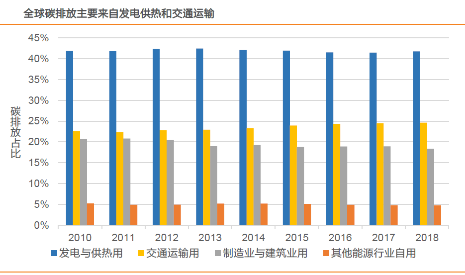

如果再说得细致点可以是：发电部门提高光伏和风电等清洁能源的比重；工业生产部门需要加快工业用电取代煤油气；以钢铁为主的金属冶炼行业需要通过去产能实现粗钢产量达峰，推广电炉冶炼设备；公交要起表率作用做到电车覆盖率90%以上，家用车和运输车辆也要逐步增大新能源车的比重....

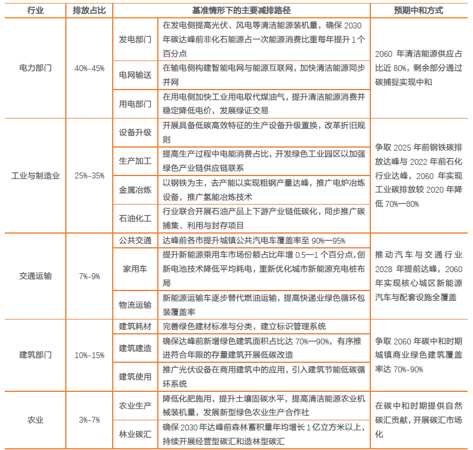

> “碳中和”下有哪些ETF可以考虑？

“碳中和”这个概念我相信大家现在基本上都是认同的，多方因素之下的这种趋势是具备强烈共识的。但按以往的经验看，这么宏大的长期国家战略计划，虽然可以挖掘的投资机会不少，但短期看还是要慎重。我们以指数基金为选取范围，看看都有哪些相关指数以及对应的指数基金**（本文只举例已有对应产品的指数）**。

**1、中证内地低碳经济主题指数（000977）**

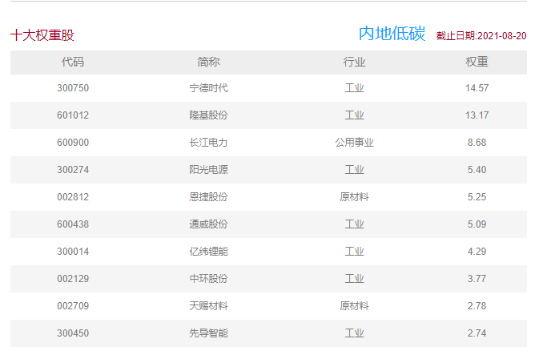

中证内地低碳经济主题指数从沪深A股中挑选日均总市值较高的50只低碳经济主题公司（清洁能源发电、能源转换及存储、清洁生产及消费与废物处理等）股票组成样本股，以反映低碳经济类公司股票的整体走势，前十大权重股如上图所示。

对应的指数基金有：规模最大、流动性最好的是华夏基金的碳中和（159790）；费率最优惠、流动性尚可的是易方达基金的碳中和50ETF（516070）；要买场外的朋友可以考虑鹏华的低碳ETF联接C类，销售服务费才0.2%/年。我下表中没列出来，但也是主要对标该指数的主动基金里规模较大的有嘉实环保低碳股票（001616）。

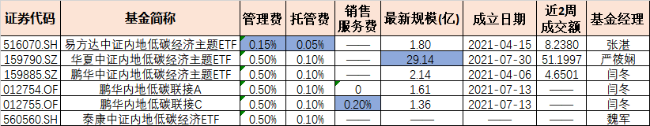

**2、中证环保产业指数（000827）**

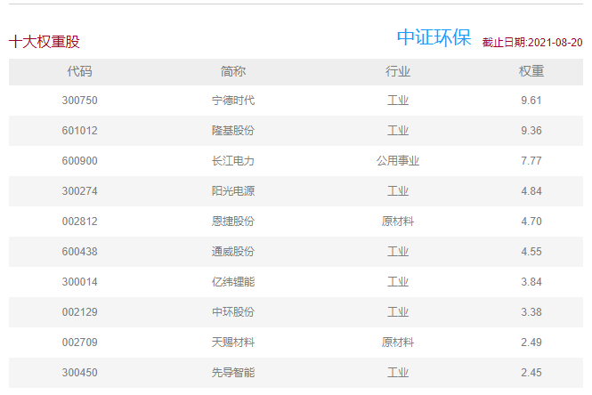

中证环保产业指数从沪深市场中选取 100 只业务涉及资源管理、清洁技术和产品、污染管理等领域的上市公司证券作为指数样本，以反映环保产业上市公司证券的整体表现。单从定义上看我不怎么认为该指数符合“碳中和”的严格定义，但我一看权重股后就还是把它纳入了。

这个环保指数当年和传媒、基建并称“广发基金指数三废”，现在也就这货搭上了碳中和的热度，有了闲鱼翻身的机会，想传媒这样的死鱼还在那躺着呢。跟踪该指数的还有一批分级基金我没编入进来，几只LOF基金虽然纳入了，但我不是很推荐大家买，非要买可以考虑广发的场内ETF，流动性尚可。另外要提一句的是，当年的环保指数有多不受待见，天弘基金也曾经发过该指数产品，可惜没熬到今年的好日子，直接因为规模太小而清盘了。

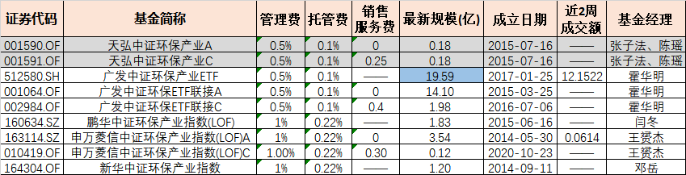

**3、中证环保产业50指数（930614）**

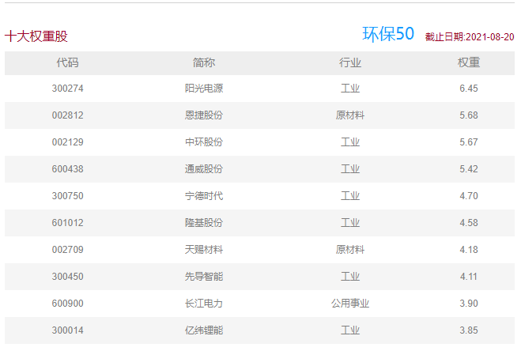

中证环保产业50指数选取涉及资源管理、清洁技术与产品、污染管理等业务的上市公司证券作为样本，以反映环保产业相关上市公司整体表现。这个指数定义上看着和中证环保差不多，但是选出来的权重股却还是有较大差异的。对应的产品目前只有国泰基金一只ETF（159861）产品和相关联接基金（012503/012504），这只基金场内的规模和流动性都不是太大，非要买可以考虑下场外联接C类。

**4、中证内地新能源主题指数（000941）**

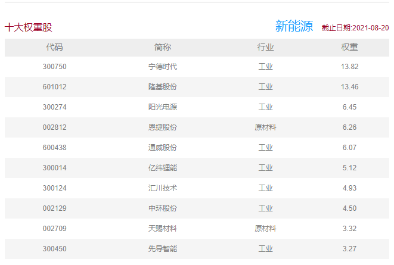

中证内地新能源主题指数从沪深市场中涉及新能源生产、新能源存储以及新能源汽车等业务的上市公司证券中选取新能源业务规模较大、盈利较好的50只样本作为指数样本，为市场提供多样化的投资标的。对应的ETF产品有华安基金的新能源50ETF（516270）和申万菱信的新能源50（159752），这两只规模、流动性（较小）、费率都差不多。

**5、中证新能源指数（399808）**

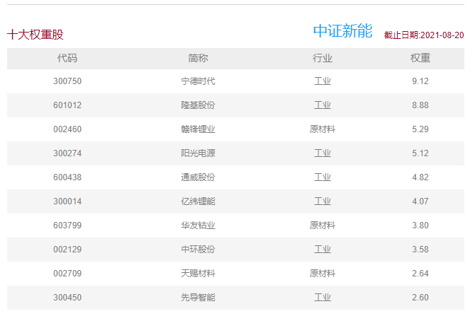

中证新能源指数选取沪深市场中涉及可再生能源生产、新能源应用、新能源存储以及新能源交互设备等业务的上市公司证券作为指数样本，以反映新能源产业相关上市公司证券的整体表现。对应的指数基金产品有很多（主动基金不在本文讨论范围内），其中南方基金的新能源ETF（516160）规模最大、流动性最好、费率也是最低之一、而且还有对应的场外联接产品；剩余的还有易方达基金的新能源ETF易方达（516090）费率挺好、流动性尚可；博时基金的新能源主题ETF（516580）、华夏基金的新能源80ETF（516850）、嘉实基金的新能源（159875）。

**6、中证新能源汽车指数（399976）**

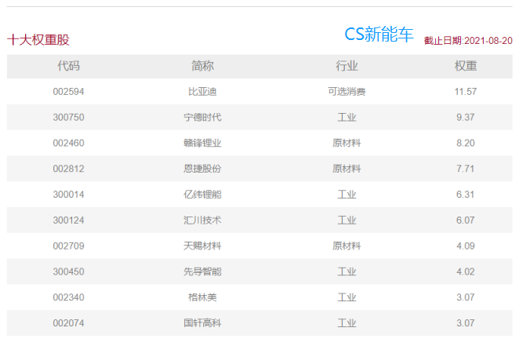

中证新能源汽车指数从沪深市场中选取涉及锂电池、充电桩、新能源整车等业务的上市公司证券作为指数样本，以反映新能源汽车相关上市公司证券的整体表现。这个指数真的非常热门，发行相关指数产品的基金公司极多，首推华夏基金的新能车ETF（515030）流动性和规模都是遥遥领先（对应的联接基金也不错），其次可以考虑下国泰的新能车（159806）、且对应的也有场外联接基金，剩下的有博时基金的新能汽车（159824）、华安基金的新能汽车ETF（516660），纯场外的还有天弘基金的天弘中证新能源车（011512）、东财基金的东财新能源车（010805），最后那些规模一般、费率较高的LOF我就不再一一列举了。

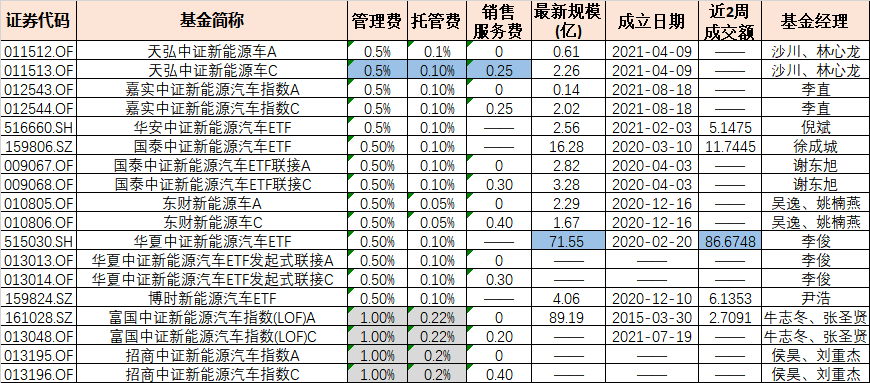

**7、中证新能源汽车产业指数（930997）**

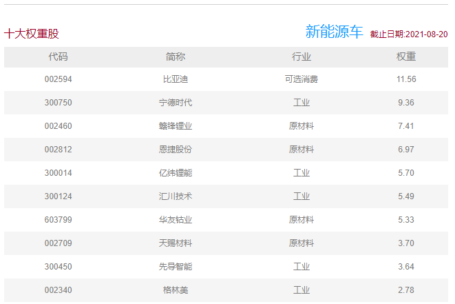

中证新能源汽车产业指数从沪深市场中选取业务涉及新能源汽车产业的上市公司证券作为指数样本，以反映新能源汽车产业上市公司证券的整体表现。这个指数对应的指数产品有平安基金和汇添富两家，其中汇添富既有新能源汽车ETF（516390）又有新能源车LOF（501057），从规模和流动性等方面考虑，我建议大家优先选择平安基金的新能车ETF（515700）。对于中证新能源汽车和中证新能源汽车产业两个指数，我去年8月有写个一篇较为详细的：《有哪些基金主要投资新能源车？》，有兴趣的可以点开看看。

**8、中证新材料主题指数（H30597）**

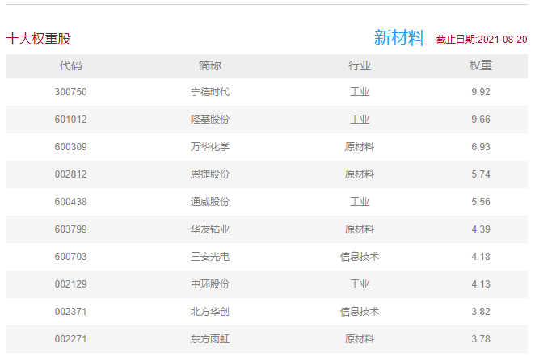

中证新材料主题指数从沪深市场中选取50只业务涉及先进钢铁、有色金属、化工、无机非金属等基础材料以及关键战略材料等新材料领域的上市公司证券作为指数样本，以反映新材料主题上市公司证券的整体表现。这个指数粗看好像和碳中和关系不大，但是你仔细看它的权重股就又觉得可以纳入进来。该指数对应的产品也很多：华宝基金的新材料ETF（516360）、天弘基金的新材料（159703）、国联安的新材料ETF基金（516480）、平安基金的新材料ETF（516890）、华夏基金的新材料50ETF（516710）、建信基金的新材料50（159763），这些基金里我最推荐流动性相对最佳的华宝基金。

**9、中证电池主题指数（931719）**

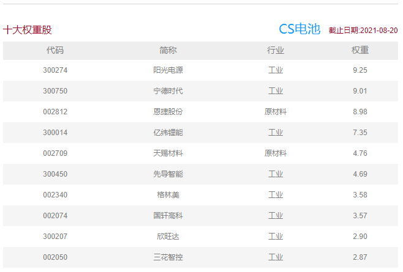

中证电池主题指数从沪深市场中选取业务涉及动力电池、储能电池、消费电子电池以及相关产业链上下游的上市公司证券作为指数样本，以反映电池主题上市公司证券的整体表现。盖指数对应的指数产品有嘉实基金的电池ETF基金（562880）、招商基金的电池ETF（561910），场外基金的话有汇添富基金的汇添富中证电池主题A/C(012862/012863)。场内建议可以考虑流动性相对可以的嘉实基金，愿意场外购买的可以等后面汇添富的这只上市（8月11日刚成立）。

**10、中证光伏产业指数（931151）**

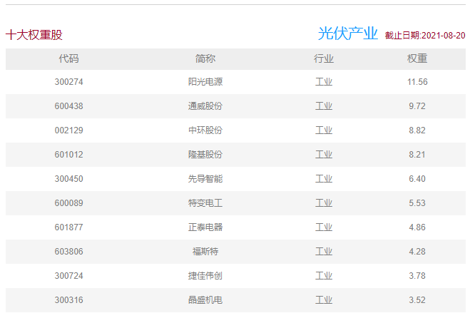

中证光伏产业指数从沪深市场主营业务涉及光伏产业链上、中、下游的上市公司证券中中，选取不超过50只最具代表性上市公司证券作为指数样本，以反映沪深市场光伏产业上市公司证券的整体表现。又是一个非常热闹的指数，这个系列也可以很明显地看到ETF的先发优势，规模最大和流动性极强的华泰柏瑞的光伏ETF（515790）；其次是善用“场外包围场内”的天弘基金的光伏ETF（159857）。并且这两家的场外基金也都各有特色，华泰柏瑞C类费率最低、天弘基金的场外规模最大（剩余的大家可以参阅下图表格）。

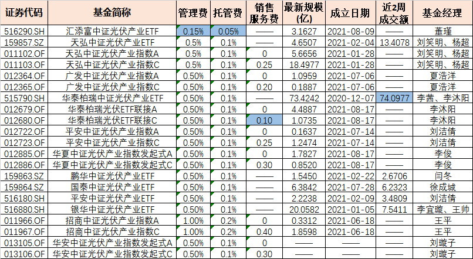

> 小结

“碳中和”已是大势所趋，欧美把其作为抑制中国发展的手段之一。而我们中国选择迎难而上，在肩负起大国重任的同时，也寻找到了一条符合我国利益的“碳中和”之路。电力部门与工业制造两者的碳排放约占总量的80%左右，所以我们只要改变能源结构并控制工业品产能来减少碳排放，最后叠加“碳捕捉”去中和剩余的量就能有效的改变现状。作为普通投资者最为关切的还是这大势之下的投资机遇，经过大半年的持续发酵，相关板块的估值也是节节高。我们在积极参与“碳中和”投资的同时也要保持一分理性，在面对这么多行业指数基金的时候要有些许取舍。总的一个原则就是大家尽量选择流动性超好、成份股数量偏少、“碳中和”含量更高、综合费率更低的指数基金。

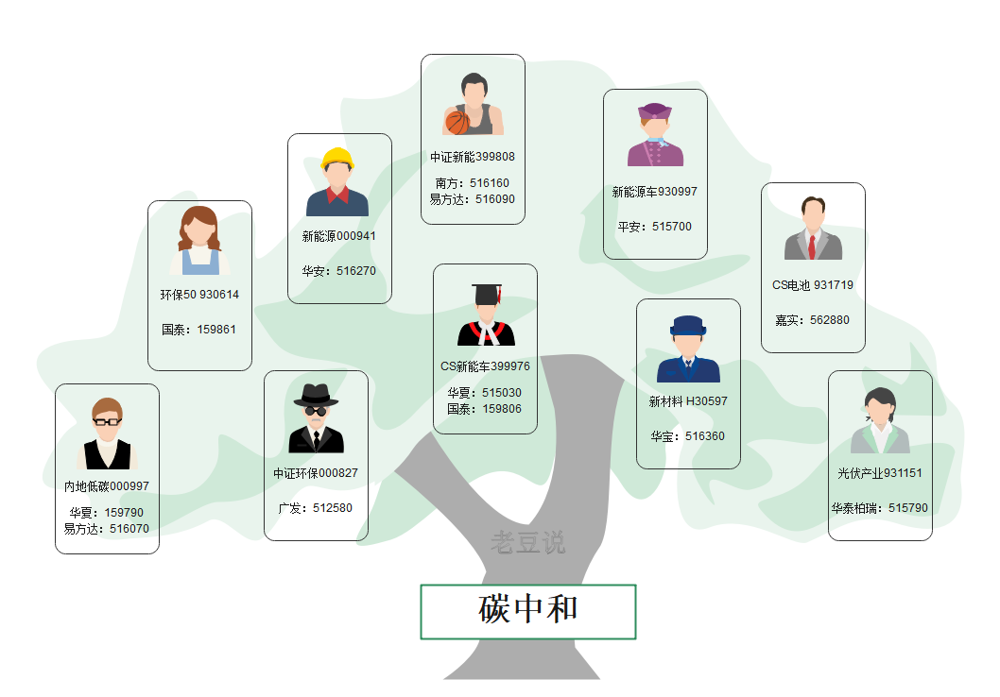

