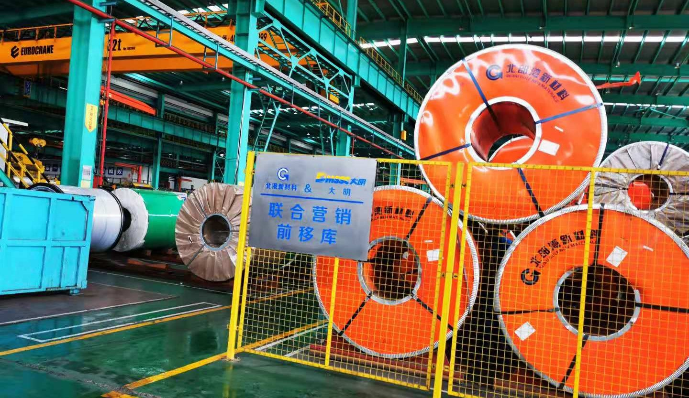
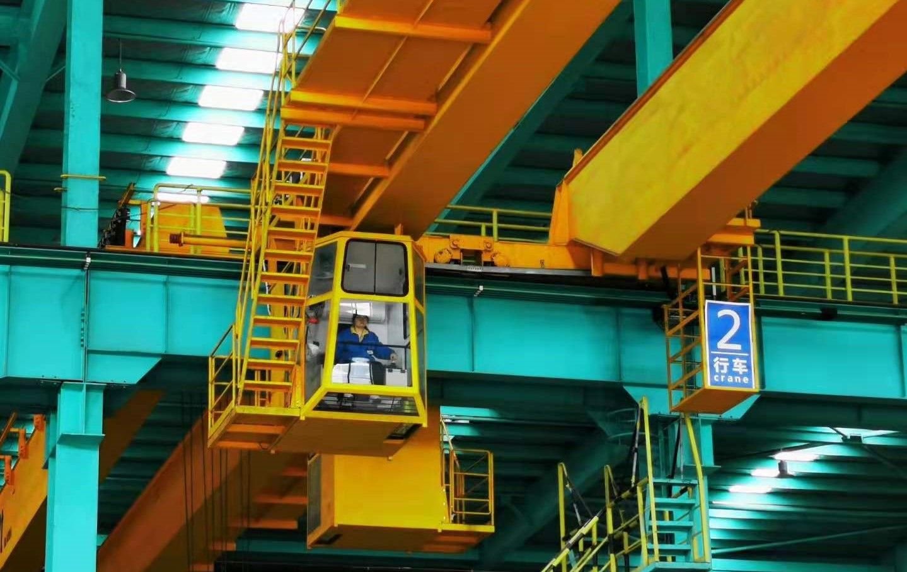
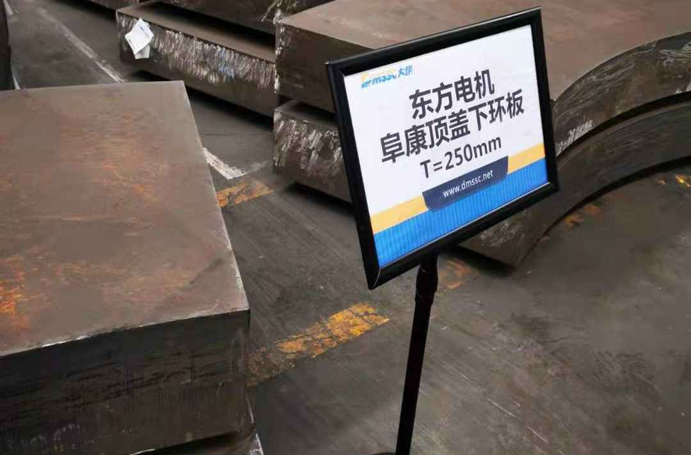
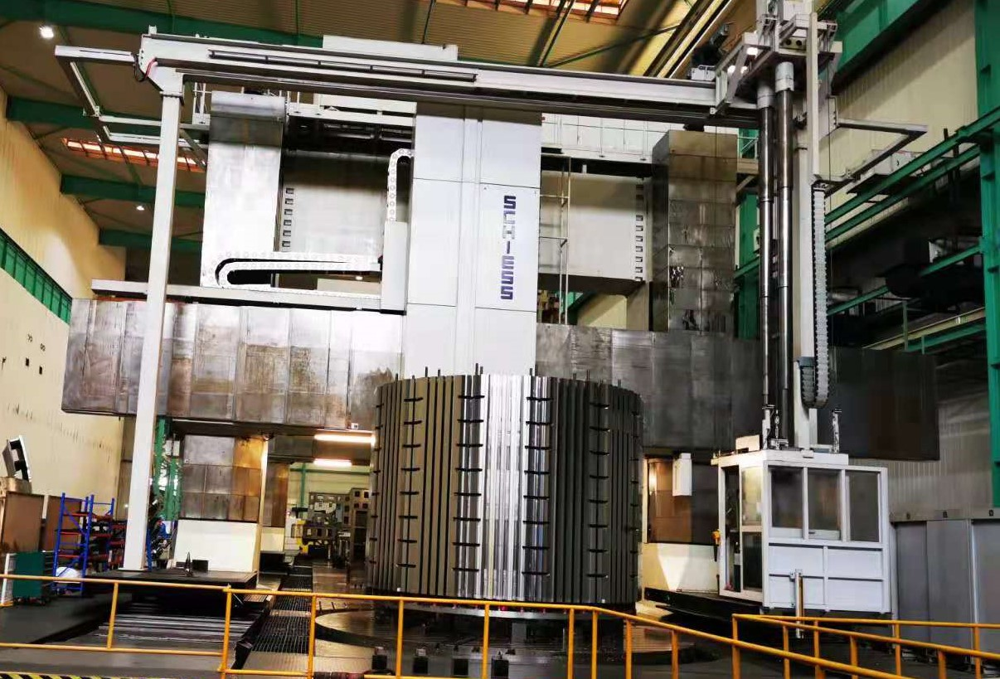
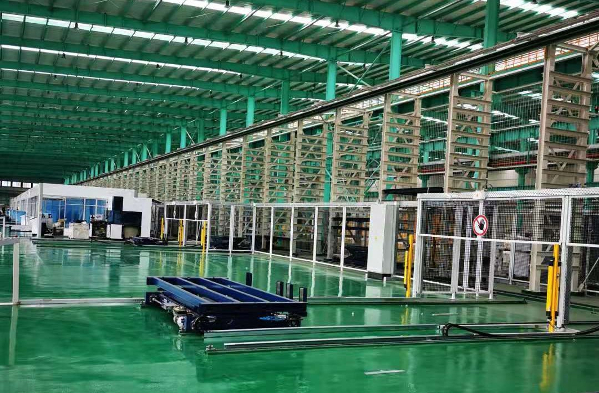
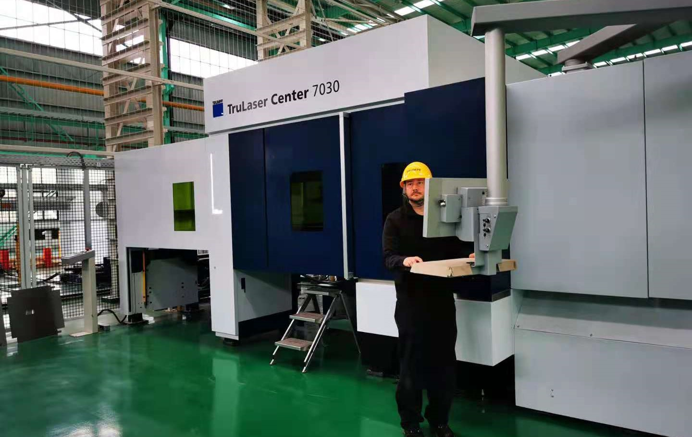
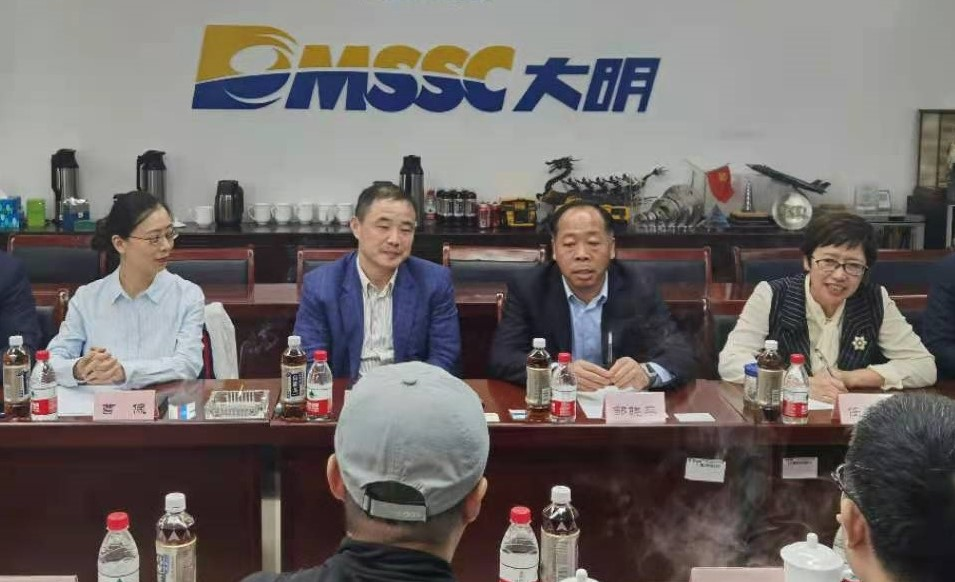
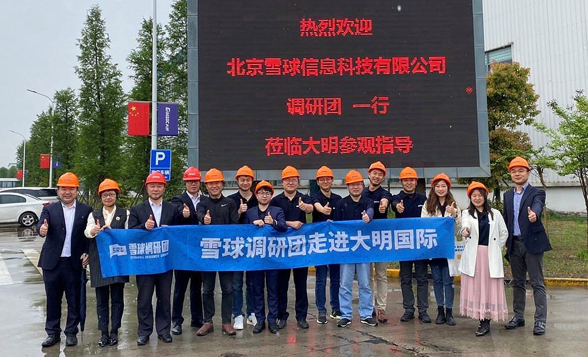

### 走进大明国际

4月下旬去了趟无锡，跟着调研团参观了大明靖江基地和大明国际无锡总部。一整天的调研行程安排地很充实，让我收获颇多：有来自参观工厂车间亲眼所见的大国重器；有来自同行球友们的少年可畏与资深前辈；还有来自与大明国际管理层交流过程中的感悟。趁着五一假期的空闲把这段经历和大家分享下，有兴趣的朋友可以看一看。

> 大国重器

上午我们参观了位于靖江的大明国际靖江生产基地（含大明金属科技、大明重工、大明精工），以前只是在纪录片里看到这样的大国重器，这次亲身走进大明国际的加工车间感觉非常好。我觉得即便不是一个相关投资者，若你对这些有兴趣且有机会的话，真的应该来走一走、看一看。这部分调研团的相关直播基本上都有覆盖：[走进大明](https://xueqiu.com/video/5285890817432973279)

1、大明国际主要加工碳钢和不锈钢，加工原料基本上都是以钢厂库存前移的方式暂存在大明的场地内。这种方式可以减少大明国际的资金占用（还能降低钢铁价格波动给企业带来的影响）、且便于生产效率的提升，于钢厂而言也可以减少堆放场地的使用。这个‘库存前移’也是大明国际行业地位的体现，当然这也离不开宝武集团（宝钢、太钢）等大股东的支持。

2、钢材粗加工看似没啥技术含量的一个生产环节，但是大明国际做到了差异化（主要面向中高端客户），做到了**人无我有且多、人有我优且快**的境界。比如大明可以加工超级厚的碳钢材料（我们现场看到的切面非常赞），每月可达12万吨的加工能力（上图的这位女工人好帅，恐高的我表示很钦佩），这也使得大明在加工品质和交付周期上几乎没有对手。

3、大明国际在生产设备的投入上也是非常肯花钱的，我们在大明重工那看到了**希斯双龙门镗铣加工设备**（这个设备的地基据说都要近50米）。这套设备据说全世界就两台、中国就这一台，现在由于众所周知的原因，就是你有钱也很难买到了，何况一般的企业也没这勇气买这套近2亿的超大型设备（大明国际说有机会还要想办法再买一台）。该设备主要是加工超大且对品质要求较高的产品，这也是大明在业内能做到‘人无我有’的一个有力保障。而且一套成品的零件若其中30%只有大明能生产，那么这整个订单大概率都会交给大明国际，毕竟交给一家生产也是省时省力。

4、在参观大明精工的时候还看到了一条正在调试中的**德国通快全自动钣金生产线**（150米长、预计三季度正式投产），该生产线仅硬件设备就要近1.5亿元。这也是一笔相当大的设备投入，这种全自动24小时的加工生产线投产，其实是在构建企业效率的护城河。在做到超高加工精度的同时，大明国际未来还可以做到**更低的用人成本、更高的生产效率、更好的产品质量以及更短的交付周期**。当然我们也从侧面看得出，大明国际确实有充足的订单支撑着这些贵重的生产设备，也注定了大明国际是一个很重资产的企业。

5、大明国际自己的码头也指日可待，码头建成后不止是运输成本的大幅降低，还能承接更大的订单。这也是企业的优势和护城河，毕竟现在码头也是稀缺资源，极难批得下来。大明国际再一次做到了差异化，完成了“人无我有”。

> 前浪后浪

这次调研学习中同行球友里有两位让我眼前一亮：一位是99年的小伙子 @小馒头- 、另一位是经验很丰富的制造业前辈。小馒头比我整整小十岁，虽然一些细节上还是能看出他稍有稚嫩的一些地方，但依旧让我感叹十年前自己在干嘛？那个在校园里穿梭的毛头小子与眼前的这位小馒头比还差远了。

另外那位制造业前辈姓李，姑且称他为李先生吧。据说他持有大明国际的股票已经10年了，而且持有份额从散户的角度看已经很大了，关键这还只是他的闲钱。他也坦言这十年来持有大明国际算不上赚大钱（远不及他近几年在蔚来上赚的），但是他依然很看好大明国际这家企业，只要他认定的一些关键点大明依然具备优势，那么他可以再等10年。他自己也是做相关制造业的，所以他对于自己看得懂且看好的企业可以有足够的耐心持有。

起初我对这位神秘的李先生还是略有疑虑的，但是随着一天多的细节观察我开始相信这些。整个参观调研的过程他几乎包揽了大部分的提问，问的点都是很专业的，很多细节中都看得出他身上一个制造业领导的气息。李先生这次前来也是带着很多的疑虑来的，但是可以看得出此行化解了他不少的困惑，而且你会发现他关注的点不仅仅是那些财报上的数字，甚至可以说他根本不在乎。我印象深刻的是他在工厂期间问得较多的几类问题：这个的毛利率是多少？这个设备的回本周期是几年？这个原材料的利润占该产品总利润的比例是多少？这类设备后续是否还会购买？

李先生还告诉我们，大明国际买了这么多贵重设备虽然财务上几年后就折旧得差不多了，但这些设备通常是很难坏的，等后期就剩一个日常维护的费用了。这个也印证了大明国际的周总下午说到的：大明艰苦了这么多年、摸索了那么多年，以前赚的很多钱都又投入到买设备和人才队伍的培养上了，但我们也可以看到这棵大树结果子的时候快要到来了。以上这两个点不走进企业、光看财报是很难觉察或者说能认知到的。

此行的调研团成员都有很多值得我去学习的地方，也有几位已经不是第一次见面了。但上面说到的这一老一少两位单独拿出来说一下，是我觉得不同年龄段或者说有着不同经历的人群，在看待一个企业的角度和方式上是完全不同的。我们与智者同行，就要多观察他们的优点，看看他们的智慧能否吸收转化为自己前行道路上的助推。

> 大明国际

下午主要是在大明国际无锡总部与董事会主席周克明、董事会副主席邹晓平、集团财务总监曹佩、集团品牌策划总监任凤华等人，就公司经营文化管理、行业未来方向、大明投资策略等问题展开深入交流。从周总身上我看到了，一个干实业的企业家对于自己事业的执着和热爱。会议中我记录了很多（很多官网可查的信息我尽量不累述），现在也选取一些与大家分享：

1、大明国际给自己的定位是：**“一站式”金属材料加工服务平台**，包含金属材料加工服务、半成品与零部件加工、成品制造，是连接钢厂和用户的纽带。钢厂更专注于原材料的生产，把对接终端客户这个环节交给了效率更高的大明国际，这也就给大明一个很好的发展空间。对于下游的客户想很快捷的拿到原材料，最好能顺带帮着做一些初期的加工，这也是大明国际可以有累积客户7万多家（覆盖30多行业）的主要原因。大明国际在几十年的发展中，在钢厂和下游客户之间起到了一个很好的纽带作用，也成功的做到了行业第一。

2、大明国际的优势：**高质量、快交期、成本低**，大明能做到这几个核心关键点与我们上午参观工厂时看到的一些点关联上。那些高端昂贵的加工设备是大明加工品质的保证，还可以帮助大明拿下很多别的同行无法加工的订单。有宝钢和太钢这两大股东的支持就可以获得很稳定的原材料，同时可以做到库存前移规避原料价格波动的风险（周总也强调大明不做原材料价格的预测，加工纽带型企业就该做好可控的环节，价格的波动就交给市场、交给上下游）。而且库存前移还能加速交付，让大明的生产周转一年可以达到15次之多，这种快交期、高周转的模式可以进一步降低企业成本。因为大明专注于自己擅长的领域，让每一个环节可以高效的联动，结合钢厂拿货优势、运输成本优势（后期自有码头完成后更明显）、龙头企业生产规模优势等，让大明做到了业内翘楚。

3、大明国际1988年就成立了，但之前一直就是单纯的钢贸商，在2002年后才开始涉足原材料的粗加工。看到大明国际这一路走来不断在摸索中成长，每一阶段的成长都离不开周克明为首的苏南企业家精神。此行也让我对江苏干实业的企业家多了一份敬佩之心，金融再牛也是锦上添花，一个社会的发展还是需要实业支撑的，江苏的长久昌盛离不开那些一代又一代实业家们的努力，此刻我为自己是江苏人而自豪。

4、大明为了与重大合作伙伴联系得更紧密，经常采取合资成立子公司这类合作方式，这个也是一种企业家的智慧。大明国际的贷款都是信用贷款，没有抵押贷款，我想光这一点就可以把A股众多企业给比下去了吧。大明的应收账款到账极快，基本控制在30天内，这也侧面说明大明国际的行业地位已经到了可以筛选掉那些结算周期过长的下游客户了。

5、在谈到大明国际的护城河时，周总说：**没人会要吃只鸡就搞个养鸡场**。只要你这个卖鸡的价格公道、服务优质，时间一久你就是行业翘首，在社会分工如此精细的今天，如果你一个企业想把整个行业的上、中、下游的钱都赚到，那个是极难也不高效的。大型钢厂也有自己的加工子公司，但产能无法覆盖那么多客户且很难都服务好；徐工这些个大型企业也有自己的加工子公司，但非核心环节交给大明这样的企业其实更有效率、成本自然更低。久而久之这个承上启下的行业就产生了，大明也与众多大型企业合作的过程中培养了自己的人才、采购了高端设备、即将配备自己的码头，在产能上也做到了规模效应，这样的企业想不成功都挺难（只要企业自己不作死）。

6、再说周总的几个细节：①、周总很喜欢抽烟，整个会议3个多小时几乎没停过；②、周总很喜欢喝冰水，全程秘书给他倒的都是冰的农夫山泉；③、周总据说很喜欢跑马拉松，大明国际也有很多马拉松相关的活动（前面提到了那位实业家前辈李先生也是很喜欢长跑），周总给的解释是：不坚持运动抗住不做企业的压力。

> 小结

大明国际的商业版图是很清晰的，企业在长期发展中不断巩固的护城河也无形中阻挡了潜在的对手。基于与钢厂的长期关系，使得大明国际在材料端优势明显；在多年的成长中也积累了庞大的多元化下游客户群体，现在可以优先服务那些优质的中高端客户。我们在感叹大明国际展示了一幅大国重器的蓝图时，也要看到作为港股上市的一个国内制造业公司，同样存在一些投资者关切的问题，比如市场流动性近乎“枯竭”，这在本次调研中是很多人提出来的。大明国际的领导也表示已经意识到广大散户投资者的诉求，正在努力解决这一重点问题，在做好企业的同时也应该提供一个更便于大家投资的股票交易环境。

