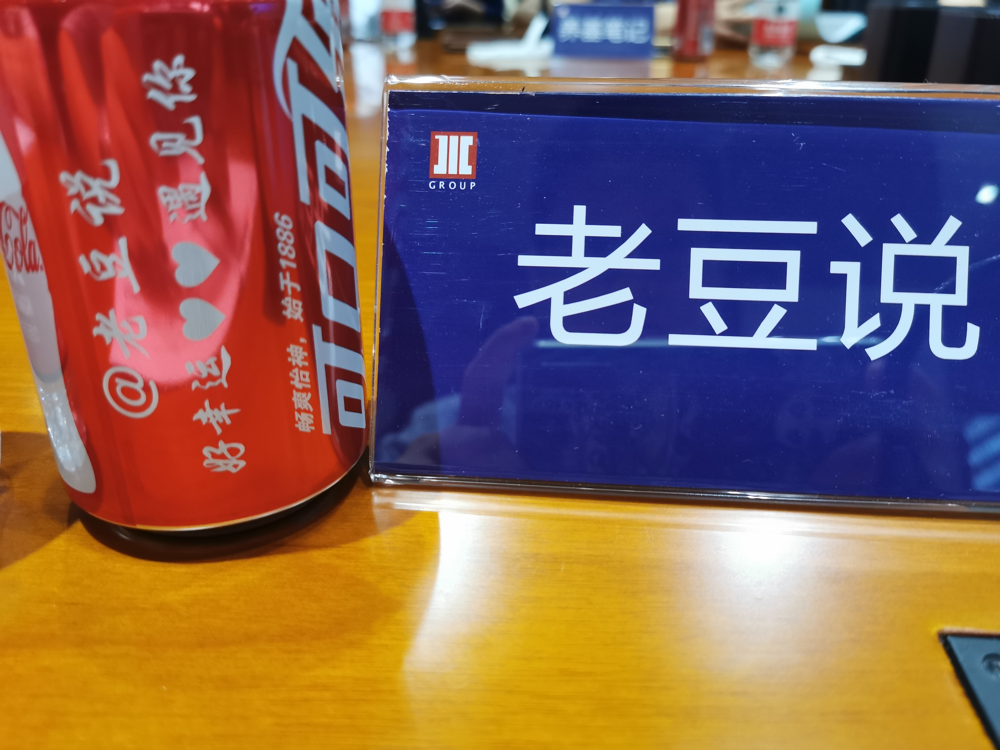

### 走进国泰

上周四有幸参加了天天基金网与国泰基金组织的#天天约大咖#走进基金公司系列活动。我发现天天基金对我特别‘关照’，每次都给我安排在美女嘉宾边上。上次华宝之行我坐在胡洁边上，这次国泰之行我被安排坐在朱丹边上，再过去就是梁杏，个个都是内外兼修的女士。

刚看已经有参会嘉宾写了很详尽的会议纪要，我就不再重复全面的铺开阐述。单单以所见所闻所想，加上我当时记的简短笔记与大家分享下。

---

**朱昂**告诉我们一个好的基金经理需要具备如下三点：

- 长期的投资业绩，越老越值钱

- 一套稳定的投资体系，不受市场风格的波动而漂移

- 相对透明的投资框架，以及不断滚雪球的持有人信任

看到这页PPT，我脑子里想这不就是在说指数基金嘛！指数基金大部分都具有较长的业绩可查，且因为编制规则是相当稳定的，所以**投资体系稳定、投资框架透明**。虽然主动基金可以有更灵活的操作，有更多的增强收益，但是**透明和稳定**是很难的，所以但凡业绩长期跑赢基准的主动型基金经理都是很优秀的。

会上朱昂说了一句话我记在了本子上：**随波逐流永远不是一种优势！** 

---

**朱丹**是我印象很深刻的一位嘉宾，她讲得很清晰、我听的很认真，我在提问环节也向她提了个问题。

朱丹对欧美的经济判断是：美强欧弱。

- 美国主要经济指标均运行良好，核心的就业、消费、通胀数据接连超预期，号称“衰退信号”的美债10Y-2Y利差倒挂也已经解除。

- 9月德国制造业PMI仅41.4，击穿2012年欧债危机乃至2008年金融危机时的低点，德国的衰退让欧洲经济前景蒙尘。

在全球降息潮之下，美元依然相对强势。朱丹预计年内美联储还会降息一次，毕竟放水的日子大家都更好过一点。

朱丹说油价还会有上行的可能，因为沙特遇袭导致油价短期反弹，但反弹幅度相比历次供给冲击仍属温和。这个点她下午说的时候我没听太清楚，晚上吃饭的时候她又坐我邻座，那会又聊到了油价，才回过神来她说的这个点。

最后就是对黄金的看法，当前各国央行都在降息放水，那么这种大环境下黄金肯定是值得持有的，至少值得我们多多关注。

---

程洲下午讲的时候，虽然给人的感觉比较沉稳，但我总觉得听着不过瘾。好在晚饭的时候他坐我边上，也听他聊了很多，果然饭局上的料更有价值。但是因为有些东西不方便说，我就把可以说的、我觉得比较好的几个观点说下：

- 偏好持续现金流为正，优选行业龙头

- 有恒产才有恒心，尊重市场，提升信心

- 自主可控的需求会带来不少企业的崛起

- 中国的仿制药未来大有可期

- 核心资产是结果，不代表未来

---

**望京博格**虽然之前一直有互动，但这是我第一次见到他真人。比我预想的要瘦，怪不得他之前抱怨别的基金公司把他的活动照片拍胖了，哈哈。

望京博格讲的有句话让我记住了：“**教育没有用，榜样最有用。**” 对于小白投资者，建个组合带他们边投资边学习，比直接对他们说投资理念和投资策略要有用的多得多。

这次国泰基金不止邀请了自媒体，还邀请了约20位投资人。望京博格后面那位老奶奶就引起了我的注意，她全程都听得很认真，我当时就想这样的老奶奶都在努力学投资，我们年轻人更应该不断学习、不断提升。

---

梁杏主要讲的是医药这方面，一来我这方面不少很熟悉，二来不愧是“最美公募基金人”，实在没办法注意听她讲的内容，大部分还是会后通过PPT回顾她所要表达的内容的。哈哈，注意力很难集中是个硬伤啊。

---

虽然我是主要专注于指数基金，但是参观了几家公司后，也认识了不少有趣的、让我大为改观的基金经理。所以面对面接触是极其有效的沟通方式，再次感谢天天基金、感谢国泰基金的邀请，国泰之行受益匪浅。

**好幸运，遇见你！**

