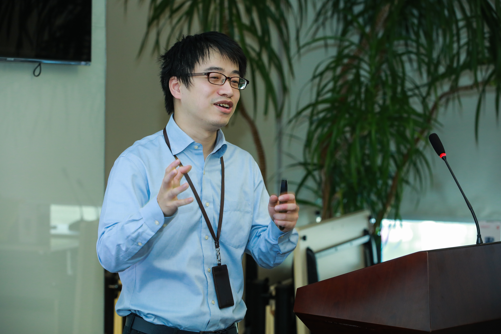
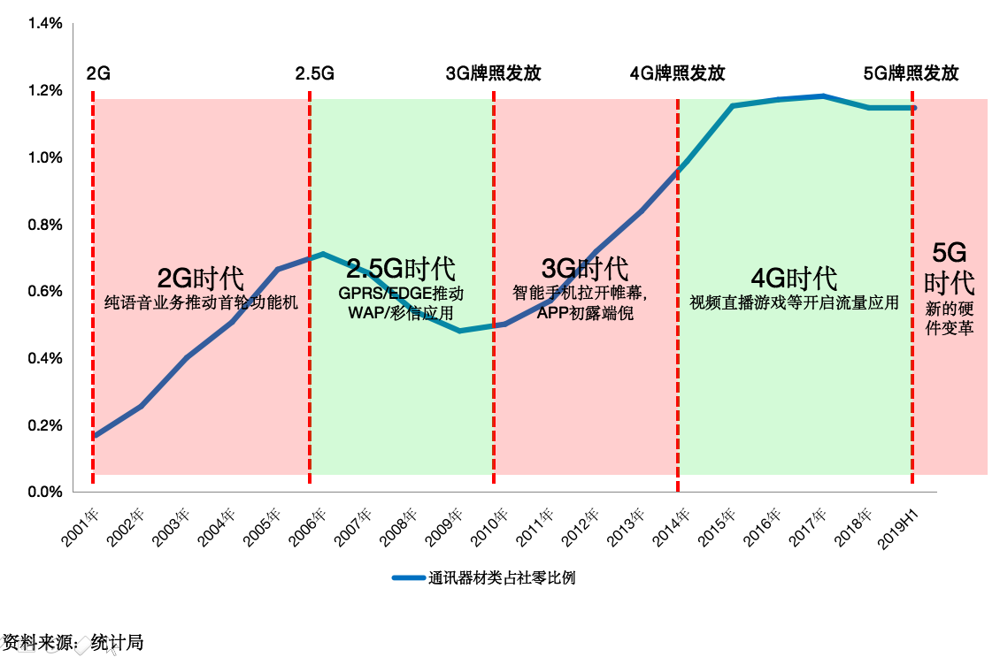
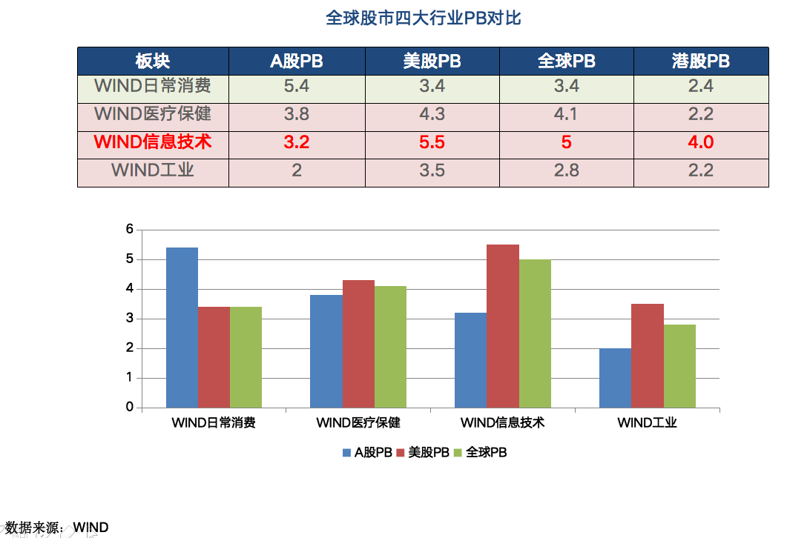
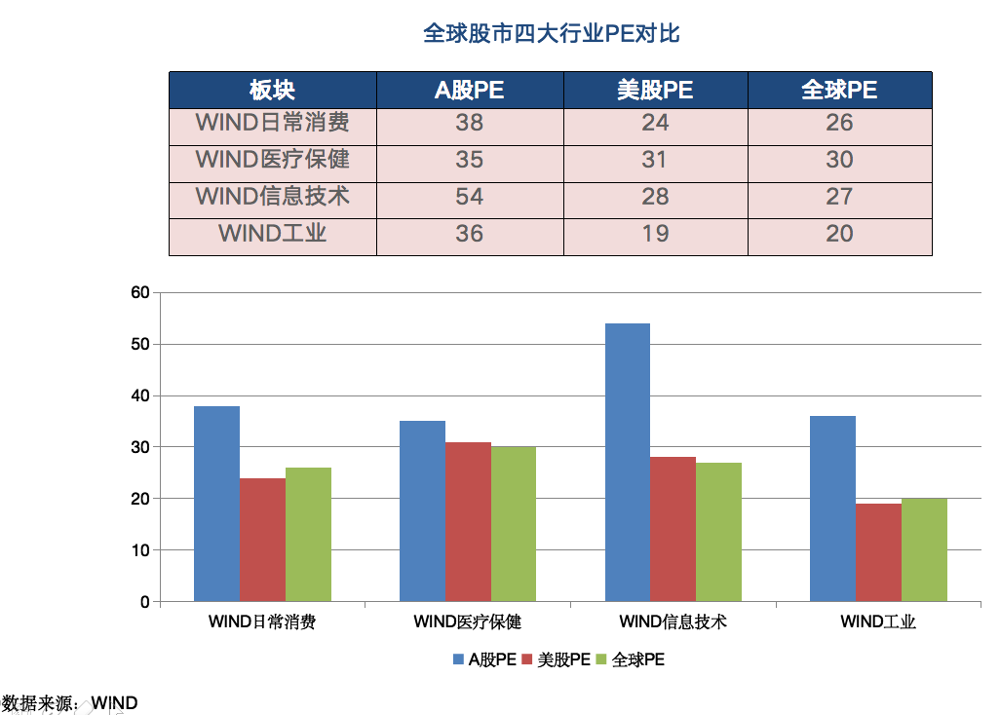
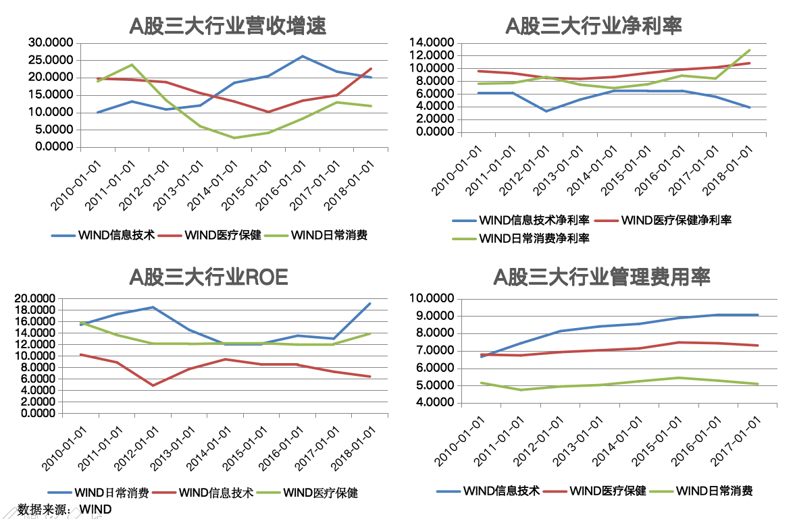

### 走进华安基金之胡宜斌

讲真我是一个主要研究指数基金的人，对于主动型基金和主动型基金经理我是既好奇又畏惧。今年的几次走入基金公司活动让我对基金经理有了不同于以往的认知，不再是那么神秘，但却有优于普通投资人的特质。所以我不排斥去基金公司看看，去听听基金经理讲些啥，看他们是怎么看待投资这件事的，是否有值得我去借鉴的地方，是否对我的投资体系产生影响。

周二（11月19日）有幸受邀去华安基金参加活动，上台演讲的嘉宾有@持有封基 ，基金经理有：胡宜斌、饶晓鹏、许之彦。本文主要讲下胡宜斌当天讲述的几个观点，以及我对这些观点的一些个人看法，其它的后续若有时间再选择性的单列文章讲下。

如开头说的，我对主动型基金经理知之甚少，所以每次去基金公司看到基金经理我都是很有新鲜感。去之前我也会查下他们的资料和历史业绩，甚至有时候会问下朋友或同行，这次一个朋友告诉我她很迷胡宜斌，狂夸他很帅。我不知道这算帅还是不帅？但是给我的印象很好，讲东西还算深入浅出，挺好。

> 5G行业

**胡宜斌：**

4G的蓬勃发展才有阿里和腾信近几年的高速成长，而5G不仅是提速，还有一个特性就是低延时，这个特性会加速‘万物互联’的发展。所以我们在看待5G发展的时候不能只盯着通路管道的铺设，也要关注在管道里奔跑的周边行业以及支撑万物互联的硬件升级前景。然后以统计局的'通讯器材类占社零比例'数据来推演5G时代会带来新的一波硬件升级需求。

**老豆说：**

我对其关于5G的另外几个点提出一点不太认同的观点。胡宜斌说手机可能应该5G技术的发展会被穿戴设备淘汰，因为手机这块屏幕可以被很多事物所取代，在万物互联的时代手机真的可能是个累赘，他举例了最近很火的无线蓝牙耳机和华为的穿戴眼镜，而且后期随着虚拟电话卡的引入可以很好的替代手机这块砖头，这个我大致认同。

但是我认为在电池容量续航这个瓶颈没解决之前，任何设备都离不开电源，而耳机和眼镜的电池容量显然要比手机小的多。甚至我觉得电池材料的发展也是非常值得期待的一个硬件升级。

另外一个点，胡宜斌提到5G提速后会超过当下固态硬盘的读取速度，当网速在线请求资源的速度大于硬盘速度的时候就不需要本地存储了，这个我表示质疑。任何资源最终展示都需要内存，如果非要说硬件的存取速度会成为瓶颈，那也应该是内存的I/O速度，而非硬盘。何况内存的升级也一直在进行着，又何况短期内还达不到那么快的理论值，5G的提速还有很长的路要走。

与此同时胡宜斌还提出5G提速后可以替代现有的实体光纤，这个我觉得也是有悖常识的。无线通信技术的底层还是需要光纤的搭建，这个肯定会在长期时间内所共存。所以我们听任何人讲一个事情的时候，都要去用常识自我判断下、辨别下。

> 科技行业估值

**胡宜斌：**

我国的科技股很贵，贵在PE而PB不贵，为什么会这样？是因为我们A股的科技股有规模没利润。我们发现营收增速没问题、净利率不行、ROE有过阶段性反弹但还是一直在下方，那什么吃掉了利润呢？“管理费用率”才是‘罪魁祸首’，结果就是研发薪酬吞噬利润，通俗的说就是员工的薪酬远大于他们给企业所带来的利润收益。

为什么会这样？胡宜斌解释道：类似乐视网这样的企业有了足够的资金，但没有研发基础的企业只能通过高薪挖取人才。这种野蛮的争抢使得用人成本变大，变大的不只是乐视，更多的是那么老老实实研发的企业，冲击的是整个科技行业薪资水平。

胡宜斌另一个的解释点是：高房价。年轻的科技工作研发人员需要在大城市生活，那么其所在的科技行业就得间接承受员工的生活成本压力，最主要的就是住房压力。在国家最近有决心控制房价增速的情况下，2018年的科技行业利润有了明显改善。只要房价的增速放缓，就是对很多高科技行业的一种变相扶持。

**老豆说：**

作为一名程序员，近五年我也享受到了互联网科技行业野蛮生长带来的‘高福利’（仅高于普通行业）。薪资增长容易，要下降就很难了，这就是常说的：由俭入奢易，由奢入俭难。所以我认同胡宜斌说的，只要抑制住房价的高速增长，就能缓解年轻人的薪资压力，也是变相的扶持了科技行业。2014年左右科技行业很多是烧的是风投的钱，后面2016年左右互联网金融行业又是都在做暴利的P2P业务，所以研发人员都能持续的加薪。年轻人要想立足于一线城市只能不停的学习，不能的加班掉头发，这样才有可能拿到高薪，可以买房定居大城市。

> 中美关系

**胡宜斌：**

胡宜斌认为，中美现在的关系主要是因为过去20年很多制造业转移到了中国，而制造业的背后就是中产阶级。胡宜斌又指出川普的上台就是因为中产的呼吁，缺失的美国中产阶级也想过好日子。美股负债率上升推动ROE和EPS。

**老豆说：**

这段想了下还是挺敏感的，暂时不作对外发布了，有空闲了再在我个人博客发布吧。