### 大王让我来巡山，我却给中邮看风水

9月21日，国庆前的一个寻常周六，清晨赶着复兴号直奔首都北京。

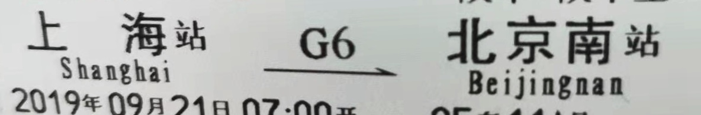

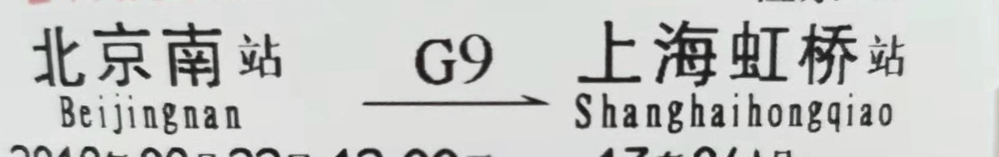

其实我还是挺怕坐飞机的，感谢现在最快的复兴号京沪只需要4.5个小时，让我多了一种去北京的选择，而且行程时间和舒适度都挺好，深深为中国发达的高铁网络自豪。就在这说话间北京南站到了，按落高铁头，只见洋河梦之蓝的广告映入眼帘。

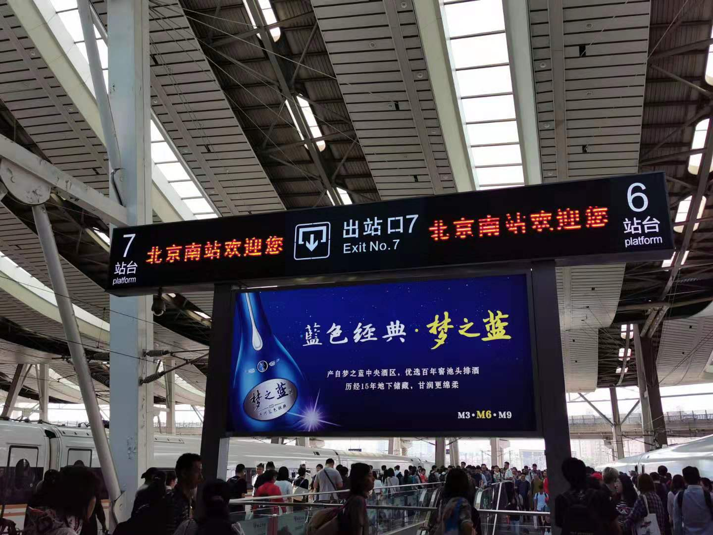

洋河通过重塑品牌爬到了白酒老三的位置，真的算是市场营销的一个经典案例了，我作为江苏人也深感自豪。白酒这种地域性很强的消费品，洋河能够立足长三角、辐射全国，确实不容易。

在北京南站随便吃了碗面就坐地铁直奔酒店，放下书包就步行到了地坛公园隔壁的中邮基金公司。

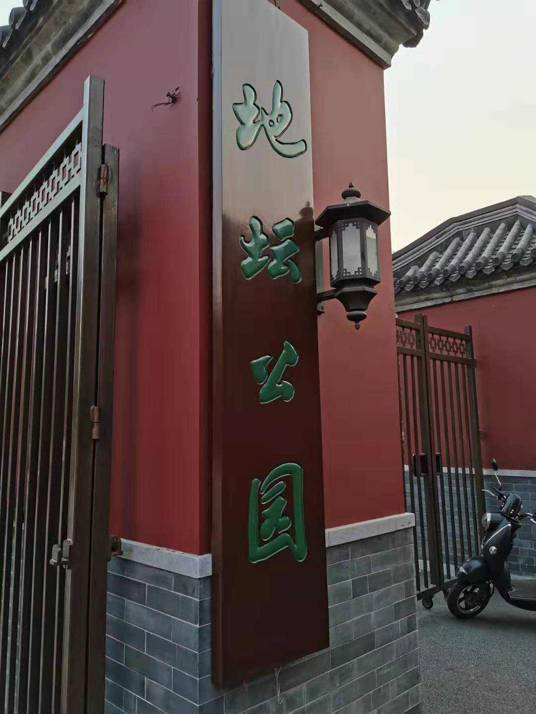

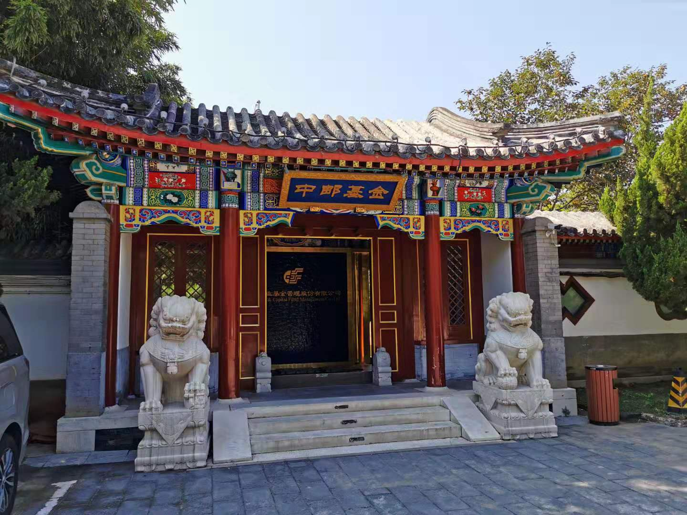

地坛公园也算是我儿时通过语文课本所了解到的一点点关于北京的符号。中邮基金的大门给我的第一感觉就是好看，很符合江南人印象中的北京建筑风格。我们一行的几个人都很羡慕在里面办公的中邮小伙伴们，他们办公室叫正光殿。

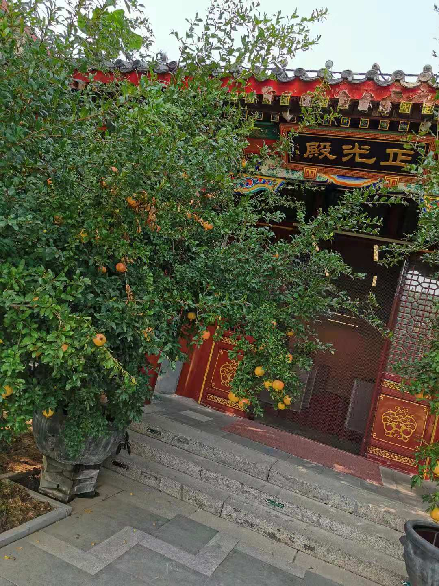

正光殿前的石榴树很吸引我，我不知道是不是认知局限，我印象中这种放任不管的石榴树，果子都不会很大。但是在北京我看到的几处石榴树的果子都挺大，第二天在齐白石故居的庭院里看到几棵石榴树上挂的果子也很大。

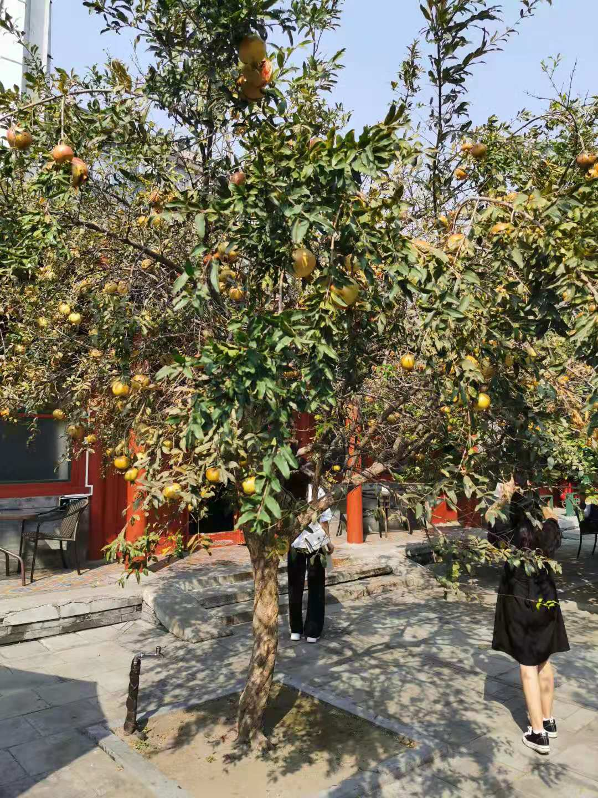

为什么我会有这种认知呢？因为我们村唯一的一棵石榴树，打我记事起就已经长在了村头李大叔家的院子里了。树这么多年过去了，依旧算不上粗壮，今年国庆回启东的时候，我还特意停下来观察了下树上的石榴，确实和中邮基金庭院里的那些比起来显得尤为干瘪而又黑小。

正光殿前有个走廊，走廊转角处有石桌和石凳，走廊边缘是个小池塘，池塘里还养着一只白天鹅。

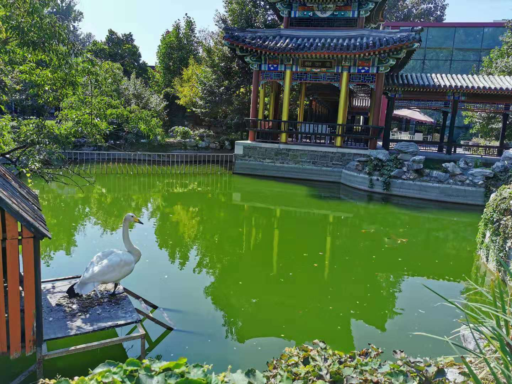

我为什么题目说要给中邮看风水呢？就是说得这个水池和天鹅。

- 你看看这一潭死水，是不是很不吉利。

- 而且这水长期不流通绿藻爆发，这水绿得发慌。

- 最后这天鹅虽然不是黑天鹅，但你仔细一看这嘴吧是黑的，这不摆明是黑嘴嘛。

业余18级风水大师老豆说强烈建议中邮基金把这个池子处理下，哈哈。闲扯告一段落，现在说下中邮之行所学习到的内容吧。

1、神奇公式为什么不包含金融股？

- 金融不以ROC赚钱。

2、神奇公式引自美国，那么有无改进？

- 美版剔除了金融和公共事业，中国版只剔除了金融；美版一年调整一次，中国版每半年调整一次成分股。

3、雪球上的‘神奇侠女’是否就是基金经理你本人？

- 基于合规考量，不便作答，可以会后私聊。

4、神奇公式中科技为什么也没有？

- 科技企业的利润反应不出来，所以对于神奇公式而言是贵的，也就自然没被纳入。

5、一句话概括神奇公式的思路？

- 赚企业利润，只要企业赚钱，神奇公式就赚钱。

6、谈下对未来一段时间中国股市的看法？

- 人民币走不出去，楼市不让去，只有去股市。

- 固定收益降低且打破刚兑。

- 养老金入市，社保持续流入，外资配置A股。

基于以上三点，A股未来底部支撑强劲，未来可期。

最后献上基金经理的可爱照片，两个大眼睛眨巴眨巴很开爱，时而插个腰更显俏皮，哈哈。

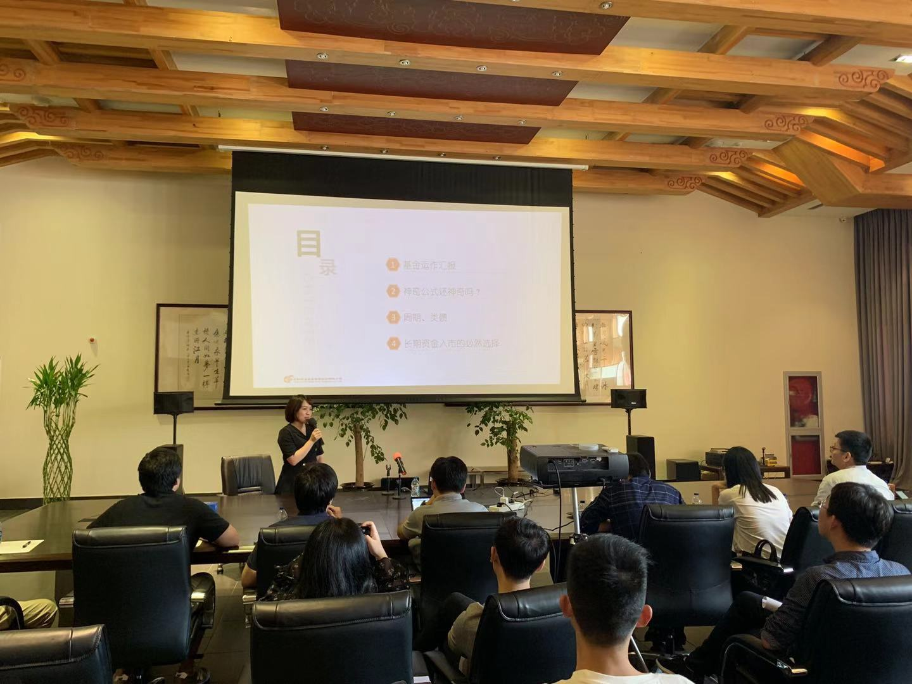

文末再附上几个本次北京之行的两张照片吧。

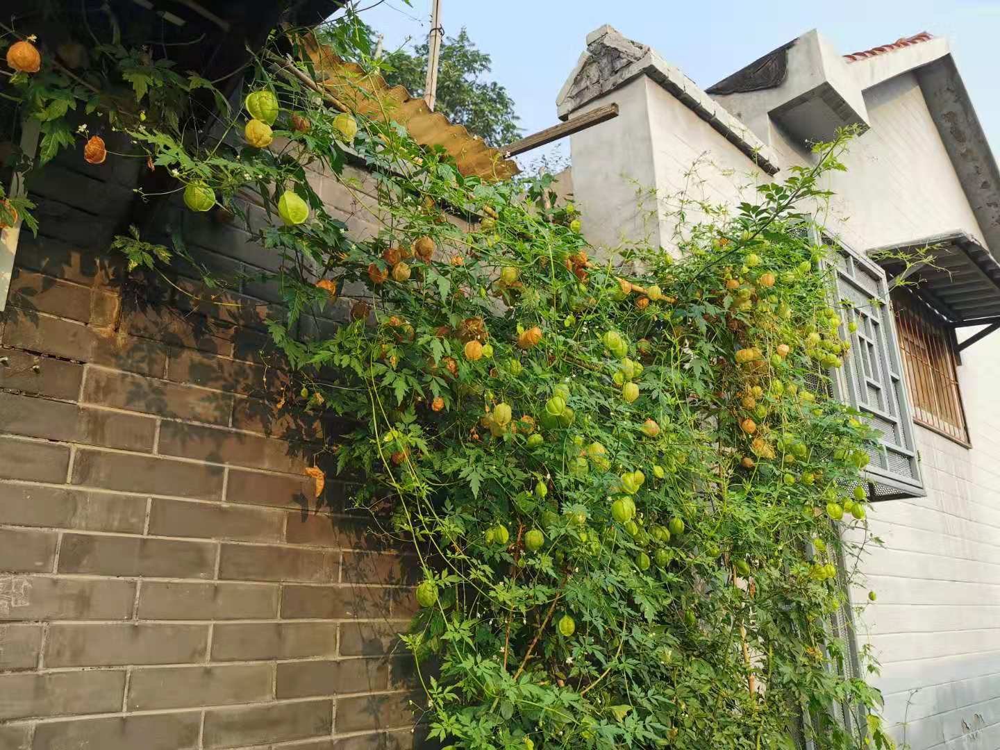

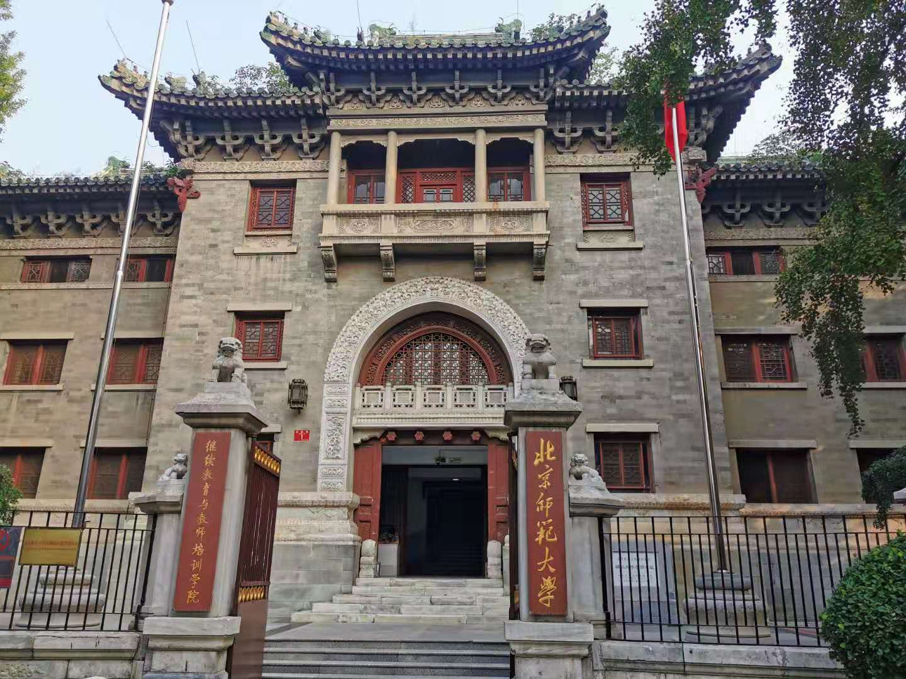
