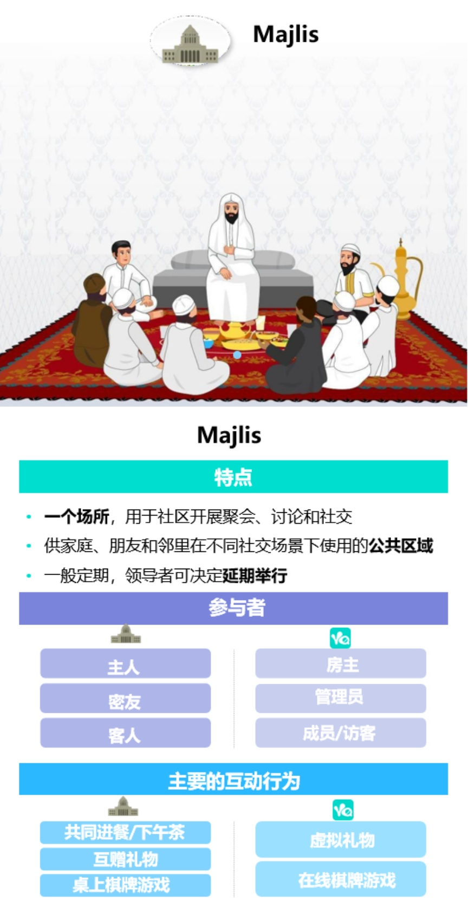

### 走进Yalla中东小腾讯

上周跟着雪球调研团去了趟位于杭州的雅乐科技，参观交流中学习到了很多。**雅乐科技（Yalla）是一家由中国人（原中兴通信员工）创建、总部位于阿联酋、以中东和北非为主要业务区，并于美国纽交所上市的阿联酋本土企业。**

有人戏称雅乐科技算是“中东小腾讯”，因为雅乐的拳头产品Yalla是中东和北非地区最大的语音社交与娱乐平台，而雅乐的第二款旗舰产品Yalla Ludo又多次位列中东地区多个国家iOS和Google Play棋牌游戏和家庭游戏畅销榜单和下载榜单榜首。社交配合游戏，是不是有内味了？当然雅乐科技不仅如此，2020年又陆续推出了三款游戏产品，今年又上线了IM产品YallaChat。我们在和雅乐CFO交流的过程中，可以看出她也不排斥外界对其“中东小腾讯”的标签。甚至也坦言腾讯老大哥确实给他们做了很多尝试，他们也一直在结合中东特殊本土文化的基础上，有选择的借鉴以腾讯为首的一些中国互联网企业的成功模式或产品。

一整个下午的交流让我对雅乐科技有了很多新的认识，我就把自己记录的一些观察和认知与大家做个简单的分享：

1、雅乐科技的Yalla是基于语音的线上社区，虽说是受腾讯社交的启发，但其本身其实是中东本土的一种叫做Majlis社交活动的线上化，这一特性让MENA（是指中东和北非地区，包括阿尔及利亚、巴林、埃及、约旦、科威特、摩洛哥、阿曼、卡塔尔、沙特阿拉伯和阿拉伯联合酋长国，共10个国家）的用户感觉非常自然。

2、因为Yalla是属于去中心化的多对多互动群聊，这就与一对多互动的直播不同，不需要直播者积极传递内容。用户都是自发、平等的积极参与到这种兼顾熟人社交和陌生人社交的直播聊天室，平台也不需要维护那些专业的内容生产者。Yalla这样基于自发的高度忠诚和不断成长的社区是很难复制的，无形之中就有了很好的护城河（如果是追求金钱的，很容易被后来者以烧钱的形式抢走）。

3、“不能提现”是雅乐科技贯穿始终的一个要点。当人与人之间的社交不掺杂金钱的时候会简单得多（放松纯粹的社交体验），这个在我们中国人看来可能有点不可思议，但因为中东那边本土文化的特点让这一理念很顺理成章，这也使得充值后的虚拟币更多的是一种增值服务（送送礼物、买买装饰、扩大房间等）。

4、雅乐科技有一位独立董事叫Osman SULTAN，是阿联酋第二大运营商（阿联酋综合电信公司DU）的创始人。因为阿联酋没有一个成熟的TMT圈，所以电信公司就兼带着这方面的大部分功能，所以Osman SULTAN的加入不仅是雅乐本土化的一个缩影，也是特殊监管之下的长久运营的保障。

5、据雅乐CFO介绍，中东那边虽然因特有文化的缘故略封闭，但不同于百废待兴的非洲，不会给你很原始的感觉，国民教育也是可以的。同时他们也是热爱社交娱乐的，生活方式是很放松的，通常下午2~3点就下班了，空闲时间极多。但还是因为特殊文化的关系，他们的线下生活也不是很丰富（饮酒限制、没有赌场、社会制约等），这也就不难理解Yalla每用户每日平均使用时长可以达到4.5小时以上了。

6、会上有一个问题多次大家问到：Yalla护城河壁垒有哪些？因为我们中国人已经习惯了互联网的大浪潮，这东西花点钱就可以搞出来嘛！其实我听后的感触是：Yalla自始至终就是一个阿联酋本土企业（只是技术开发主要在中国），所以其产品的从诞生起就是高度适配阿拉伯语言国家的，这也是它能这么长时间在那样的环境下持续成长。我们也可以通过数据看到国际社交软件对阿拉伯语言的支持很弱，即便少量软件支持了也只是一个语言包的翻译，这和土生土长的Yalla（真正长久的量身定制）就差远了。那为什么这样的本土龙头企业是由中国人创建的呢？除了阿联酋本土TMT团队匮乏、本土创投极度稀缺外，这也是因为文化差异导致的，他们的淡定（不喜欢创新、纯消费国家、石油就是钱）遇到了我们中国人勤劳（一心一意搞钱），所以这也是很自然而然的结果吧。

7、为什么选在阿联酋？除了创始人团队更熟悉外，也是因为阿联酋是阿语国家里最开放包容的国家。为什么要上市？为了企业在中东更稳定的发展，有了纽交所上市这个标签，会有很多无形的便利。当然上市后企业运作也会更规范，后续产品的推进也会更顺畅，公共关系、政府关系、社会责任等方面的规划也会更好，这些都是一个企业更上一个台阶必须要走的路。

---

在上面的观察记录中我尽量避免了一些数据的展示，因为我参观学习后觉得这样的一家企业，对于普通投资者来说先了解下其外围的一些信息更重要。或者说对于基本面的财务数据，公司的财报已经很清晰了，而这些数据之外的接触和沟通也很重要，这些也是部分持有人坚定持有的信心来源。当然我们看到雅乐科技在今年2月开始股价有了个很大幅度的调整，这就是看财报的机构投资者对其2020年净利润大幅下滑的担忧，这个雅乐方面的解释是因为去年三季度一次性计提了大额股权激励导致的。

还有一些投资人发现雅乐科技的游戏业务收入没预期的那么好，甚至还不如社交业务。毕竟很多人是冲着“中东小腾讯”去的，可大家都知道腾讯最大收入来源就是游戏业务呀！而且也有投资者展望了未来其往支付和电商领域的拓展，但这些雅乐都以极其克制的力度在发展。关于这些问题雅乐的解释是由于中东特殊的文化关系，支付和电商的基因在本土还不具备，所以在可预见的未来应该都不会有所推进。至于说游戏业务没大家预想的强，也是因为雅乐的高度克制，两个最大APP的账户体系至今还没打通，这也是雅乐长远发展的一步棋。

最后感谢雪球调研团的组织，是一次不错的学习经历。

