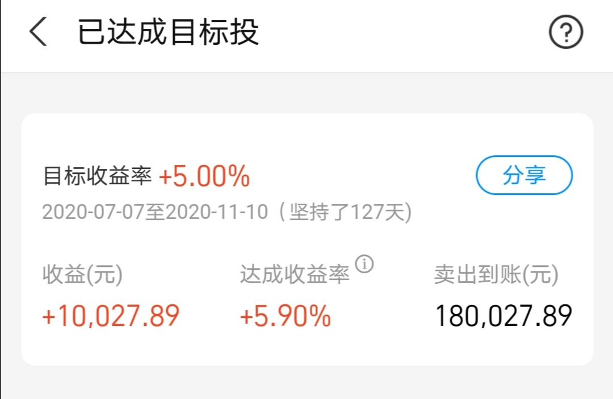

### 四天涨，周五跌都成惯例了

五天的交易又结束了，这应该是至少连续第三个星期，周一~周四负责涨、周五负责跌！好吧我们来回顾下这周资本市场发生了些什么？

1、周一因为美国选举结果明朗后，不止是我们大A股，全球主要资本市场都是涨声一片。我账户上多个目标投计划自动止盈了，其中时间最久的就是沪深300指数，为期127天，止盈收益为5.9%

 

2、伴随着本周的大涨，止盈的还有：煤炭、为期12天、获利+7.49%；钢铁、为期83天、获利+6.78%；中证100、为期78天、获利+5.52%；MSCI、为期89天、获利+6.26%；芯片、为期120天、获利+3.37%；酒、为期12天、获利+4.93%；日经225、为期90天、获利+6.35%  ，这些图就不一一贴了，总得来说本周还是有不小收获的，账户上的资金也回血了不少。

3、周一芯片是暴涨的，说实话我觉得涨得莫名其妙。以前说被打压后自主可控的逻辑，那么涨一波还理解，现在可能会适度放宽了，依然无脑暴涨。当然剩下四天的走势也告诉我们，无法被理解的暴涨很快就会坍塌，这也是为什么我们即便是定投也需要按需及时止盈。

4、中国恒大正式决议终止与深深房的重组计划，深深房在停牌4年2个月后复牌，第一天假装封了个涨停，后续就哐哐的炸下来。对于这种票，我建议普通投资人就看个热闹即可，弄个小板凳嗑嗑瓜子，它不香吗？

5、辉瑞宣布其新冠疫苗已经证明了超过90%的有效性，远高于美国FDA要求的50%。这个消息搅动了整个欧美股市，对应的去阿牛大宗也波动剧烈，毕竟他们都等着疫苗来恢复生产生活呢。对应到我们国内更多的是会改善民航的预期，这个也在股价上有所体现，其他的没多关联是因为我们国内早就日常化工作生活了。

6、统计局数据：10月CPI同比增长0.5%，预期增长0.8%，前值增长1.7%。主要是受去年同期对比基数较高、翘尾因素减少以及猪肉价格由升转降的影响。另外，10月PPI同比下降2.1%，预期下降1.9%，前值下降2.1%。

7、《关于平台经济领域的反垄断指南（征求意见稿）》表示禁止“二选一”、低价倾销、大数据杀熟、捆绑销售等行为。这一意见稿的发布让国内互联网巨头被重锤，其实我手里还是有一点中概互联仓位的，在这个意见稿的敲打下颓的惨目忍睹，但我暂时没有卖出的打算。

8、今天周五，都成惯例下跌了，真的很无奈。昨天开始国企信用债大幅跳水，起因是永煤集团一只10亿元短期债券“20永煤SCP003”，中诚信国际把永煤集团的主体信用等级由AAA调降至BB。经过债券市场的一系列传导，大家比较熟悉的苏宁、紫光、清华控股的相关债券也跌的惨目忍睹。于我自己而言就是手里还有点本钢转债，上次受华晨违约跌了一顿，今天又因信用债再跌一顿，具体操作上就是两次下跌我都忍住了没补仓，可以理解为我已经放弃了，还有五年多时间，要是这个可转债能上100面值我就卖出了，也不亏就当傻傻的定存了，买个教训。这个也让我对AAA级转债有了一个全新的认识，以后还是得绕着点走。好在我买可转债都是很分散的，我也再次建议大家投资还是要适度分散哈。

