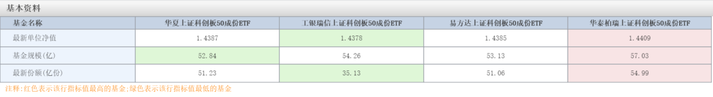
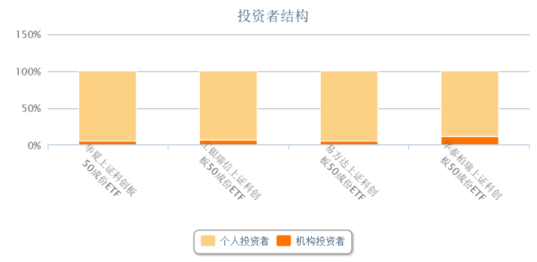

### 有些消费只是被延迟了

稀里糊涂又过了一周，我们来看看这周投资的世界又发生了些什么？

1、周一最大的话题应该就是RCEP正式签署，市场给予的反应也是符合预期的正面，受益的相关板块如：有色、航运、纺织等。我觉得这个是挺好的一个事件，即便澳大利亚今年和我们那样了，该签的还是签，能坐下来好好谈生意是很重要的。

2、白酒这块本周还算蛮活跃的，和之前略不同的是暴涨暴跌多为小市值白酒企业，到周四、周五的时候连黄酒、啤酒都开始热闹起来了。当一个板块都在小市值上做文章，甚至是边缘企业上做文章的时候，就该多想想是不是意味着这个板块的一个阶段结束了？今年还一个多月，很多基金的权重都有白酒，叠加过年消费行情，暂时应该不会有大幅回撤。但明年上半年呢？

3、周一ETF界最热闹的就是四家科创50ETF上市了，截止周五收盘规模数据如下（数据源choice,2020年11月20日收盘）：

规模：华泰柏瑞57.03亿（机构占12.01%）、工银瑞信54.26亿（机构占6.89%）、易方达53.13亿（机构占5.49%）、华夏52.84亿（机构占5.01%）。

其实我在查这组数据的时候，这规模排序是有点出乎我意外的，因为和这几天的每日交易额排序差异较大，这也是为什么我去查看第2张图（机构持有比例），只能说四家的规模之争还没结束，过段时间再看看吧。

 

 

4、华为的荣耀确定出售了，最终接手的是深圳市智信新信息技术有限公司。该公司由深圳国资委牵头，原荣耀30多家代理商、经销商一起设立。消息出来后之前的神州数码和TCL都应声下跌。

5、债券市场这周依然挺凉，紫光13亿的“17紫光PPN005”展期无果，构成实质性违约。华晨集团也在今天正式进入破产重整程序。还有就是苏宁的问题也在一直坊间传着，反正我还是老老实实每周20元苏宁会员的无敌券羊毛薅着。但企业债的风险会一定程度上反衬国债的安全性，买了国债相关的资产不要慌哈。还有永城煤电的债券问题牵扯了海通证券，协会将对海通证券及其相关子公司开展自律调查，然后就是毫不意外的一个大跌。

6、滴滴本周宣布与比亚迪合作生产的电动汽车“D1”将作为网约车车型正式投入使用，D1正式上线时间在12月，首个上线城市为长沙。滴滴这个想法我觉得还不错，车的用途专业化，可以做更多的定制和适配，同时也搭上了新能车的浪潮，合作方也是老牌的企业比亚迪。希望早点上海也投放这类车，我有体验下的兴趣。

7、百度刚要巨资收购欢聚时代（YY）准备在直播领域卡个位，没想到浑水立马来给你弄个做空。虽然直播领域的数据水分国内都是有心理准备的，但老外不管，你敢造假我就砸下来，反正股价是直线暴跌了。百度渐渐淡出了互联网的头部企业，这个事实我不知道该开心还是难过，三十年河东又河西！

8、最后说下今天去美年大健康去体检的一个感悟：有些消费只是被延迟了，并没有消失。
今年疫情的突然到来，本来大家开开心心过年、走亲访友、好吃好喝，但是最终都停止了。我们在新闻上看到很多海鲜小店主屯了一大堆食材等着过年大赚一笔，哪知道最后绝大多数都砸自己手里，因为有些东西过了这个时节不消费，大家就不太愿意补上了。但有的消费只会延迟，比如说体检。我们公司本来都是每年春天做员工体检的，但疫情的关系推迟到了11月份。
消费这个行业门道还是颇多的，我们有时候自己投资的时候也很难抉择。有人喜欢白酒，有人偏爱家电，还有人钟爱互联网消费服务企业，如果你不擅长或者感到困惑的时候可以去看看主动基金经理们是如何操作的。比如陈媛的华安生态优先就不错，作为女性基金对消费有独特的见解，专注消费赛道的她主要投资美妆、家电、食品等可选和必须消费企业。陈媛也将在下周（11月26日）新发一只消费基金：华安新兴消费（A类:010554 C类：010555），这个新基金还可以配置不超过50%的港股通标的，投资范围更广、选择也更丰富。新基金限额80亿，极具爆款潜质，有兴趣的朋友可以去看看了解下。