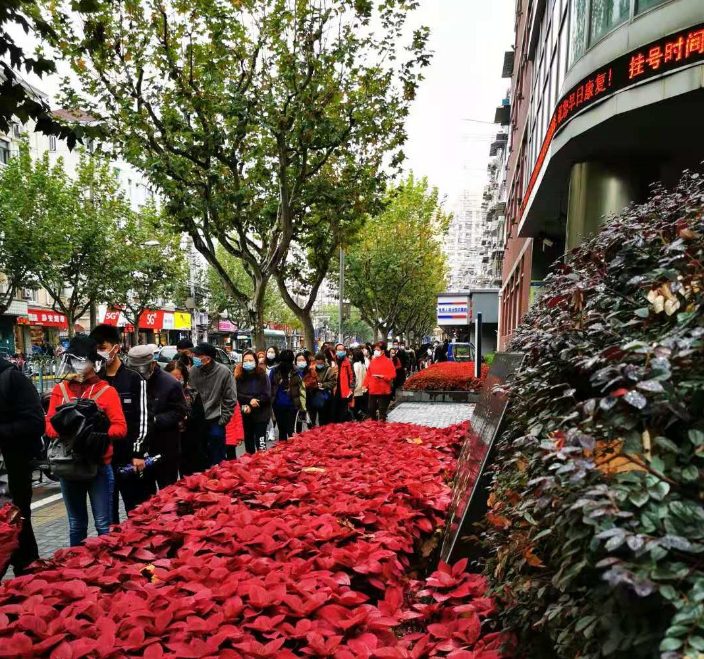

### 生活好了、饭吃得太软

又到周五了，上海是下了一个星期的雨，让人很不舒适。话说大家遇到连续的阴雨天小件衣服不够换的时候怎么办？闲话不多说，我们来回顾下本周都发生了些啥？

1、5只战配基金（华夏、易方达、汇添富、鹏华、中欧）之前增设B份额并修订基金合同及招募说明书。本周开始如果想要提前退出的小伙伴可以操作了，但我还是建议大家慎重。我觉得这几家基金公司和基金经理都没问题，如果你不是绝对地冲着10%蚂蚁去的，那么可以继续拿着，当然这只是个人建议哈。

2、美国那边顶层也基本确定了，我们也正式发去了贺电，反映到资本市场就是全球股市整体向好。与之对应的是本周我们的A股如上海的天气一样：阴雨绵绵。市场主流观点是医药、白酒等前期涨幅很大的板块开始有动摇的趋势，叠加年末因素才出现了这个情况。我个人觉得只要你不是超短线，这种波动不要太在意，也别被什么年末行情吓到，踏踏实实拿着就行。

3、这周新能源车继续发飙，暴涨暴跌真是热闹非凡。在外面的蔚来、理想、小鹏都是涨上天了，国内A股和新能源车有关的也是鸡犬升天。我印象深刻的是，我之前持有一个小康转债长期在面值附近徘徊，最近在正股的妖涨之下也摸了下130元，对于很多摊大饼的可转债投资人是一个很好获利卖出的节点。我个人对新能源车肯定是看好的，但是大家都炒得这么疯，真的好吗？我建议大家稍微克制点，先把新能源车的产量提上去再说吧。

4、本周金融地产板块还是不错，要不是这几个大块头撑着，估计上证指数又得很难看了。我昨天还发了一篇关于银行板块的文章，大意就是看好明年经济复苏，现在的银行依然可以布局。我自己的话在三个月前就在公开组合【薪火相传】里开始分批买入银行和地产了。银行这种板块要降低收益预期，在低估底部积极配置即可。

5、这周也有了几天煤飞色舞的行情，但昙花一现很快就跌回去了。还有在集采的影响下医药继续趴着，这个影响我觉得短期是很难消退的，整个行业需要重新适应这种模式，即便是头部的企业也需要时间修整。

 

6、这周二我带女儿去医院补牙和拔牙，现在很多孩子都是恒牙已经出来了，但乳牙还丝毫不松动。拔一颗完好的牙是一件很血腥的事情，而且孩子还那么小。拔的时候我是转过脸去的，但我脑海里还是久久不能拂去这残忍的画面。

孩子补牙已经不是第一次的，但之前让我抱着走到停车场我都没答应。这次她没说，我却主动问她要不要抱？拔过牙后嘴里塞了纱布的女儿不能说话，但略显虚弱的点了下头。平时抱她的时候总是动来动去、晃来晃去，今天异常的老实。手也很自然的圈着我的脖子，小脸侧靠在我的肩上。即便隔着口罩和纸巾，我依然能微微闻到她嘴里的一点点血腥味。

刚上完围棋课回来，她好像已经满血复活了，而我还为下午虚弱的她而感伤。医生给的建议是：日常饮食可以适度的吃点硬的食物，特别是小孩子，这样做对牙齿有利。

回来后我看了下医院的发票，最贵的居然是补牙的那个材料，名目是“复合树脂类填充”，单价120元。我们补了2颗就是240的材料费，关键这东西用量真的很少，一两只普通蚂蚁的大小就要240元。据说这个基本上被3M公司给垄断了，大大小小的医院以及一些个人的牙科诊所也都是3M的材料。

但不得不承认这种贵的材质确实更美观，记得我们小时候补牙都是用一个类似金属的东西补的， 完了牙齿就没那么好看，当然我相信这种材质上的优势肯定不止是美观度。所以随着生活水平的提升，自然而然大家会开始消费升级，而新的、更好的消费品就会有更高的溢价，一个企业能有更多的好产品，那么企业的股价也会对应的体现出来。这就是消费板块可以走出长牛的一个基础原因，因为人们对美好生活的追求是本能，是不容易受经济周期影响的。

