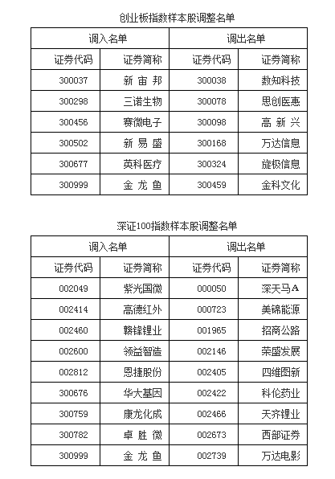
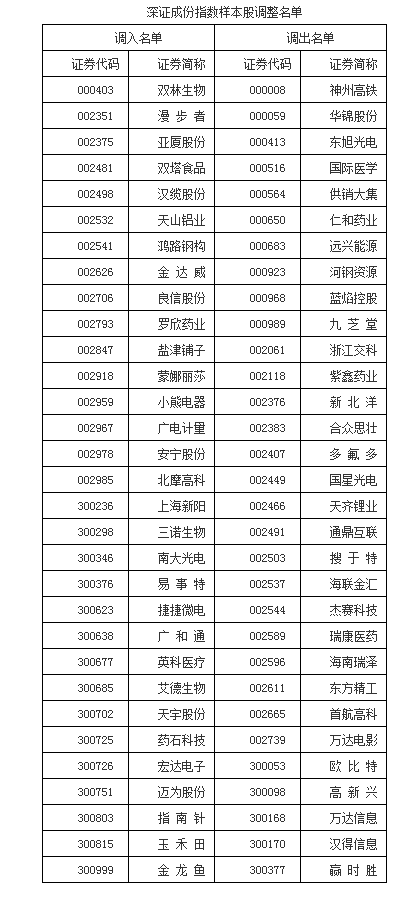
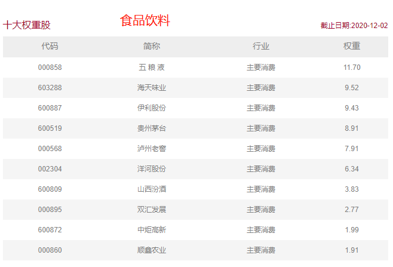
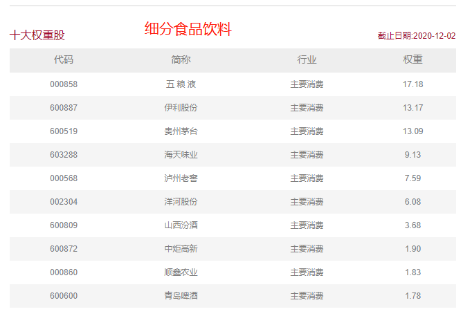

### 抗冻我不如牵牛花

真的很不喜欢冬天，冷我可以开空调或者取暖器，可最近每天中午的太阳都很稀薄，持续时间也就2小时不到。面对寒冷我还不及阳台上的这棵牵牛花，勇敢的它借着这仅有的一点点阳光，努力地孕育着这淡粉色的花骨朵。然后再一想现在才12月初，春天还要很长一段时间才来，我内心突然莫名的崩溃！好吧，收拾下寒冷的心，一起回顾下这周我们投资市场发生了些什么？

  

1、大宗和贵金属近期波动较大，上周末几家大银行都先后宣布暂停贵金属等业务新开户，看来年初‘原油宝’事件已经让银行十年怕井绳了。而且业内人士认为关闭后短期是不会再放开了，而且坦率的讲这块业务收入占银行比重很小，若你是银行大概率也会关停的。我建议普通投资人不熟悉的还是少参与这类交易，如果真需要投资黄金的可以场内买黄金ETF（华安、易方达、博时），场外的可以买对应的联接基金都是可以的。

2、果然和科创板扯上关系的都容易牵动大家的神经。这次各大指数调整成份股比以往更受大家关注，主要就因为：上海证券交易所和中证指数有限公司决定将上市时间超过1年的科创板证券纳入上证180、沪深300等成份指数样本空间。我给大家罗列下哪些科创板个股会被纳入：

上证180调入：688012中微公司；

上证380调入：688002睿创微纳、688006杭可科技、688008澜起科技、688019安集科技、688122西部超导、688139海尔生物；

科创50这次调入5个成份股，最关心的应该是688981中芯国际的调入；

沪深300调入：688008澜起科技、688009中国通号、688012中微公司、688036传音控股。

看了下被调入的基本上都是科创50指数的头部企业，别的我不知道，但大概率会进一步利好科创50的几个ETF。

3、上周四开始以银行股为首的金融板块加速了涨势，但本周一来了一招高开低走。本当大家以为和7月那次一样不具备持续性，金融行情就此结束的时候，周二起金融板块仍旧很坚挺。关于银行的观点我上周文章单独说了，现处于低估区间的银行是可以稍微配置点的，但要明确配置银行不是为了短期的收益，而且看多明年的中国经济。还有天弘基金下周一也会发一个银行ETF，天弘这种把好的场外基金申请发ETF的玩法还是很具特色的。

4、深交所也开始调整指数样本了，大家比较关心的金龙鱼(300999)  会同时纳入：深证成份指数、创业板指数、深圳100指数。
 

 
5、探月工程嫦娥五号着陆器和上升器组合体完成了月球钻取采样及封装，这个进展还是挺顺利的。我们国家持续的发力于航天航空科研是对的，这也是作为大国必须去承担的。

6、富时中国A50指数新纳入比亚迪、泸州老窖、爱尔眼科，剔除保利地产、智飞生物、中国联通，变更将于12月18日收盘后生效。

7、本周市场热点其实很飘忽， 昨天医药全线大涨，当然今天也还可以，我们【薪火相传】组合内的医药指数还是占比很大的，所以本周业绩也很稳定。还有就是沉寂了一小段时间后的白酒，在今天又嗨起来了，果然万物皆可利好茅台，你说找谁说理去，哈哈。说起白酒，这周华夏和华宝都获批了中证细分食品饮料产业主题指数ETF，两家基金公司也在基金的筹备中。我去中证指数官网看看这个细分指数和之前的中证食品饮料指数相比到底细分在什么地方？

【中证食品饮料指数以中证全指为样本空间，选取归属于饮料、包装食品与肉类两个行业的上市公司股票作为成份股，以反映食品饮料类相关上市公司整体表现，为市场提供多样化的投资标的。】

【中证细分食品饮料产业主题指数反映沪深两市细分食品产业公司股票的整体走势，该指数从食品制造等细分产业中挑选规模较大、流动性较好的公司股票组成样本股。】
 

 
8、上面我们也说了现在市场的热点轮动极快，整体的风格也不是很明朗，这种氛围下的市场就很考验投资能力和选股能力。如果你不是很熟练，那我建议还是选择一些业绩优秀的主动基金经理，比如华安的聚优精选（009714）。

买个靠谱的产品有时候比自己瞎折腾要好很多，华安的聚优精选的基金经理是饶晓鹏。饶晓鹏拥有13年以上基金行业从业经验，其中2013年末起管理公募基金，拥有6年以上公募基金投资经验。面对各式各样的市场风格，他都能带领基金趟过了波折，业绩一路向前，饶晓鹏始终保持前瞻性的视野洞察市场趋势。

截至2020年11月20日，饶晓鹏共有5个产品管理时间超1年，所有产品均取得正收益，且都跑赢了同期业绩基准，所管产品的历史年化收益均超25%，这种业绩还是很让人踏实的。

去年底去华安的时候见过他一面，听他演讲总觉他不善言辞，属于那种很踏实搞投资研究的，但是他的观点很鲜明、不含糊，我当时听后还是蛮受益的。我最近看他的观点是看好经济复苏带来的顺周期板块机会，这个从他所管产品的净值表现也看出了，很好的契合了当下的市场走势。有兴趣的朋友可以关注下哦！

