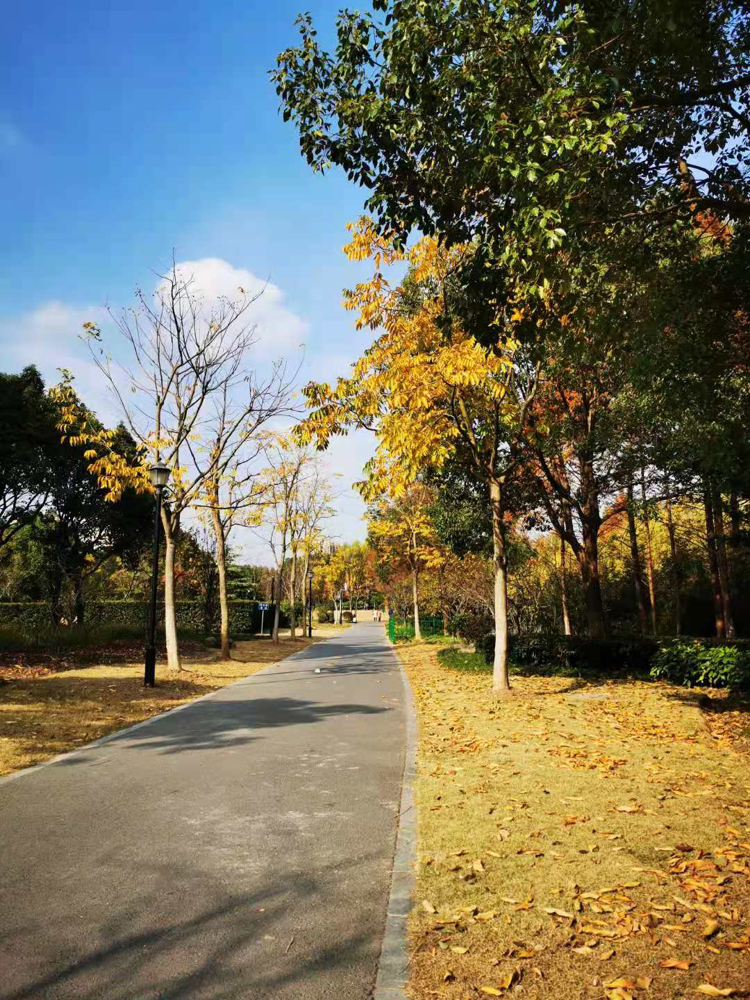
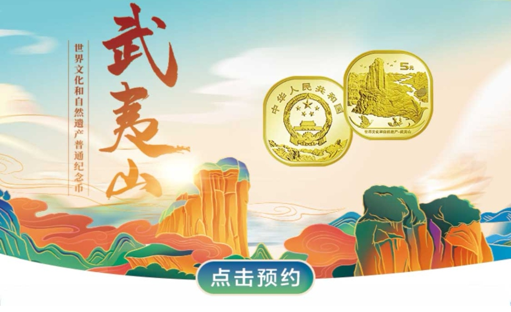
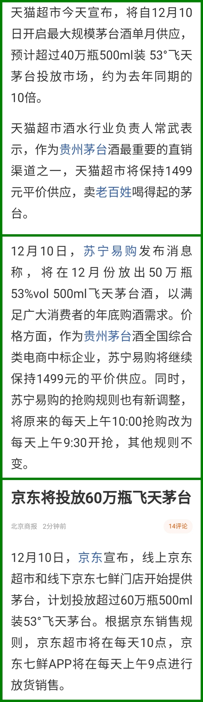

### 行情不行、太阳不错

本周三上海的天气应该是11月下旬以来最好的一天。吃过午饭就出去溜达了圈，这太阳晒得太舒适了，坐在长椅上听会歌真的是惬意。后来路过一座木桥边的时候居然闻到了一股淡淡的桂花香，走近一看才发现原来冬天有些桂花树也是会开花的。其实如果股市不太好，天气又不错，可以试试放下大盘，出来透透气。

最近一段时间让人不舒服很大原因就是热点板块轮动太快了，大家基本上都没啥利润可赚，运气不好还折在里面。年关将至又叠加很多不确定因素，导致大家对于热点的认知差异很大，使得散户也开始老老实实的观望着了。具体的表现有交易量持续低迷，很多板块也是一日游的行情，没有更多的追随者续上。那现在收拾下这糟糕的心情后，来回顾下本周都发生了些什么事？

1、上周末闹得比较大的一件事就：沃森生物以11.4亿元转让上海泽润32.60%股权，同时放弃增资的优先认可权，如果转让成功，那么股权从67.8%降为28.5%，上海泽润将不再是其控股子公司。

当时电话会议上投资人直接跳了起来，而且言语也非常愤慨。其实大家也能理解，毕竟泽润生物的前景支撑着沃森生物的高估值，你现在突然直接"贱卖"，是人都得跳起来呀。后来这事就在媒体上传开了，深交所也问询了，周一沃森生物公告说：暂不将转让上海泽润股权议案提交股东大会审议。

反正周一最后还是在跌停板上躺下了，要知道现在的创业板是20%的涨跌幅哈。周一单日成交量逼近100亿（机构触发风控直接跑路），后面四天也是保存较大的成交量，如果你看下最近半年沃森生物的股价就明白了，我建议大家还是看看戏就行了，没必要自己给自己弄个炒股地狱模式。

2、本周热点板块方面轮动极快，甚至有些是上午涨下午跌，连第二天都等不及了，比如今天的煤炭（行业的涨价逻辑）。整个市场的交易活跃度也很弱，抛开指数看个股那更是惨目忍睹，难道大家都在等着明天的双12打折吗？可惜明天是周六，股市不开门呀！如果非要说哪个板块还能看看，那首选肯定是白酒，涨得让你怀疑人生，近两年拿着茅台、五粮液这种不动人就能轻松秒杀99%的投资者，跑得好的主动基金也都是重仓食品饮料，就问你服不服！

3、本周的新股和新可转债都挺多，但现在很多朋友都和我反应说：打可转债真的太难了，很怀念去年那种弯腰捡钱的日子。说到弯腰捡钱昨晚半夜农行预约的武夷山纪念币有抢没？我去年泰山币懒得去弄，今年心里多少有点遗憾就抢了一套武夷山纪念币，还算比较好抢的。反正比1499的茅台要好抢的多得多，最近各大网购平台都在说要放出大量平价的茅台（天猫超市40万瓶、苏宁易购50万瓶、京东线上线下合计60万瓶），还大言不惭说卖老百姓喝得起的酒。嗯，你们都是大佬，居然开始重新定义老百姓了。

4、本周成都也出现零星的新冠本土感染者，引起了很大的关注，因为这次没有明显的证据表明是外来接触相关（机场、境外海鲜等）引起的。另外这次有位女士感染者的14日活动相当丰富，所以也引发了不小的动静，这个我就不评判了。新冠真的很顽固，已经伴随着我们一整年了，大家还是要注意安全啊。

5、本周还值得聊聊的就是张近东把苏宁控股股权全部出质给淘宝（中国）软件有限公司。前面苏宁的债券价格（多只债券在80元附近）就已经很能说明问题了，但苏宁方面一直予以否认，还说要追究造谣者。苏宁短期我觉得还能各方斡旋下，弄点钱缓解下当前的资金问题，但是整个苏宁集团还能撑多久？我是觉得大家还是绕着点走吧，毕竟企业已经没啥想象空间了（主营业务不赚钱，之前还能靠卖一点当年和阿里互换的股票维持下）。另外今年国庆开始苏宁易购给会员每周发20元无门槛抵用券，这个活动很实在，我每周都会支持下，我想着这是我最后能帮到苏宁的事了，哈哈。
