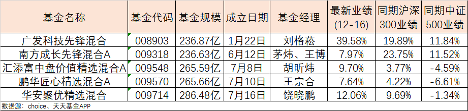

### 周期股又嗨了一把

经历了上周磨人的行情后，本周剧本竟是涨四天半再回调半天。但不管怎么说本周还是再次突破了3400点，当大家都以为最后两周对3500的高位没啥幻想了，但今天这一出让你又开始心存侥幸了。那么我们就来看看这周都发生了些啥？

1、市场监管总局对阿里巴巴收购银泰商业、阅文集团收购新丽传媒、丰巢网络收购中邮智递等三起未依法申报违法实施经营者集中案作出顶格处罚（每家50万）。上层的意图更多的是敲打下巨头们，希望他们不要总是把精力放在这种收购合并且意图一家独大上。之前官媒针对‘社区团购’也发声了：互联网巨头别只惦记着几捆白菜；不热衷于短期变现；在科技创新上要有更多担当。

看了这几个消息后，有朋友问我那你一直推崇的中概互联是不是不行了？我说中概互联已经徘徊了很久，我对中概互联的认知就是：长期不涨就是跌、每次下跌都是上车机会、中概互联需要适度阶段性的止盈。包括美国对中概股的打压（纳斯达克将于12月21日把中国交建、中国铁建、中国中车和中芯国际从其指数中剔除，以遵循美国政府限制购买这些公司股票的行政令。另外富时罗素、道琼斯、MSCI也删除它们了。），我觉得问题不大，巨头在港股都已经有了二次上市，而且阿里腾讯的海外投资人占比也不小，牵涉面很大，我们不必惊慌，中概互联是一个值得去买的指数基金。

2、本周周期股又是大爆发，今天动力煤期货直接涨停，最大的原因我认为还是美国指数的趋势性下跌，而且大家对于这种趋势认知上很一致。这两天的有色、钢铁、煤炭都是大涨，煤炭更是在部分省电力紧张的情况下走出了暴涨行情，中证煤炭指数今日涨幅+6.33%，联合昨天周四涨幅近10%，这个还是很惊人的。对于周期能源板块，我认为明年还会延续涨价行情，美国明年继续放水也是板上钉钉了，我们和袋鼠国的关系也是不太好。综上，我认为便宜的时候可以稍微配置点有色、煤炭、钢铁，我自己主要是买对应的ETF，有色买的是南方基金的，煤炭和钢铁买的是国泰基金的，流动性都是可以的。

3、上周末还出了个新词“需求侧供给”，但是本周看也没太大动静，参照当年的“供给侧改革
，我觉得后续可以多关注这方面的变化，这种大方向如果抓对了，并先人一步，那定会事半功倍。

4、第四批药品集采已开启，但这次官媒没有像之前那样大规模报道细节，估计也是想给药企留一点底裤，不然真按死了也不是好事。可以看到本周医药有了一定程度的回暖，昨天恒瑞甚至触及涨不停，要知道恒瑞股价已经趴着很久了，当然恒瑞的涨停主要是因为它有药物进入了医保目录。

5、本周沪深交易所对退市规则做了部分调整:

a、低股价退市标准改为连续20天收盘价低于1元。

b、增加了连续20天市值低于3亿的退市标准（略鸡肋）。

c、财务类指标增加了扣非后净利润为负，且营业收入低于1亿元的组合标准。

d、取消暂停上市和恢复上市环节，退市整理期改为15天。

长期看这肯定是算利好的，但是我个人觉得中证800指数成分以外的个股基本上就别看了，珍爱生命，远离僵尸股。

6、中芯国际联合CEO梁孟松请求辞职这件事也是炸开了锅，隔行如隔山，但是从公开资料看梁孟松确实是个人才，看他近千字的自述也是挺实在。我仅从自己也是一个技术员工角度出发说几句，技术搞得好的大多不太喜欢那些复杂的人事关系和管理斗争。但现状就是纯技术员工往往是被压榨的最厉害的一群人，那些领导高层表面上谈着技术很重要，暗地里都是业务导向。销售部门的绩效就要远高于技术部门，因为在绝大多数高层眼里，你技术部就是纯支出的部门，人家销售部才是收入部门。

7、瑞幸咖啡与美国证券交易委员会（SEC）已就部分前员工涉嫌财务造假事件达成和解。代价就是瑞幸咖啡将支付1.8亿美元（约合人民币11.75亿元）以达成和解。瑞幸咖啡这是国内已经罚过了（约6100万），而且后面美国股东还会告瑞幸咖啡，这种财务造假在美国一告一个准，可怜的瑞幸咖啡。

8、截止12月17日，今年新成立基金数量已高达1339只，总规模达30141.95亿元。这个数据有多恐怖？2020年的新基金规模超过了2017年、2018年、2019年三年的总和！这也直接导致今年公募基金出了很多爆款，以200亿元为界限的就有5只（广发、南方、汇添富、鹏华、华安）。
我们上周说到的华安聚优精选混合（009714）就是这5只基金之一，我们通过下表的数据也能很明显的看出该只基金业绩还是很不错的。

华安聚优精选的基金经理是饶晓鹏，他给我的总体感觉是风格低调，奉行行业均衡、不追逐热点、属于严格的价值投资派。饶晓鹏作为“中生代的宝藏基金经理”，跟业绩辉煌的老将比更年轻有活力，跟新锐们比风格更稳定，扮演者一个很不错的承上启下作用。有兴趣的朋友可以去关注下这只基金。