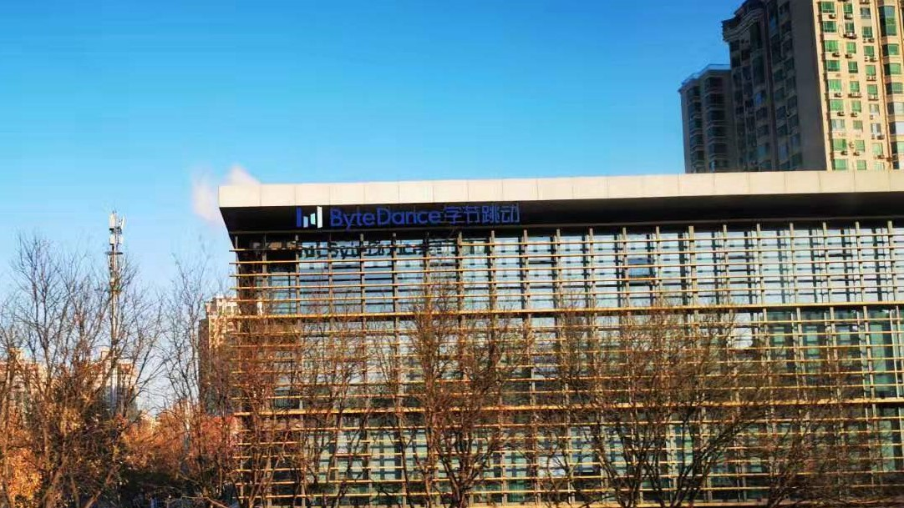

### 没等来北京的雪，却有新冠

1、上周末开了个重要的经济工作会议，几个重点罗列如下：①强化国家战略科技力量；②增强产业链供应链自主可控能力；③坚持扩大内需这个战略基点；④全面推进改革开放；⑤解决好种子和耕地问题；⑥强化反垄断和防止资本无序扩张；⑦解决好大城市住房突出问题；⑧做好碳达峰、碳中和工作。

本周国内资本市场的波动很多都是围绕这些点展开。比如为了响应反垄断这事，24日市场监管总局对阿里巴巴关于垄断行为立案调查（阿里股价周四晚上也暴跌），央行、银保监会、证监会、外管局也在近日约谈蚂蚁集团；比如种子问题第一次被拔的那么高，农业板块周一大涨以示庆祝；上面说住房问题依旧突出，那么这种地产板块也是继续下探阴跌....

2、互联网存款“主动”下架这事就不细说了，反正本来就不是什么长久的产品，也不符合当下对互联网企业的态度。但可转债破发这个事情可以说说，比如本周永安转债上市当日就破发，而这还只是一个开始，现在整个可转债市场已经凉到了冰点。（提醒下，可转债打新现在又到了需要稍微看看的时候了）

为什么这么说？我们知道很多人买可转债就是想着能涨到130元以上后强赎，这样各方皆大欢喜。而且即便后面没涨，也不会跌破面值很多，毕竟还有债券属性，可今年债券市场已经发生多起实质性违约后，机构和个人投资者都已经心凉了。借债这东西一旦没了信任支持，那么你说啥大家也都不再信了，信任的建立很难，但要破坏就很容易。

我自己对于可转债的态度也两个月前就说了，盈利的逐步撤退，亏损的也不再补仓，再便宜也不补，本钢转债是我今年最失败的一笔投资，即便我现在仍愿意等它慢慢恢复，但为此我付出了太多的时间成本，我显然有更好的投资去处（这是一个深刻的教训）。

3、高瓴在最近获得隆基股份6%的股权后，成为隆基股份的第二大股东。这个标志性举措让本周光伏板块直接炸锅了，以华泰柏瑞的光伏ETF成交量为例：周三上午成交量11.01亿、周四上午成交量10.31亿。这可是一只行业ETF半天的交易量哦，足矣展示光伏板块的火爆程度。

4、本周行情基本上还是涨一天、跌一天，这种磨来磨去的日子其实挺难受，也挺无聊的。还有最近比较受争议的白酒板块终于在本周有了两次比较像样的回调，国家也说要整治下囤货的情况，那些看空白酒的人就很开心。其实我还是那个观点，在经济没全面恢复前，白酒大方向还是往上的，适度享受泡沫的过程，但也随时做好雪崩前撤退的准备（白酒行业盘子那么大，要逃还是有足够的时间的）。

5、上面说了反垄断的问题，本周中概互联被锤的很厉害，毕竟那些互联网巨头有几个没做过“二选一”这种事情呢？如果你没干过，只能说明你在互联网行业还不够强大，没有资本让用户二选一罢了。中概互联的问题我上周说了，这个行业本身的前景是没问题的，大家需要给他们一点时间调整，国家监管也不是说要弄死他们，只是不希望真的只盯着白菜这种小事，希望互联网公司利用自身高效去便利大家的生活、去提升整个社会的效率。所以慢慢定投，中概互联的春天会来的，最后活着的不一定是阿里和腾讯，但互联网这个行业是现在生活无法绕开的。

6、今天在北京参加个活动，本来想着最好能遇见场大雪，可惜只等来了新冠病例的消息，北京的街头人人都带着口罩。这次活动也遇到了好几个熟悉的大V，我们休息的时候聊聊今年各自的收益，有人也感叹折腾一年了，其实选个业绩好一点的基金经理也是蛮好的，关键还省心。

所以，对于主动基金的选择，基金经理的选择就是重中之重，这个直接决定了你持有期间的收益水平。有的基金经理就是行业偏好很明显，这就需要市场风格配合对应的基金才能有好的业绩，不然也就很稀疏平常。有的基金经理就是均衡型选手，能对市场风格的变换有个很好的预判，即便大盘在震荡中也能获得不错的收益。

上周我写了一篇《今年新发基金已超3万亿了》，其中提到的华安基金饶晓鹏就是我刚说的均衡型选手，我们在盘点其历史管理的基金业绩时发现，他所有的产品年化均超25%，要知道其中两只管理时间已经在5年左右了，是经过牛熊考验的。

发了这文章后，也有朋友和我说饶晓鹏换手率不低呀，在我翻阅的资料中发现的确如此。但他不盲目参与抱团那些消费、科技、新能源等，而是做到了行业均衡和坚守自己的一套价值投资体系。我们看一个基金经理最重要的还是关注其长期的收益是否优秀且可持续，能否适应不同的市场风格和牛熊变换。今年饶晓鹏发的爆款基金华安聚优精选混合（009714）业绩还是不错的，大家可以去了解下。

 