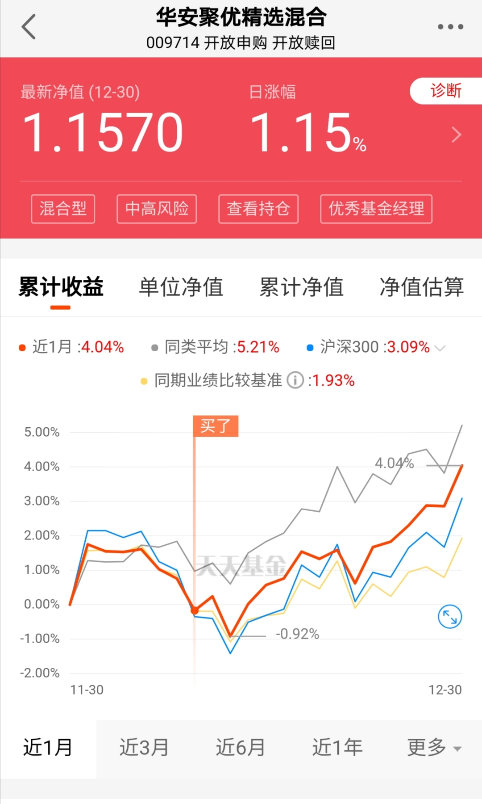

### 2020就这么过去了

2020年就要结束了，大家总在说今年真的“太难了”。但你回头细看有些方面也并非如此：新冠疫情让全世界都卷入了一场世纪灾难中，众多经济体一度停摆，可我们的股市又以肉眼可见的速度爬升上了一个新高度。就如昨天上海气温首次突破了零度，出个门肯定能把你耳朵冻到麻木，但如果你正午时分在向阳的封闭屋内，坐在落地窗边看会书，还是能很明显地感受到暖暖的阳光照在身上。明天元旦股市休市，那么我们本周的周报就提前今天发掉，让大家过一个愉快的元旦假期。

1、昨天和今天整个股市都是其乐融融，特别是今天作为2020年的收官日，上证涨了1.72%突破前高。上证今年涨13.8%，深证成指、创业板指今年分别涨38.7%、64.9%，就创业板这涨幅在全球都算顶端了。2020年上证收官于3473.07，希望这份暖意能延续到2021年，也提前祝大家明年能继续发财。

2、日本的元旦过节还是很隆重的，加之最近疫情都有卷土从来的可能，所以日本宣布1月暂停它国人员入境，同样欧洲那边也是有类似的断飞或阻止入境。国内也是部分省份出现了零星的本土病例（并有加剧的事态），这个相对于单纯的境外输入更让人担忧。担忧的不是防治和控制（我对现在的防控还是有信心的），是担忧因此带来的人员不再流动，进而再一次影响春节的消费行情。现在我们还是很在意内需的，所以我还是希望本土疫情在最近还是要消灭到个位数的，不仅可以开心过个年，还能拉动经济。

3、游族网络董事长在圣诞节去世这个事之前一直没讲，就是想着等有个可靠的官方结论后再谈谈。我的第一家公司就在游族网络的马路对面（和我们公司都是2007年上市的），那时候加班餐经常会路过他们那边。创始人今年才39岁，也就是说游族上市的时候他才不到30岁，再看看自己已经30出头了，还是这么平庸，有点唏嘘。但这个事情也告诉我们，活着比绝大多数事情都更重要，剩下本次事件八卦的部分就不多展开了，这两周大家都聊得差不多了（对了，不少上市公司的公告真是毫无可信度），最后说一句游族网络这种股票吧，还是绕着点走。

4、比特币截止我写稿的时候已经突破2.9万美元了，要知道10月初的时候才1万刚出头啊。这种涨幅，我身边很多炒币的朋友都直呼发生了啥？大部分人都卖飞了。因为国内没有合法的交易平台，所以我自己没有参与，但这个东西我一直有关注，是一个有趣且不容忽视的投资标的。但我多次强调，数字货币除了比特币，其他的大家都尽量绕着点走，不然分分钟被割韭菜。为什么又想起说比特币呢？因为今天广汽蔚来官方微博宣布：成为中国首家接受比特币支付购车款的汽车企业。然后修改将“比特币”更改为“数字货币”，后面又把这条微博给删了。

5、昨天官宣中欧投资协议谈判已经完成，后续会开展文本审核、翻译等工作，力争推动协定早日签署。今年还有个比较正面的协议签署是RCEP，这些协议的签订对于我们肯定是利大于弊的，我们后面在外贸这块也会更有斡旋的余地。再次希望我们国内的疫情能持续控制好，国外的疫情也能早日疫苗免疫，长此以往对大家都没有好处。

6、大家还记得我这个月初提到的华安聚优精选混合（009714）吗？我们投资中总说要知行合一，那我就是这么做的（见下图）。

其实熟悉我的老朋友都清楚， 我在前几年对主动基金是很不信任的，但这两年接触的基金经理多了后，再加上受一些基金大V的影响，最关键这种肉眼可见的超额收益实打实的说服了我。

饶晓鹏历经多轮市场牛熊转换，妥妥的业绩长跑健将，以往的业绩也体现了他应对不同市场风格的优秀管理能力。在行业配置上，饶晓鹏对制造业和金融业做核心配置，其他行业均衡配置，呈现一种“核心-卫星”双擎驱动策略，也是饶晓鹏能够适应市场风格变幻的有效策略。

如何你对于2021年的投资还有所迷茫，不知道自己该怎么操作，那可以了解下这只基金。