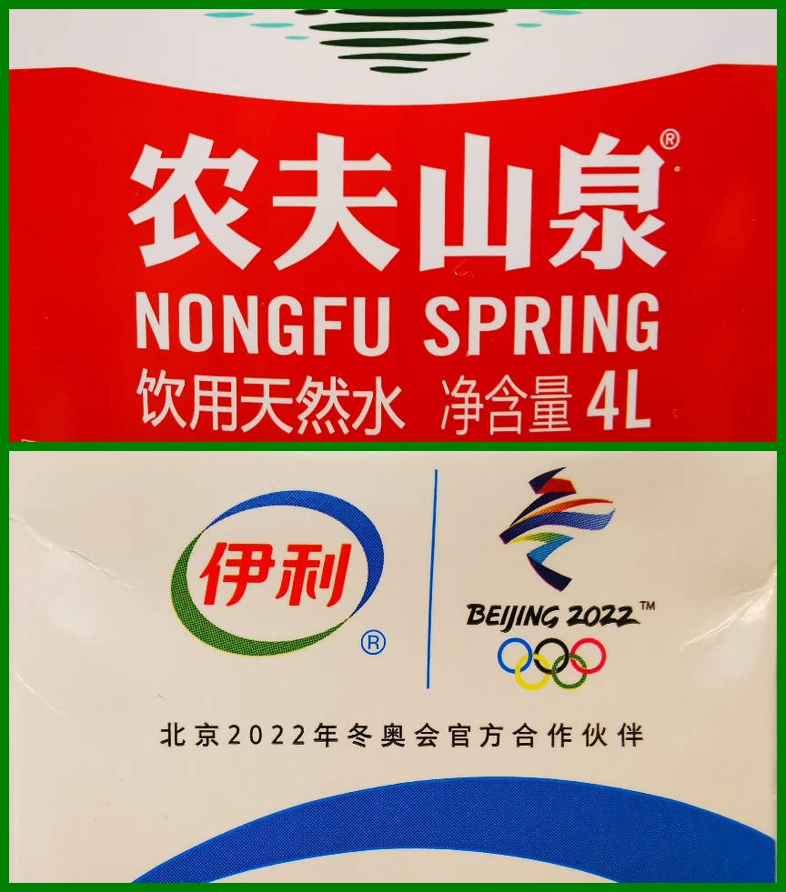

### 指数涨、个股跌，2021指数基金依然是当打之年？

最近两天上海的室外温度都突破了零下8度，这应该是我毕业后来上海最冷的一个冬天了。反正阳台的多肉已经被冻得差不多了，我也懒得去搬进来，任其自生自灭吧。之前中午饭后还会趁着有太阳出去走个五六公里，最近是实在冻得头冷（刚淘宝下单买了个雷锋帽），现在唯一需要出门的就是去丰巢拿快递和去自助柜拿生鲜。这种极寒天气，不管南方还是北方的朋友（不含在海南度假的），都应该注意保暖和出行安全。闲聊结束，老规矩开始一周的事件回顾：

1、2020年我们心心念念了一整年的3500点，难得的闰年366天都没突破。2021年第一个交易日就轻松拿下，并且全周都站稳了，你说气人不气人。本周多日成交量破万亿、每天有超100亿去抄底港股，总得来说有点内味了（但券商板块依然没啥大动作）。本周是2021年的第一个交易周，但市场行情把指数和个股的分化推到了极致。周一到周四三大股指都是上涨的，可每天下跌的个股数平均近2500家；周五三大股指微跌，但下跌的个股依然逼近2000家。真可谓旱的旱死、涝的涝死，我自己对指数的投资占比还是蛮大的，所以本周收益还不错，即便面对窗外的严冬，我内心也还算舒适。

2、上周末爱尔眼科的事情发酵地很热闹（网红医生在爱尔眼科手术后，视网膜脱落近乎失明），其实我周末在便签上已经写了：若爱尔跌停，即买点。上一次写这个条子还是12月沃森生物跌停的时候，可惜这次历史没有重演，大概率是像我这样等着抄底的人很多吧，很难砸下来。关于这种玩法说说我的看法吧：只要企业大的逻辑没有变化，这种看似民间的舆论不会对企业经营有啥实质的影响。当然这个适合于大市值的企业，且产品或服务有较强的实力，并且整体估值不能过高，市场情绪要足够宣泄后才好介入。总得来说还是舔刀子的活，入门级投资者还是慎用。

3、福布斯富豪榜最近又有变动，马斯克超过贝佐斯成为世界首富，钟睒睒超越巴菲特排全球第六（中国首富、亚洲首富）。农夫山泉从筹备港股上市起，这位一向极度低调的企业家就不断被媒体提及（也教会了大家一个生僻字‘睒’）。但他本人继续保持一贯低调的行事风格，我个人还是蛮喜欢这类闷声发财的大智慧。据说现在很多国内顶级的企业家都会花钱让自己尽可能的少被报道，尽可能的不要出现在大家的视野里。因为他们只想把自己的产品渗透到大家的生活中去（卖水真的是一门很好的生意），而不是他们企业家自己本身。这一对比，同为浙江的企业家就凸显出几个月前说错话的那位外星人，现在也是一点消息都不敢出了呀，不禁令人唏嘘啊。

4、受牛奶涨价的影响，乳业公司股价都暴涨，龙头伊利更是创出了历史新高（我买乳企股票很大程度就是为了赚点一家人的牛奶费）。泸州老窖自2021年1月4日起，52度国窖1573经典装团购价建议1050元/瓶，零售价建议维持1399元/瓶，38度国窖1573经典装团购价建议750元/瓶，零售价建议999元/瓶。食品饮料真是个好生意（再联动下上面那段我说卖水也是个好生意），实在不行了就涨点价，因此我个人对于乳制品行业的股票还是比较看好的（我自己买的不是伊利，但本周也涨停过了）。如果你不是很有把握选个股，那么现在食品饮料也出了两个场内的ETF（华夏基金和华宝基金），对于普通投资人还是蛮方便的。

5、本周可转债继续出现上市即破发的情况，面对一些评级和质地较差的可转债很多大V也纷纷开始提醒【不建议申购】了。去年债券暴雷后连带可转债板块是越走越差，我自己之前也说过，对于可转债的一些底层逻辑和以往不一样了，我们还是审慎一些。对于那些仍旧在摊大饼的朋友们我想说，方法策略可能没啥大问题，但这次你们牺牲的时间成本可能不小，我自己也深受其扰。说到可转债那就再说下本周上海电气的骚操作吧：电气转债本来2月2日就要到期了，要知道这个AAA级转债当年发行了60亿，至今还有38亿多没转股。眼看着电气转债一直半死不活，很多人都开始放弃了，它突然出了个公告，其中提到了“光刻机”。然后周五正股上海电气直接涨停，港股更是收盘于+19.92%，转债也很配合+8.63%，顺带把转股溢价率拉回到-1.48%，转债周五收盘是116.76元，比赎回价的106.6可高了不少。依港股的趋势，下周还可能继续冲刺，坦率地说这一招就是真的很有效。

6、纽交所最终还是准备摘牌三大运营商，这个事情一周内反复了好几次（先说要摘，后来又说不再计划摘牌，最后又要摘了）。虽然这三家在港股也都有上市，在纽交所的那点交易量回港股其实也没啥问题，但这种美国政府和交易所随意的姿态和对外展示出来的意图就让人很不舒适。而更让人不舒服的是：我们还没办法，只能憋着。

7、石家庄的新冠疫情很是严重，确诊人数激增，客运总站暂时停运。12月以来国内疫情事态明显恶劣了不少，现在已经有多省市建议大家留在本省市内过春节。我还是认为这个事会影响大家春节消费的意愿，最简单的就是我老婆部门每年都有的冬季团建已经取消了，我刚还看到有些贺岁档电影又要延期了，唉！

