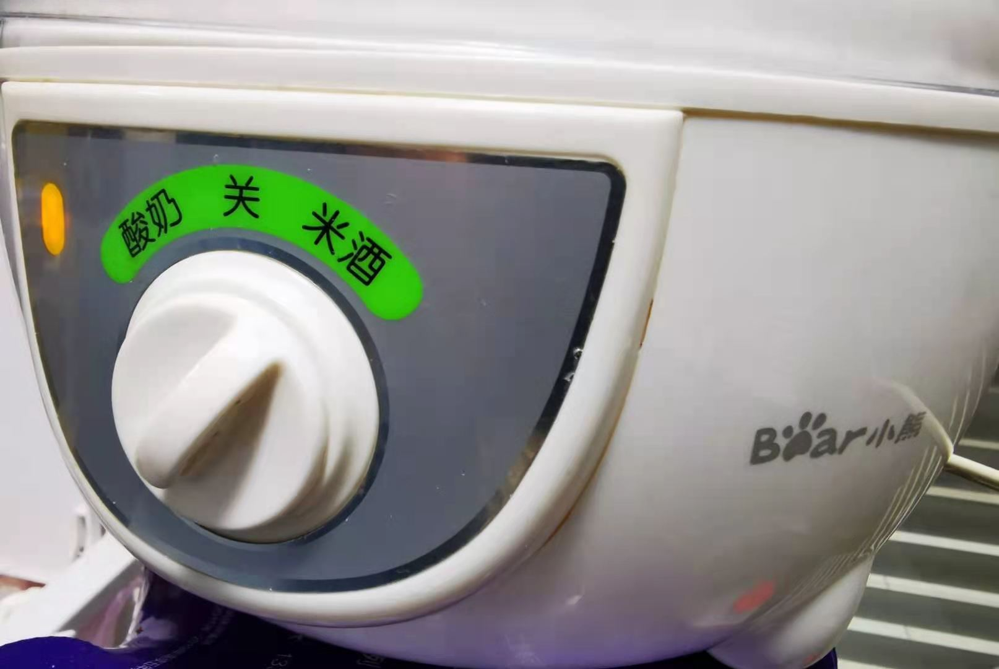
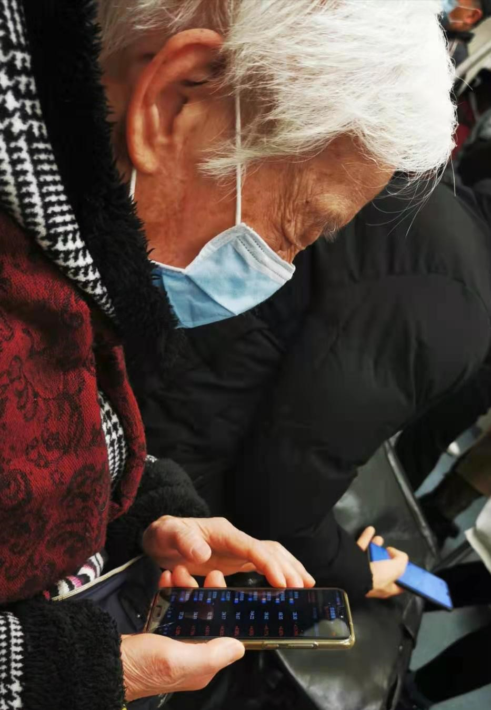
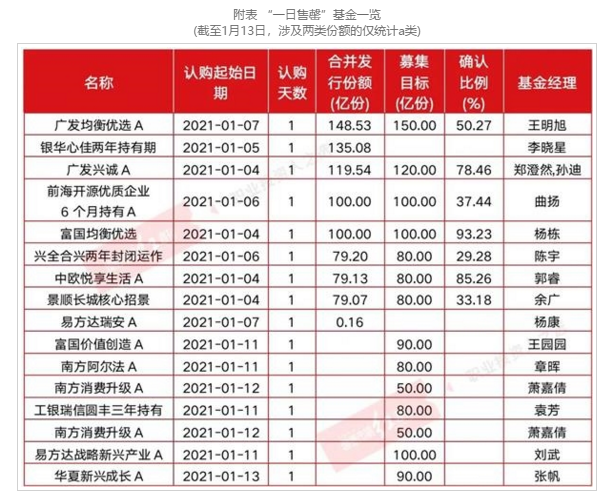
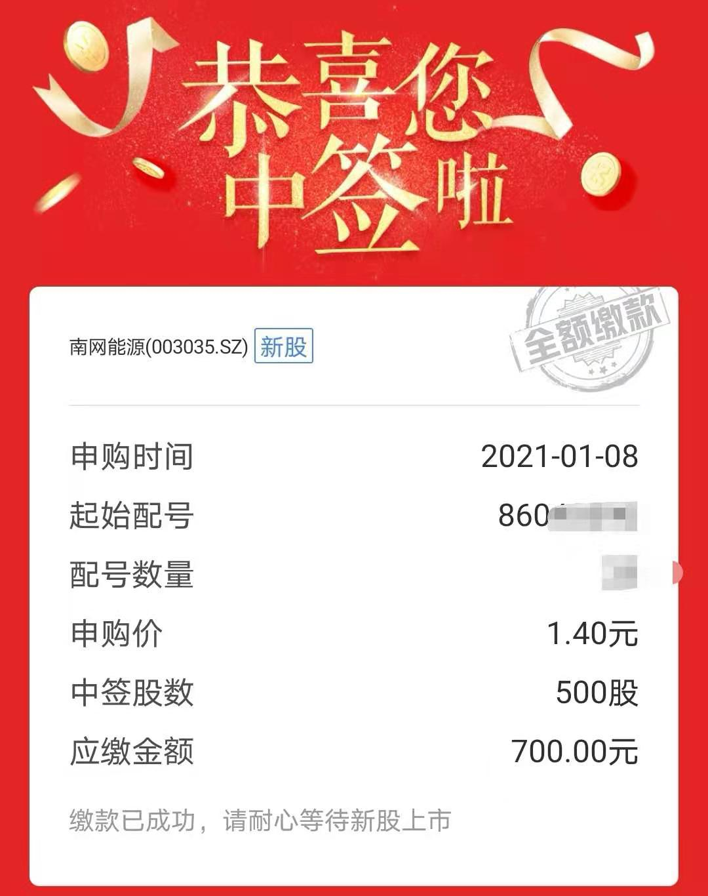

### 冬日米酒，好像还不错！

上周刚买完雷锋帽，这周不但不冷了还蛮热，中午出门有种春天了的错觉。快要过年了，在家稍微整理了下，翻出来柜子里几年前买的小熊电器米酒酸奶，做了一碗米酒（对于不喝酒的我来说，米酒可能是我唯一敢主动尝试的酒精饮品了）和一大杯酸奶。自制的和外面买的还是有一点点差距，但偶尔体验下还是不错的，这也算是人类利用微生物的两个典型例子了。

 

1、本周把优酷独播的《巡回检察组》追完了，剧情和《人民的名义》根本不能比，整个剧也是充斥着各种植入广告，唯一可以表扬下的就是部分老戏骨的演技。我发现优酷手机端已经支持3倍速度播放了（ipad暂不支持），说实话现在的国产剧不倍速播放真的没法看。最近两年优酷、腾讯、爱奇艺都有很多自制或者独播剧，但我个人感觉爱奇艺和腾讯视频要明显好于优酷。顺带联想下即将下架的虾米音乐，阿里巴巴集团的文娱真做得不算出彩，有些现象背后是有共性的，也不是什么偶然。

 

2、与气温一起回暖的还有A股，上证站稳3500点后又爬上了3600点，2021年每日的交易量也是一直稳定在万亿级别。我地铁上都能见到白发老奶奶在炒股了，虽然我相信她是一位优秀的资深老前辈。昨天去按了个背，出来的时候听到美容顾问在和她同事聊炒股，我就问：你都买了些啥呀？她说：瞎买买，反正也不懂，听说新能源车不错，就买了点上汽集团。我说现在新能源已经不便宜了，何况上汽的新能源成分不高呀，我觉得你可以有更好的选择。然后我追问买了多少呀？她给我看了下7千多元。我说，那你就随便玩玩吧，反正也没几个钱。她想让我坐下来继续聊聊，我心想这位带不动啊，赶紧找个借口溜了。

 

3、白酒出现了一定的回调，金融地产被翘起来了，特别是银行（本周中证白酒-7.99%；中证银行+5.07%），有种和珅跌倒嘉庆吃饱的感觉。每次白酒下跌一点就开始很多喊抱团要崩了，风格要转移到金融地产上去了，我觉得这个结论还为时尚早。一个是这点跌幅根本不会让那些买茅台和五粮液的人所动摇，你只要接触过这类白酒的拥护者你就知道他们是多么笃信白酒的长牛；二是银行板块虽然最近一些业绩预期好转了，但大家还是有很多担忧，现在的行情还不足以支撑银行的大反弹。但我也要说下，当下的银行地产依然具备适量配置的条件，是一个很好的组合内底仓和对冲成分。

4、上周多只大规模基金一日售罄，本周延续了这个节奏，真的是热闹非凡。现在头部的基金公司限购发个80~100亿的产品，如果你一天卖不完都不好意思出门和人打招呼了。其实从2019年开始就看得出，越来越多的投资者开始借道基金参与股市的投资，这也使得公募基金成了市场增量资金的重要来源之一。在大规模公募基金引导的市场氛围之下，大市值股票依然会具备‘抱团’优势，如果你还是一位个股投资人，那么不在中证800指数成份股内的票，就可以直接pass了，没必要给自己的投资增加选择难度。

 

5、这周中了一个总价值700元的新股，我也是醉了。我没去查是不是历史上最低，但肯定是我中过新股里最便宜的。南网能源发行价1.4元，每签号分配500股，总价值700元，就算翻倍也就一顿饭的钱。但一细想总比没有好呀，和老婆分享了这个“喜讯”后，她立马提议去吃顿烧烤，我说那还有多的呢？她头也不抬地回到：上市开板了再去吃顿海底捞。。。

 

6、周五上市的大秦转债也值得讲一讲，虽然我一再强调现在的可转债行情已经和之前有了不小的变化，比如说无脑打新可能行不通了，还有不少企业真的存在没钱还，也没能力运作后促成转股了。但大秦转债这种质地优良，正股又是出了名的现金奶牛，这次发行320亿超大规模的可转债很多人在说会不会破发？其实很多看好大秦铁路的人都巴不得你们破发，然后来捞点恐慌的钱，而且你一细想这操作性价比还很好、很安全。之前还有类似的标的如：招路转债，同样是正股靠谱、AAA评级、有破发的可能和事实。但这种稍纵即逝的机会，如果搭配条件单会更省力，善用工具也很重要。
