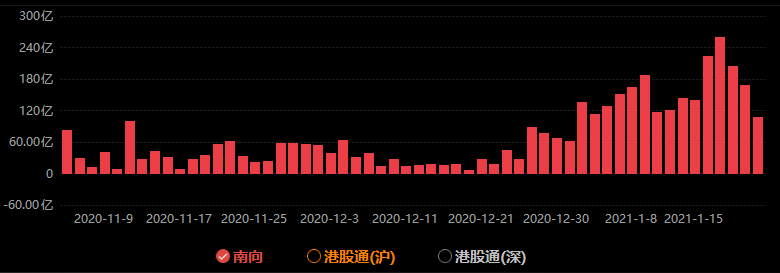
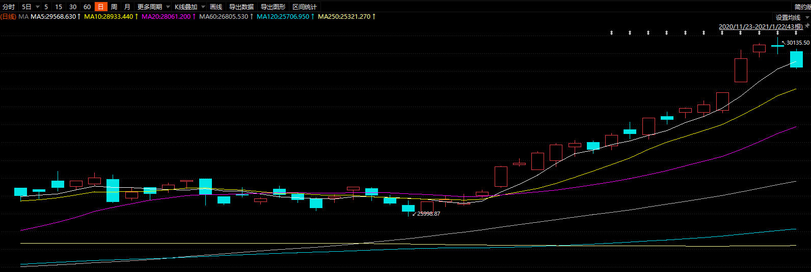

### 核酸检测被捅真的太难受了

周一起来后肚子一直不舒服，上午要么躺着、要么就是在马桶上蹲着。下午开始肚子好点了，但发现体温上去了，睡一觉后依然没有退烧的趋势，人也一直处于无力的状态。傍晚体温已经高达38.5度了，一想到我圣诞节还去了趟北京，最近国内本土疫情又有抬头趋势，保险起见还是去医院做个核酸检测吧。我本以为是口腔检测，哪知道我们家门口的这个三甲医院是鼻子检测，这酸爽的检测经历让我久久不能忘却。那天因为急性肠胃炎也抽验血了，平时我是蛮怕抽血的，但这次是在被捅鼻子之后，感觉抽血简直就是小儿科。讲完了这糟心的经历，那就开始我们一周的回顾吧：

1、本周美国的换届终于落定了，美国的疫情大概率会有所好转，至少不会再像去年那样胡来了。和积极防疫同时的，肯定会有更宽松的货币政策。美国持续放水会引导全球的批量放水，至少2021年我们还能继续享受放水的“舒适”生活。我个人的建议是不要全部放在医药、新能源、消费等板块，可以适度地配置一些会受益于涨价的资产。

2、本周另一个热点是南下资金热、港股报复性反弹（周二多只港股板块ETF涨幅超8%，甚至有几个直接涨停）。1月份每个交易日的南向净流入资金都是超过100亿了，你回头再看去年11月、12月发现基本上就是在20~50之间徘徊。我们去年A股涨的那是热火朝天，港股却一直萎靡不振，现在资金大量南下，也是合情合理的，今年港股大概率有表现的机会。还有近几年新出的基金都留了口子可以买港股（通过港股通），老基金很多也积极修改规则去尽量可以配置港股，当下港股确实是一个可以适度配置的资产。

 

短期翻倍资金量涌入港股，这就使得港股一路上涨，下图是近3个月的恒生指数走势。所以大家要明白股价往往都是靠资金堆出来的，你自己认为这个企业或者行业好没有，要大资金认可才行。同理全球资本市场都会打击利用大资金操作市场的行为，因为有钱真的可以为所欲为。关于港股投资，我给普通投资者的建议还是借道港股基金，如果非要买个股建议选那几个浓眉大眼的：腾讯、港交所、美团等等。

 

3、国内疫情有所加剧，上海也开始有本土病例了，而北方部分省份更严重，每天的新增数据有点吓人。本来我26日去深圳还有个活动，现在也不敢去了。本周关系到大家过年的规定就是春运返乡需要七日核酸，对于部分情况还要隔离且即便都正常了也不能聚集了，这注定又是一个缺少年味的春节。这也使得周三、周四、周五医药板块又是连续暴涨，权重股含有大量医药的创业板指数本周也是表现很亮眼。

4、易方达竞争优势企业基金首募规模达2398.57亿（募集上限150亿、有效认购申请确认比例为6.253716%）刷新历史（之前的记录是鹏华匠心精选创下的1357亿元认购）。这是头部基金公司的狂、渠道的狂欢，有些基金公司甚至提前开始募集，就是盯上了那些配售退回的钱。为什么说是头部基金的狂欢呢？这种刷新历史的募集规模会让基金公司形象进一步受益（易方达确实强大得令同行都瑟瑟发抖，易方达张坤管理的5只基金总规模已达到1255.09亿元，成为首批公募基金管理规模逾千亿的基金经理之一），对于这类基金公司后续发行的产品会更容易受渠道和投资人的欢喜。为什么又说是渠道的狂欢呢？因为渠道知道了客户居然还有那么多钱，怎么可能轻易让你退回呢，怎么也得买点别的再走呗。

