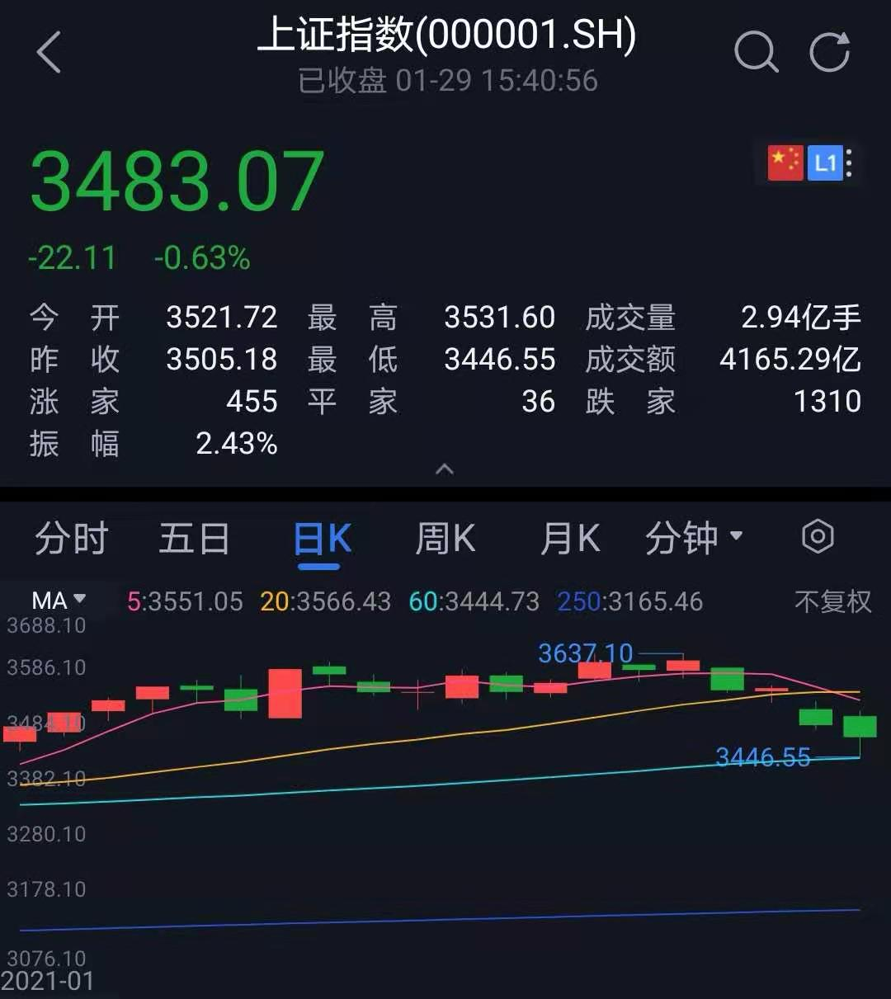

### 玩了一个月，原来玩的是寂寞

2021年1月的全部交易日已经过去了，本周复盘的时候我发现整个月玩了个寂寞：1月4日开盘点位3474.68点，1月29日收盘点位3483.07点。第一周负责涨涨涨，新年第一天就把去年一整年没完成的3500点给无感的捅破了；然后就是2周的横盘，反正大盘就是不断划水；最后就是本周的跌跌跌，经过周五最后的‘努力’终于跌回到了月初的起点附近。

 

是不是有种被戏耍的感觉？其实不尽然，我们投资不能只看起始点，中间让你爽了一个月你怎么不谈呢？如果你能冷静地不追高，能时刻保持几分的清醒，或者至少你有一个逻辑自洽的投资策略，那么大概率还是能在这样的行情里赚点小钱的。闲聊结束，老规矩开始一周的回顾：

1、本周南下资金继续大幅净流入，周一的时候恒生科技指数站上了10000点关口，腾讯、美团、网易、京东都创了新高，腾讯更是单日暴涨近9%，典型的大象起舞啊。关于港股上周已经说了，本周再次重申下：盯着那些个浓眉大眼的买就行，如腾讯、美团、港交所等。与之对应的A股明显交易量一直上不去，如果一直没新的交易量那么3600点的A股就很难撑住，本周的下跌也印证了这个观点。说真的这个点位还是要做两手的准备，这也是为什么我自己的公开组合一直还保有着近30%的短债基金，不求暴富、但求稳稳的幸福。

2、易方达蓝筹精选开始限购5千了，这是基金公司和基金经理负责的表现之一，临近过年适度的限额有利于保护现有持有人的利益。但我要借机聊聊基金经理的造神运动，最近2年主动基金开始大幅跑赢指数，有人说都是外部环境恶劣、内部经济遇到瓶颈，然后引发公募开始**抱团消费医药等优质赛道内的核心资产**。你们仔细看下加粗的这句，是不是全是近两年的热门词汇组成的？

坦率地说，受市场和身边研究主动基金经理的自媒体朋友们的影响，我自己对主动基金也不那么排斥了，甚至去年底在自己公开组合内加入了一点点主动混合基金的仓位。这两年我有幸也参加了一些基金公司的活动，可以面对面地接触了一些基金经理，我对他们的认知也不再仅限于网站上的那几行简介了。他们中绝大多数都是非常优秀的人才，对基金公司的投研能力和基金经理的打理水平我现在愿意用一个更善意的起点去面对，但我总是无法面对人性（考验什么也别轻易考验人性）。我们在认同基金经理的同时切不可神化基金经理，等行情不好的时候，现在所有的造神运动都会是沉重的伤害，伤还了自己的钱袋也伤害了高高在上的基金经理们。

3、“散户抱团逼空机构”这个事情本周闹得蛮大， 大意就是美股散户把一只将退市的垃圾股‘游戏驿站’从3美元拉升到300美元，直接拉爆了做空该股的机构们。其实这种动作显然不是单纯的散户能完成的，其实就是机构之间的多空对决，散户应该也是有参与，但更多的是一种噱头。这事发酵到后面已经出现了一些机构不顾吃相的恶劣操作了（拔网线、删代码、关服务等），当然我们也就随意地吃个瓜，不要太纠结这种，更别莫名自嗨：感觉散户终于扬眉吐气了一回。投资还是少一点情绪、多一些思考，少一点自作多情、多一些客观冷静。

4、本月底资金面应该是紧张的，本周四逆回购有一瞬间高达9.99%（我随手放了两笔分别是GC002和GC007，价格分别是5.025和5.060），还一个数据就是央行本周净回笼资金4705亿（本周央行逆回购了3840亿、有6140亿逆回购到期、有2405亿TMLF到期）。不知道这个资金面的紧张是否会在春节前重演，对于手上还有闲钱的朋友可以留意下，如果不想持股过年，至少也得给资金一个稍微高一点利息的归处。（其实可以借助一些自动化的交易工具帮助我们盯盘，如果有飙高的国债逆回购可以参与下）

