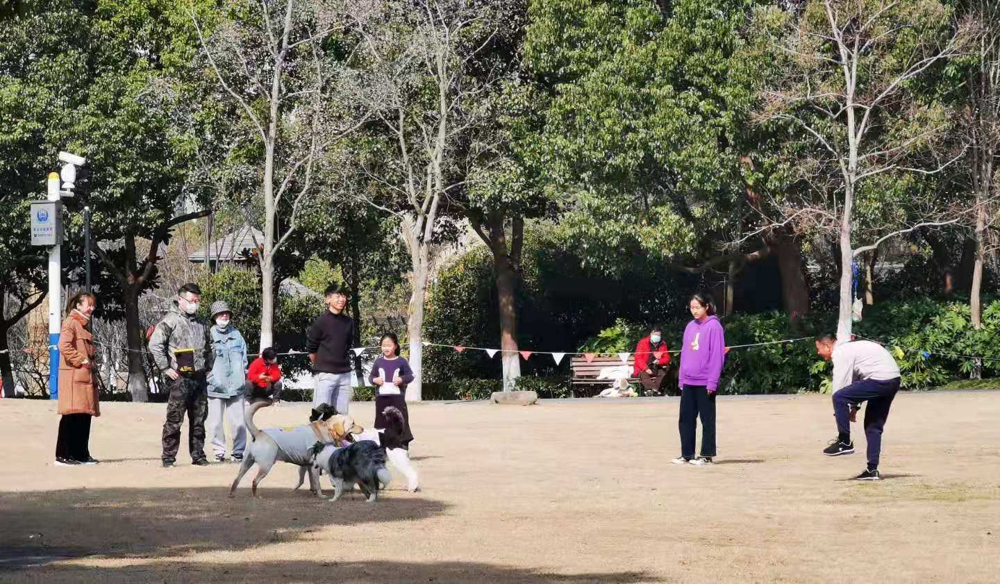

### 周末有点春天的感觉了

本周上海的天气还是非常好的，小区公园里遛狗的人也多了起来，孩子们都放寒假了，很多家长也都会带娃出来晒会太阳、透透气。照例进入本周的回顾时间：

 

1、上海机场是本周的热门话题，大意就是与中国中免的合同重新签了下，原来是保底收入的现在成封顶收入了，叠加因为疫情年报显示巨亏。市场结结实实地给了两个跌停板，一周累积下跌近30%（股价基本上跌回到了一年前），当然这个票成为热议焦点还有一个原因就是：公募一哥张坤的易方达中小盘混合前十大重仓股就有上海机场。当然数据是四季报显示的，不知道当下有没调整仓位，反正该基金这周五个交易日是天天上涨，张坤的实力你不得不服呀！

![易方达中小盘]](../img/week20210206-1.jpg) 

上海机场事件也一定程度影响到了白云机场、港股北京首都机场等同类股票。顺带说下上海机场市值1124.96亿、PE377.17；北京首都机场市值248.19亿、PE65.61（数据截止2021年2月6日），即便考虑港股和A股的定价差异外两者的估值还是相差甚远，这也佐证了流动性溢价。上海机场质地肯定是可以的，但贵也是它经常被大家所诟病的，如果你看好机场那北京首都机场是否也是个选择呢？（无任何推荐意图，就是一个思路的分享，投资需谨慎）

2、本周另外一个事我觉得也需要和大家聊聊，大意是：500ETF近期融券激增多次被暂停，有人开始怀疑是机构在一边“抱团”一边做空。我觉得这是一个不断循环叠加效应的过程，起初可能是有部分做空的意图在里面，但还有个事也需要讲清楚：因为中证500股指期货长期贴水（期指低于指数），故通过股指期货做空成本会高于融券卖出成本（可以融券卖出500ETF+买入500期指套利），这也是500ETF融券卖出需求旺盛的一个主要原因。

3、周五快手港股上市首日直接高开193.91%，报338港元/股，总市值一度达1.38万亿港元，位列港股第八。1.38万亿港元是个什么概念呢？A股现在超过1万亿市值的公司只有7家：贵州茅台、工商银行、建设银行、中国平安、招商银行、五粮液、农业银行（一只保险、两瓶酒、四个银行）。看得出大家对于互联网科技股还是很愿意给更高的估值的，这也是我个人一直极力推荐中概互联的重要原因。

再一想最近抖音和腾讯打官司这事，抖音看着快手的市值心想：老二刚上市就破万亿，自己作为短视频老大应该是有底气和腾讯搞一搞了，何况现在国家也是有意敲打垄断这事。说起垄断再插播一个关于数字人民币的事情，本周日北京也开始试点数字人民币了，摇奖中了的每人发200元（北京好像什么都喜欢摇号哈）。官方指定活动平台是京东，这里面多少有点抬下老三京东，稍微抑制下支付宝和微信支付的意味哈。

 

4、网传诺安基金蔡嵩松年终奖7000万，这个事诺安基金已经回应数据不实。然后我看很多自媒体也帮着大家分析一通，其实我就给大家说几句扎心的话：无论人家是跌成蔡狗还是涨如蔡神，蔡嵩松的管理基金规模那么大，一年下来的年终奖都能轻松超过绝大多数白领十年的工资了。你们成天想这些干啥？多花钱心思搞好自己的投资收益它不香吗？投资切莫入戏太深，很多事基本上和你我普通散户无关，浪费精力不说还容易带偏我们的投资情绪，这样不好！

下周就要春节了，节前的交易按理会清淡很多，很多大佬已经提前进入了休假状态。每到这种时候总会有人问该持币过年，还是持股过年？甚至有些人节假日都手痒想开个美股玩一玩。我自己是不会纠结这种节日情绪的，我的投资很大程度是看价格是否合理、未来货币是否宽松、行业前景是否可期等。至于说节假日手痒嘛，那可以和亲戚们稍微打会扑克啥的，难得休息几天多陪陪家人也是极好的，在此也提前祝大家新春快乐！

