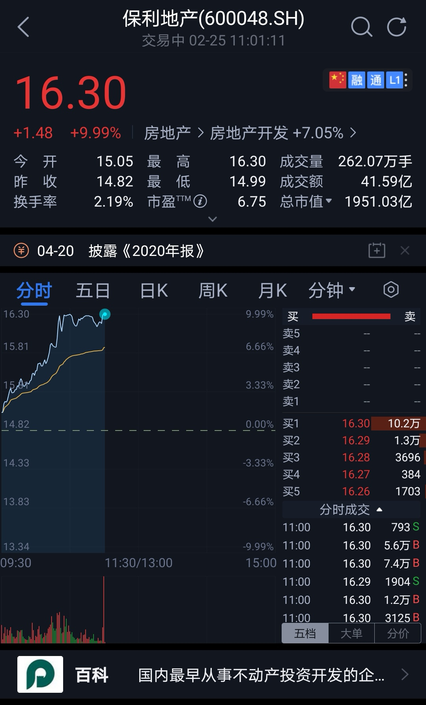

### 牛年貌似开了个不好的头呀！

春节期间的周报偷懒了一期，春节后的这7个交易日A股是跌跌不休，甚至比上海的天气还阴冷。本周上海大部分时间都下着小雨，这种湿哒哒感觉真的很不舒适，但和这阴跌的股市比起来还算凑合。二月份也就这么过去了，我们还是老规矩先回顾下一周的事件吧。**（文末有超实用提醒）**

**1、科创板将新入超200亿资金。**富时罗素公布3月半年度评审结果，有11只科创板个股（澜起科技、睿创微纳、君实生物-U、海尔生物、西部超导、康希诺-U、中微公司、杭可科技、安集科技、中国通号、昊海生物）进入富时GEIS名单中，预计将会带来约6亿多人民币的外部资金。

另外易方达、华夏、华泰柏瑞、工银瑞信去年发的四只科创50ETF终于要出联接基金了。四只科创50联接基金24日起同步发售，单只限购50亿，一次性就带来了200亿人民币的增量资金。当初搞这四个ETF很大程度上就是为了补充科创板的流动性，同时也是方便普通投资者参与到科创板里来，这次四家一起获批联接基金也是同样的道理。

按往常至少有1家可以单日售罄，可是近期市场行情太冷淡了，最快的易方达也花了两天时间才完成募集，其余三家至今未募集完毕，略显凄凉啊。相关的事情我上周写了两篇《科创50将新增200亿以上的流动性》、《四家科创50联接基金费率最大相差4倍》，有兴趣的朋友可以去看看。

**2、白酒‘崩塌’，张坤停购。**该来的总归会来的，踏空白酒的那些人心心念念了一年多的白酒，这次终于出现了比较大的回撤。最近白马抱团股都有不同程度的瓦解，反倒是之前压抑许久的顺周期股还有点看头，连去年闷了一年的地产板块本周都出现了大面积涨停，银行、煤炭、钢铁、有色等行业也有不错的表现。

与此同时本周公募一哥张坤的基金开始暂停申购且大比例分红，这种精神领袖主动降低规模的举动多少让市场有些慌张。虽按张坤以往的情况看不会大幅度调仓，但因分红而需要等比例的赎回是在所难免了。当然这其实也是对基民负责，对既有持有者负责。

在这种抱团股瓦解，周期冷板凳板块上涨的市场氛围下，这周来找我解惑的朋友急剧增多。当白酒、医药这种明显的精神支柱有瓦解迹象时，大家还是很迷茫和焦虑的，这种焦虑不仅限于新手。

我有个同事的老公也算股市老鸟了，上周日晚上也找我聊了十几分钟，我能感受到他为春节前清仓了紫金矿业而感到郁闷，也因为这一操作叠加阴跌的大市使其一时间不知该如何是好。而新手问得最多的就是，是不是要卖出了，这都跌成啥样了呀？

给他们回答各有不同，但大致就是我之前也说过的，短期还是盯着有涨价预期的板块，这也可能是短期比较确定的事情了。剩下的就得看后市发展了，等新趋势明朗了，才能有进一步针对性的操作。当然如果你实在困惑，现在适当止盈一部分去年的仓位也是蛮好，不然你一直焦虑影响了工作生活可不好。

**3、香港计划将印花税提高至0.13%，港股大跌。**这个事情也是本周的大热点，香港近两年日子真的不容易，财政压力那么大，港币又和美元挂钩，没办法随意印钱。那加税就成了合理且较为有效的手段了，春节前后南下资金那真是猛如虎，那时候你会看到鼓吹港股投资价值巨大的自媒体陡然增多，这种送上门来的印花税不征白不征。当然投资者也是用实际行动给与了投票，港股因此下跌且港交所也表示失望。因为增加印花税会实实在在地降低交易量，没有流动性何来溢价呢？

但客观地讲这件事情不会阻碍中概股回香港二次上市的大趋势，虽然最近港股科技板块回调得不小，但长期看我还是不认为这是恒生科技的高点。至于短期嘛，大家如果慌了，那就先缓一缓也是可以的。

**4、苏宁易购停牌，深圳国资委接手。**深圳国际港交所公告，就深国际（深圳）及鲲鹏资本分别可能收购张近东、苏宁控股、苏宁电器、西藏信托持有的苏宁易购集团股份有限公司8%及15%已发行股份订立一份股份转让框架协议。框架协议显示，深国际及鲲鹏资本计划，分别拟按每股人民币6.92元，收购苏宁易购的7.45亿股及13.97亿股股份，占总股本的8%及15%，交易分别作价51.54亿元及96.63亿元。

虽然我自己也是江苏人，但是对苏宁还是蛮无感的，而且单独说苏宁易购这块业务也看不到啥前景了。这次深圳国资委出手唯一的好处可能就是那堆外债不会出现连锁反应了，也看得出苏宁真硬着路会影响不小啊。

**5、2020综合所得年度汇算从3月1日开始。**最后还是提醒下大家一年一度的个人所得税汇算开始了（3月1日~6月30日），今年应该是第二年。说得直白点，对于很多老老实实上班的朋友可以通过汇算退到一些税费，纳税是我们公民的义务，但如果预缴的个税有可退、可减的，那么我们也可以理直气壮的领回来。

另外对于一些优秀的斜杠青年，除日常工作以外还有不少劳务报酬、稿酬等收入，那这种情况也是可以有退税的可能的。即便大家没有税需要退或者补，那我也建议抽空上去看看，回顾下去年自己的收入（或许还能查到你老公有没藏外快私房钱）。