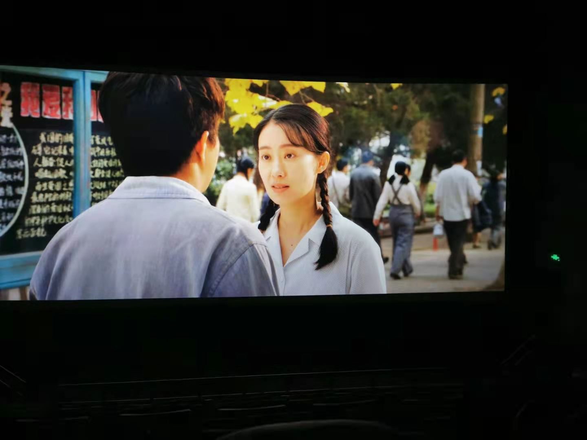
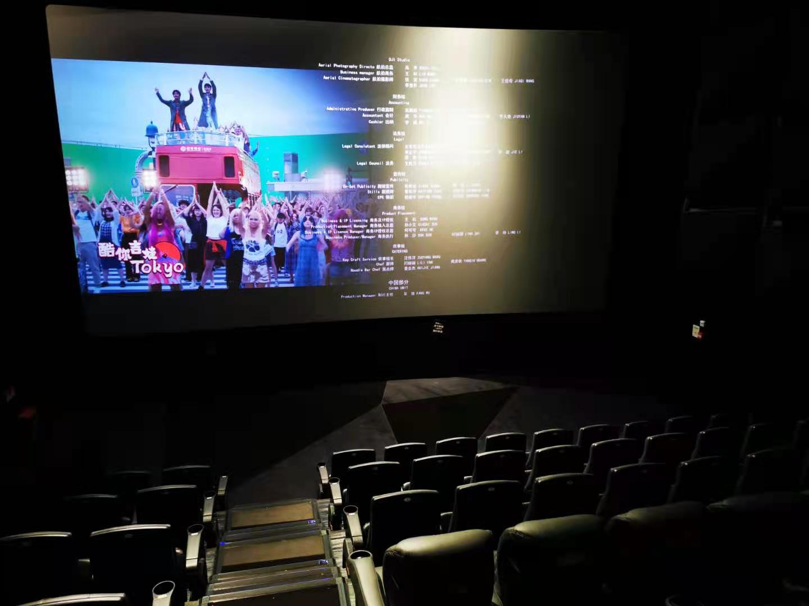

### 如果行情不好看，那就看看剧吧

【你的生活就是:追剧、看电影、看综艺，小日子很是潇洒啊~】这是一位球友今天给我发的评论，我当时的回复是：（你看不到我）还有深夜被迫营业的时候。后来我私下里也和她说：近期行情低迷，趁能悠闲几日就赶紧把之前堆积的电影和剧都给补上了，投资有时候就是很无趣的，我们要学会找到自己生活的乐趣。

行情不好的时候、市场风格很纠结的时候我们要少看盘，更要减少盘中做什么冲动的决定。但我还是希望大家每周花一点时间回顾下当周发生的事件，稍微捋一捋有利于下周的操作，至少会让自己心里有个底。老规矩开始一周的盘点：

1、本周香港特区政府财政司司长陈茂波表示，香港股票交易税对于高频交易者只是成本的一小部分，现阶段没有征收股息税的计划，**未来不排除进一步增加印花税的可能。**同时他还强调，增加印花税不会影响到香港股市的竞争力。

虽然我们上周也谈过了，涨点印花税也不至于改变中概股回港股二次上市的大趋势，但你第一波还没开始加收， 就又急吼吼地加强市场预期了，我也真是醉了。有时候即便心里这么想，你也不能那么急吼吼地说出来，甚至很多人即便这么做了也会反过来安抚大家情绪，**低调捞钱不好吗？**结果大家也看到了， 港股继续萎靡不振，年前那种大举南下的姿态早已不见了。

2、前期机构重仓的抱团股出现了明显不同程度的瓦解，公募基金的调研力度也开始向中小个股倾斜了，短时间内我认为很难再有较强势的抱团现象了。如果市场进一步走弱，那么这轮由公募主导的小牛市会面临基民赎回后的连续踩踏和跌跌不休。当然这个要看基民对后市的信心了，如果你是属于担忧的那类且买入较早还有浮盈的，现在适度减仓防守下也是不错的。因为要考虑到这些95后新基民大多是“不讲武德”的， 他们的操作往往很迷幻，真跑路赎回你也别太惊讶。

3、基金已经出圈得越来越厉害了，网传《天天向上》节目准备邀请了一众明星基金经理录制节目。然后各家基金公司纷纷出来辟谣，协会也出来发声说不允许了。其实我认为即便协会不出来禁止，那么顶流的基金经理也极少有可能会参加这么一个娱乐节目，业绩优异的基金经理平日都很少出来参加访谈，更别说这类娱乐节目了。

4、在成立仅12个交易日后，汇安均衡优选基金净值下跌近18%，基金公司紧急发致歉信表示，“短期内，这只产品让信任我们的投资者产生了一定程度的浮亏，这让我们深感不安。希望大家给我们一些时间。”

2月9日，汇安均衡优选基金将募集来的8.2亿元资金划入基金托管专户；2月10日，当日净值上涨1.34%，应该是建仓得差不多了；3月4日，当日净值为0.8244元，浮亏17.56%，再然后就发道歉信了。

原谅我平时不怎么关注这个基金公司，但这次新闻搞得也挺大，算是一个迅速建仓怕踏空的典型了吧。基金经理也不容易，建仓太快太慢都要被骂，只要你“害”持有人亏钱了、少赚了就会被骂。这个事情**也再次印证了择时是一个多么困难的事情**，人家基金经理各方面的资源应该比我们普通投资者要好很多了吧，最后还不是老马失蹄呀。

其实还是有点心疼那些买了这个基金的朋友们，然后这事变成新闻后就出现了“杀跌-赎回-杀跌”的恶性循环，类似现象大概率也会出现在其他抱团股较重的基金上，这也是我上面说如果你仓位重且前期已经有浮盈了，可以适度降降仓位。

5、我这周前几天还算清闲，就把春节没看的电影给补了，总的感受是：**群众的预期还是很重要的，观影如此、投资亦如此。**

周二看了《你好，李焕英》，周三又去看了《唐人街探案3》，工作日的影院是真的很空荡。唐探3早期把大家胃口吊得很足，各大影院给与的排期也是超多，但是春节一开映恶评如潮，豆瓣评分也是一路下滑。我春节前本来也是打算首先看唐探3，但是后来口碑那么拉跨就放弃了。

所以先看了李焕英，这个号称是今年春节档的黑马。里面有很多我喜欢的演员，比如沈腾和张小斐等，风格也是一如既往那种开心麻花、大碗娱乐的套路。可能后期口碑起来了，宣传过度了，反倒让我没太多的惊喜。

而周四去看的唐探3，也因为恶评一堆，反而让我抱着消遣的心态去看，看完感觉也还可以。影片里大段的日语原生台词还是蛮舒适的，让我想起了刚毕业那会在公司学日语的日子。另外唐探3内的植入还是蛮多的，最显眼的就是招商信用卡，另外有全家便利店、统一汤达人泡面、东鹏特饮、华为笔记本等。

最后我感觉今年的票房基本上就是靠涨价撑起来的，两部均是2D的电影票价都是50元，这还是在上海的郊区电影院。据说唐探3一开始票价都要80多，我不知道说这是货币贬值飞速，还是电影行业的悲哀。

6、周四起得早就把书房稍微整理了下，翻出来一本雪球2019年的日历本，发现当时还在上面记录了些东西，这些事情貌似发生了很久：

1月16日：指数基金之父约翰·博格去世；（一晃都2年了）

1月18日：《啥是佩奇》一夜火爆全网；（看到这条我脑子里依然会浮现出那个笨拙的鼓风机佩奇）

1月26日：监管换帅 刘=》易；（前者后来去了什么供销社啥的，后面又被调查了）

1月31日：雏鹰农牧 公告因饲料不足饿死猪；（搞笑程度不亚于扇贝跑路）

2月16日：春节后第一周涨势喜人；（比对今年的春节后行情很凄凉啊）

3月2日：科创板制度正式发布；（如今科创50的联接基金都发售完毕了）

3月5日：褚时健去世；（对于老一代人可能都很崇拜他，而我对他的印象起源于一只橙子🍊）

4月3日：上证指数突破3200点；（本周五收盘险守3500点）

4月13日：雪球全网禁言一周；（在此之前小秘书还是很清闲的职务）

5月6日：特朗普一条推特让A股千股跌停；（物是人非，后来的新冠打破了全球的方方面面） 

再后面好像就没有再记录了，估计后来放抽屉下面，就不怎么翻阅了。

图片

7、周六晚上把《奇葩说第七季》看完了，因为李诞才注意到奇葩说这个节目，不知不觉已经追了3季，也渐渐接受了比赛排名其实更需要考虑的是节目效果和“大局观”。

这一季陈铭和梁秋阳依旧非常优秀，席瑞、熊浩、欧阳超、子寅等人也有很好的表现，本季的新人小鹿是一颗耀阳的星，我相信她后面的脱口秀之路会更顺畅。

嘉宾方面杨幂的几期让我对她有了些更正面的认知，或许只是我原来脑海里的杨幂印象很不好吧。李诞那种“丧”的外表下依然透露出些许不一样的世界观，总是冷不丁的给大家带来一些启发。我觉得李诞应该会邀请小鹿参加他下一季的脱口秀大会，我看弹幕里也很多观众这样要求着。

对于部分老奇葩我不知道是江郎才尽了，还是他们的路数已经使我厌倦了；另外一些撒泼打闹的路数，不管是新奇葩还是老奇葩，我实在欣赏不来。当然每个人都有自己的喜好，以上仅是我个人的观点。

我自己看奇葩说也就是图个乐，有时候看书码字累了就看看这些“人精”是如何一本正经的胡说八道的，学学人家是如何“颠倒黑白”，并能让人相信他们所说观点的。