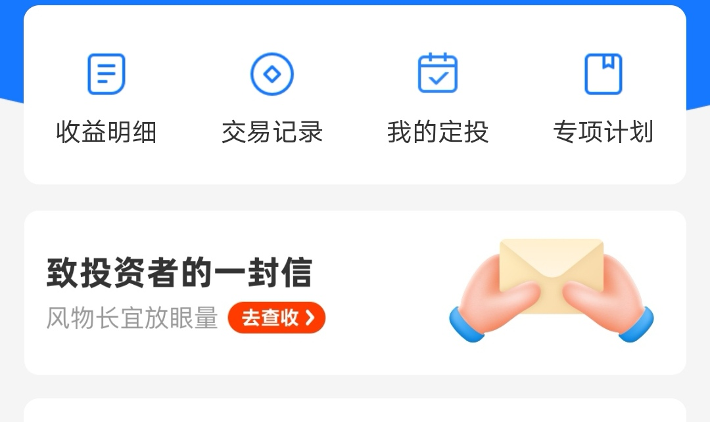
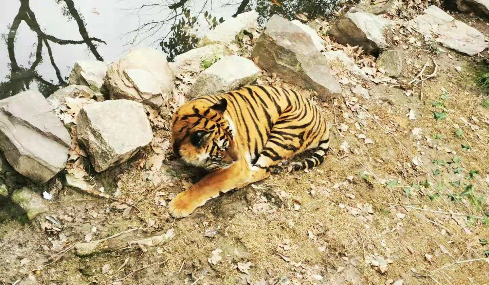

### 理财资金转基金过程中仍需加紧配套教育

周末两天上海的天气好了起来，我家附近公园的樱花也开了，周六单日就有9万人次的游客，反正每年的樱花节我们这边的路都堵得一塌糊涂（去年疫情原因没游客）。**春暖花开的三月，你是喜欢去这种人多的地方打卡游玩，还是更倾向于和家人朋友找一个幽静的地方过个周末？**

说回投资上，本周A股其实表现依旧不好，从全球主要市场比对来看也是很落后的，我们看看本周都有哪些值得说一说的事呢？

**1、本周有3只百亿基金纷纷宣布大幅放宽限购，**分别是杨浩的交银施罗德内核驱动混合和交银施罗德新生活力混合、周应波的中欧互联网先锋混合。限购放宽级别也都是从原来的单日10万调整到单日100万，我觉得对于普通散户几乎没啥影响，更多的可能就是释放一些信号和态度。公募一哥张坤就继续维持限购状态，而且我个人预计张坤短期内不会放开限购，当下这种纠结的行情考虑到多方利益是不大可能这么做的。

总之经过春节后的这段行情演绎，我觉得广大基民的心态已经崩塌了，短期市场也不会有什么新增资金进入了。而且**基民有个特性，遇到急跌亏损了就干耗着，可一旦反弹回本稍有赢利就会开始赎回，这种心态会导致短期不会出现什么大市新高了。**而这轮牛市和公募的助推有极大关联，所以后面重铸辉煌继续往上涨的可能性不大，能有一波时间跨度较长的反弹已经算是不错了。

**2、知乎要 IPO了**，这个事情我关注到的自媒体都在说“不看好”，大意就是说虽然知乎的月活数据还可以，但人均贡献营收远不及 B站和快手。这种“高端”知识分子社区的氛围之下，你就很难腆着脸收费变现，而作为媒体的内容输出方来说，你没有好的变现方式我肯定会转移到别的好变现的平台去。

知乎作为一个社区平台，你要有盈利必须要有强劲的内容来黏住用户，这就需要自媒体们积极输出优质内容。何况知识付费原本就比打游戏、看直播、买东西要难一个级别，所以大家不太看好知乎的营收能力是很合理的。

**3、支付宝也开始给投资人写"按摩"信了。**文章开头也说了本周行情依旧很寡淡，跌跌不休的行情逼得支付宝也不得不写起了"按摩"信。今年基金公司怎么突然有了一个奇怪的风气（以前也有，但没那么多）：一大跌就发投资者信。现在可好，不只是基金公司，连卖基金的平台方也不得不出来安抚基民了。支付宝的基金资产首页就有一份大大的信入口：

其实这个现象的背后反映出来的是：**银行理财的那批资金在转移到公募基金的过程中，投资者的教育还是没有完全的跟上。**他们中很多小白投资人对于基金常识的认知还远远不足，对自己所购买的产品也说不出个一二来，更别说什么风险意识了。毕竟他们原来的投资认知基本上就是余额宝这类货基或者近乎刚兑的银行理财产品，这种每日净值的波动在全民上涨的时候都是欢呼雀跃了，觉得原来投资是如此的简单，但真跌下来了就又是一脸懵逼。头部的基金公司和主流代销平台都在很努力地做着理财投资的科普教育，这个很好也很有必要。我希望这种财商教育能越来越好，但最终效果还是需要看投资人自己的领悟与成长。

**4、周五的时候和女儿去了趟上海动物园，**工作日+阴天+不暖和导致动物园里游客少得几乎只剩动物了。不少动物也都慵懒得趴着，鸟类和灵长类的相对活跃一点，我们还看到两个狒狒打了起来，发出了很有喜感的叫声。而鸽子已经毫不惧人了，还会追着女儿要吃面包，黑叶猴甚至直接手伸出铁丝网问路人要投喂，它们手虽然小但接食物那是相当地熟练。之前听庞博说创作没灵感的时候会一个人去动物园看猩猩，这次我们也看到了好多猩猩，**我现在才知道猩猩、大猩猩、黑猩猩是三个不同的品种。**

