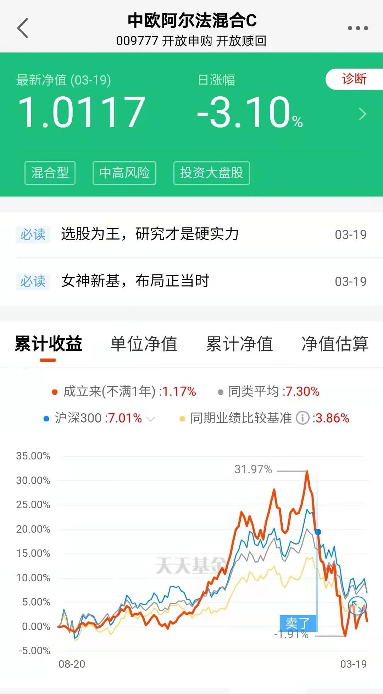

### 基金销售再冷清一个台阶

这周跟着雪球调研团去了趟淮安的今世缘， 因为我第一天到的比较早就去了趟周总理纪念馆。出馆的时候已经五点多了，我发现刚吐芽的柳叶其实是浅绿中泛些淡黄，在夕阳的照射下有了种金黄的感觉。岸边一排垂柳整齐的倒影在这池塘里，这种满屏幕的金黄真的很舒适，有点类似秋天里的银杏叶，只是春天柳芽的是朝气新生、秋天的银杏叶是即将凋零，此刻的柳树更胜一筹，看着也更让人欢喜。闲聊结束，照例回顾下本周我们投资上的事：

**1、基金销售再冷清一个台阶。**3月份已经有广发价值优选、诺德优势产业、嘉实中证大农业ETF等20多只基金发布了延长募集期限的公告，其中最夸张的就是华富中证证券公司先锋策略ETF将募集截止日从3月22日推迟至6月8日，对于这种跨度几个月的募集期我只想说：还玩个屁啊！

你以为就是中小基金公司或者普通基金经理募集缓慢？热门基金经理新发的基金也是“灰头土脸”呀，跟去年募集的那种单日售罄外加配售比例不足20%的火热行情比起来真是略显凄凉。比如中欧基金的医药女神葛兰，去年的中欧阿尔法混合最近业绩也是渐渐有人开始吐槽了，好在我前段时间把一些小额的观察基金都清理了，侥幸逃过一劫。

中欧基金经理葛兰和卢纯青的这次新发基金中欧研究精选混合限额100亿，本周四（3月18日）就开始卖了，但是截止今天还是没募集满。反正我看这几天支付宝基金首页进去就是这个产品的宣传入口，明天就剩最后一天不知道最终募集成绩会如何？总的来说，市场情绪还是很冷淡啊！

**2、拼多多超过了阿里巴巴成为我国用户规模最大的电商平台。**拼多多2020年活跃买家超7.8亿、成交额超1.6万亿、全年营收近595亿。拼多多创始人黄峥发布2021年度致股东信，宣布经董事会批准后将董事长职位交棒给现任CEO陈磊。其实黄峥辞职也是有预兆的，2020年的7月初就辞去了CEO的职务由陈磊接任，这大半年来的交接应该还是可以的（至少业绩上没啥问题）。拼多多是真牛逼，才5年就干到了行业用户规模第一。黄峥的急流勇退给他再添一分神奇色彩，他也宣称会投身前沿科技研究“去摸一摸10年之后路上的石头”，这种格局让人惊叹和佩服。

**3、蚂蚁“花呗”、京东“白条”又挨一棍。**银保监会、央行等五部委近期联合发布《关于进一步规范大学生互联网消费贷款监督管理工作的通知》，禁止小额贷款公司向大学生发放互联网消费贷款，禁止非持牌机构为大学生提供信贷服务。

我们那会上大学办个信用卡都挺难，即便能办的也都是招行和中信这种特定的学生信用卡，额度很有限且逾期直接上征信。现在的孩子很容易获得这种“高逾期利息”的贷款，这对于消费心智还不够成熟的大多数学生来说是很危险的一件事，最近几年类似的新闻报道也是屡见不鲜。现在监管层严格规范是第一步，我希望大学生的理财消费等技能的宣导也是很重要，急需同步实行的，凡事疏堵结合才能事半功倍。

最后是一些简报吧：

4、华为将从2021年开始收取5G专利授权许可费，将提供适用于5G手机售价的合理百分比费率，单台手机许可费不超过2.5美元。

5、欧菲光公告：境外特定客户（苹果）通知计划终止与公司及其子公司的采购关系，后续公司将不再从特定客户取得现有业务订单。没啥可说的，反复辟谣终于成真，就是一首凉凉送给欧菲光。

6、百度将香港IPO发行价定为每股252港元，低于定价上限的295港元/股，比美国ADS折价2.7%，还是那句话：主流中概股回港股二次上市是大势所趋，不为任何因素（包括什么提高印花税）干扰。

7、美联储公布了3月份货币政策声明，决定将其基准利率维持在0%到0.25%的目标区间不变。美联储还上调了经济展望，反映出该行对经济复苏的前景更为乐观，预计在2023年之前不会加息。决定继续实施其每个月至少购买1200亿美元债券的资产购买计划。