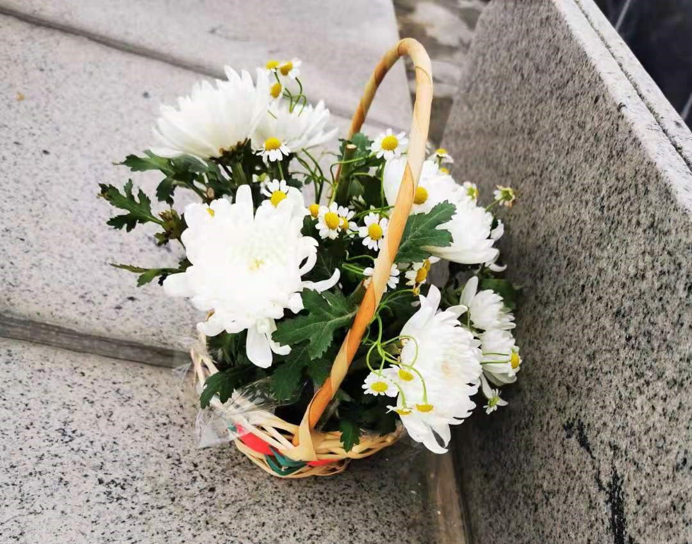
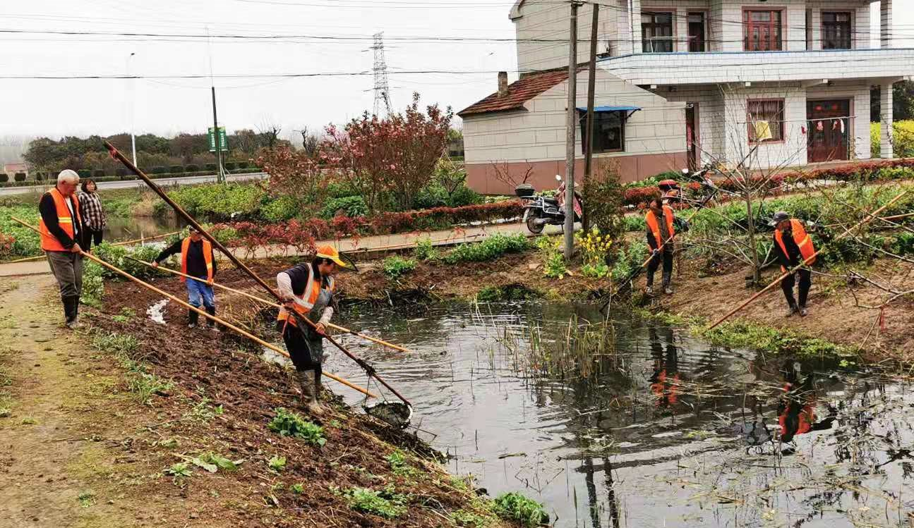
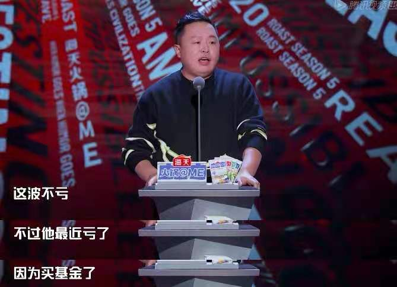

### 酒鬼酒这个涨停是要带领白酒反攻？

可能是因为春节很多人因故无法回去祭祖，这次清明返乡人员还是很多的。老家今年开始禁止烧纸钱了，让我略感意外的是村里老人们也基本上表示理解，很多家庭也带上了鲜花和贡品去祭祖。

我在村头闲逛的时候发现臭水沟也开始清理了，这个蛮好的。村里老人干活领点小钱，也是乐呵呵的，这比单纯发钱要好很多，社会也会更和谐。在沟的另一头蹲下来看到密密麻麻的小蝌蚪，细看发现它们黑得发亮，圆鼓鼓的脑袋看着也没那么可爱了，有些物种就是靠着强大的繁殖能力活到了现在。闲话结束，开始回顾下上周发生了些啥？

1、投资慎用杠杆。包钢员工炒、炒期货负债过多后无法偿还，最后跳入高温钢水中自杀（这兄弟也是个狠人）。对冲基金经理Bill Hwang（韩国老哥一枚）爆仓，野村证券和瑞士信贷近期都表示受此而损失“重大”（据说野村证券损失20亿美元左右、瑞士信贷损失在30亿美元左右），这也是前期中概股加剧暴跌的主要原因之一。为什么把这个两个新闻放一起说呢？就是劝诫大家投资切莫加杠杆（借钱炒股本质也是加杠杆），无论你是资本大佬还是普通打工人，杠杆投资虽然爽，但一旦陨落就是万劫不复。

2、小米终于官宣要造车了。小米集团公告称，拟成立一家全资子公司，负责智能电动汽车业务。首期投资为100亿元人民币，预计未来10年投资额100亿美元，雷军亲自兼任智能电动汽车业务的CEO。雷军说这是他最后一次带头创业了，俨然是相当重视哈。但是小米股价上没啥反应，不知道是小米真的只想好好造车，还是说小米官宣的时间没挑好。与平淡的股价对比，反而小米换logo这事被大家议论得很热，直呼这200万的设计费也太好赚了。

3、酒鬼酒一季度业绩优秀，有带领白酒板块反弹之势。酒鬼酒预计一季度利润为2.5-2.7亿，同比增长160-181%。酒鬼酒去年三季和四季都是1.5亿左右，如今一季度跃升至2.5亿+，这个业绩就很优秀了。酒鬼酒周五也因此喜提涨停，而且整个白酒板块也跟着涨了一波，突然有点内味了。

4、21世纪人才最贵。中芯国际年报里披露，公司给梁孟松买了一套价值2233万的房子，并且薪水从34万美金涨到153万美金。所以去年这封离职公开信是有效果的，也看得出这位技术出身的大佬对企业是相当重要的。这让我想起很多企业（至少IT行业）往往会用更高的价格去外面再招人，但给老员工每年的涨薪真的不一定能超过通胀水平。

另外相关的一条新闻是：【上海面向全球招人！共8580个博士后和事业单位高层次紧缺岗位】。中国的主要省会城市近几年都在不同程度的"抢人"，因为人才都被北上广深吸走了，而且是那种拖家带口的吸走。那现在上海就更狠了，已经开始有计划的面向全球，吸引超高端人才服务上海、服务中国。很多高精尖行业确实需要大量优质人才，比如我前几天去一家生物医药公司参观学习，第一次感觉隔行如隔山能隔到这个地步。

5、吐槽大会被整乖了。基金出圈已经不是啥新闻了，但这仅一集搞笑的综艺节目居然那么高频率的提到基金，并吐槽基金，我真是佩服。另外该节目上次被官方点名后，直接删除了一期节目，而且在最近变得极其乖，因为新疆棉事件把好多演员嘉宾的鞋全程给打码了，满满的求生欲。

6、支付宝展示“客户维护费”。细心的朋友会发现支付宝基金的费率介绍页面，在管理费下方有个【客户维护费】。费率绝大多数都是40%，对于蚂蚁那么大的流量抽40%我能理解，我好奇的是其他几个主流平台抽多少呢？毕竟监管红线可以到50% 。当然需要说明的是这个东西其实一直存在，只是现在被要求需要明确展示，这个费用不会额外向持有人征收，大家随便看看即可。

7、支付宝目标投支持多开了。我一直推荐小白用户使用的一个小工具，支付宝的【目标投】，终于可以设置多个产品了。这个东西呢虽然赚不到啥大钱，但是超级省心，身边同事用了都说好，按年计算收益也会比银行理财要好很多。现在可以同时开设多个产品（上证50、沪深300、创业板指、医药100、食品饮料、中证银行），大家可以选择几个相关性较弱的做下对冲。

