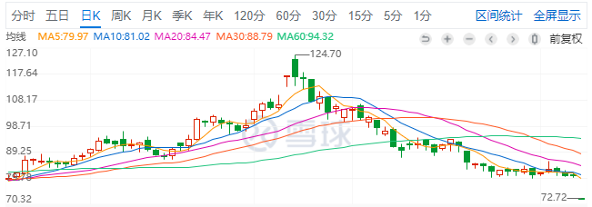
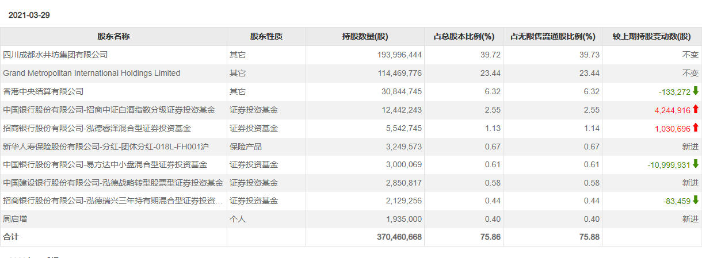
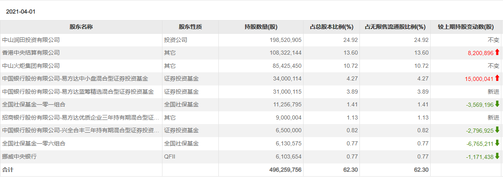
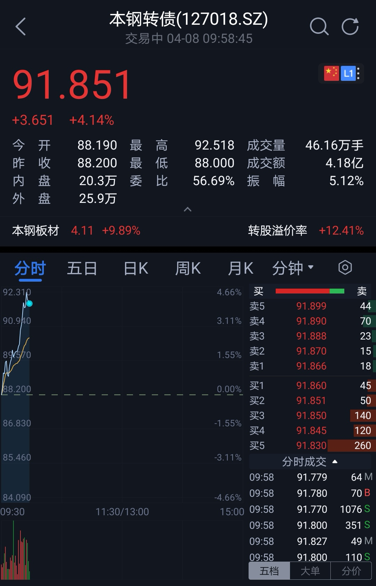

### 白酒换酱油？

本周市场行情相当的冷淡，除了周四有些许的翻红其余4天都很凉，以至于周三的时候两市交易量突破5000亿都能算一个新闻，平时不都至少上了一万亿才聊的吗？在我常逛的几个论坛也是一片冷清，金融圈吃瓜的人也没啥热情了，讲段子的也都半耷拉着。算了，行情再凉也要复盘呀：

1、东方财富第三次可转债(东财转3)正式发行了。去年9月底刚出公告的时候我就写了相关文章：《首家第3次发可转债的公司已揭晓》。这家企业把可转债已经玩得炉火纯青了，别人家的可转债一次还没了结，它都已经发第三次了，霸气。所以投资者对其也愿意出更高的溢价，正股股东参与配售更是超级热情，最终数据显示本次东财转3，单账户顶格申购中签率在58%样子（发行金额大且没安排网下打新），基本上可以算是雨露均沾了。东财是一家很好的公司，但是其股价总是比我心理价位要高，有时候也只能眼睁睁看着其不断新高。

2、4月6日起深市主板将与中小板合并。证券代码0开头的是深主板，002、003开头的是中小板。原中小板上市公司的证券类别变更为“主板A股”，证券代码和证券简称保持不变。这种合并对普通股民其实没啥影响，大家知道下就行了。

3、预告一季度，几家欢喜几家愁。中远海控，预告一季度利润154亿，业绩很劲爆直接涨停板伺候；顺丰控股，预告一季度净亏损9~11亿，去年同期盈利是9.07亿，周五死死的一个跌停板表明了一切。

航运我不是很懂，应该也属于很明显的周期板块，我查了下这个票之前也是被按在地上打的货，这次总算是硬气一回了。但这个我实在不熟悉，自己就不参与了，建议普通投资者也不要盲目追这种热点。

顺丰控股预告一季度净亏损约10亿，这个算得上是大白马暴雷了。先说明下，我是有一点点顺丰仓位的，去年11月去深圳那会心血来潮买了点（成本价80左右），然后在前期突破100元后我分两次减持了一些，今年春节后跌回80附近的时候我把仓位又补回来了。我现在的想法就是：不急着补仓，但肯定不会割肉，毕竟企业没有太大问题，这个票于我而言也还是有盈利的。

顺丰出公告后董事长王卫还特意出来致歉了，当然市场上也有很多人对顺丰给出的五点解释不是很认可，但我还是觉得没啥大问题。你会发现这两天媒体文章开始数落顺丰的人变多了起来，这让王卫不得不在业绩说明会上表示二季度肯定不会再亏，但全年利润还是回不到去年同期水平。

关于顺丰再说下，我依然认为顺丰是当下最好的快递（但是不是好的股票这个再议）。但凡有点重要的东西我相信大家都会选择顺丰快递的，这点服务品质没有变，大家的认可依然在。所以这个护城河很坚固，同行很难挤进来，三通一达也好、极兔也罢，根本不够顺丰打的。

4、易方达张坤白酒换酱油？在水井坊和中炬高新最新的十大流通股表上我们发现：张坤的易方达中小盘混合在一季度减持10,999,931股水井坊，易方达蓝筹精选更是直接跌出了前十；与此同时易方达中小盘混合在一季度增持15,000,041股中炬高新，易方达蓝筹精选也是新增进入中炬高新的前十流通股东。（详见下图）

张坤这是很明显的把一部分白酒仓位换成了酱油调味品，而且从变动股数上看还是很坚决的。我第一反应是张坤有没买海天味业？我看了眼易方达中小盘的所有持仓，没看到海天味业，但恒顺醋业在列表内。大佬的操作我也不便多评说，但我觉得应该是没啥问题，后续我应该也会多关注下这个中炬高新，最后提一句：中炬高新的实际控制人是姚振华！

5、腾讯遭大股东减持1.9亿股。腾讯最大的股东Prosus宣布减持腾讯股票，折合人民币约1000亿。虽然金额很大，但这个也不是没有先例（2018年减持过一次，且当时也承诺三年内不再减持，这次正好到期了），确实也是大股东需要一些现金去扶持其他好的项目，并且承诺三年内不会再减持腾讯。所以我觉得这应该是个偏中性的消息，后面腾讯的股价也表明了这个没啥大事。其实大股东Naspers的这个投资也算是世界互联网投资史上最神奇的一笔了，这种大几千倍的投资收益也让后续的风投们对高新科技企业趋之若鹜。

6、去年我被套的本钢转债终于回本了。本周虽然大市行情不行，但钢铁板块异常养眼，在正股多次涨停后，我去年最失败的一次投资：重仓本钢转债，也终于回到了我成本线91元之上。我之前也提过，自己已经做好躺尸两年的准备了，现在这么早的回本我还是蛮开心的，同时也再次提醒大家，投资可转债要适度的分散配置，反正我是长记性了。

7、阿里巴巴因垄断被罚182亿。周六醒来就是满屏幕的阿里因“二选一”问题被罚182亿的新闻：市场监管总局对阿里实施反垄断处罚，责令阿里巴巴集团停止违法行为，并处以其2019年中国境内销售额4557.12亿元4%的罚款，计182.28亿元。同时向阿里巴巴集团发出《行政指导书》，要求其加强内控合规管理、维护公平竞争、保护平台内商家和消费者合法权益，并连续三年向市场监管总局提交自查合规报告。随后，阿里发布公开信回应：诚恳接受，坚决服从。

阿里这两年也是不断被敲打，虽然这些钱对阿里来说可以接受，但182亿也是创了因反垄断而被罚的新纪录。对注重企业文化的阿里来说，这顶“垄断”的帽子算是扣严实了，多少有点糟心。

对于投资来说我认为是利空偏中性，至少这个“靴子”算是落地了。而且我相信国家更多的也主要是敲打作用，国家也希望阿里能发展好，并且这个敲打可以有效地警示腾讯、美团、字节等大型互联网企业。最后我想说，这些都不会动摇我对中概互联的持续看好！