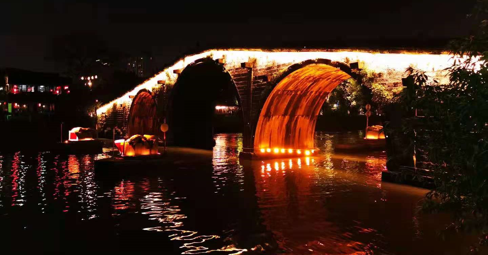
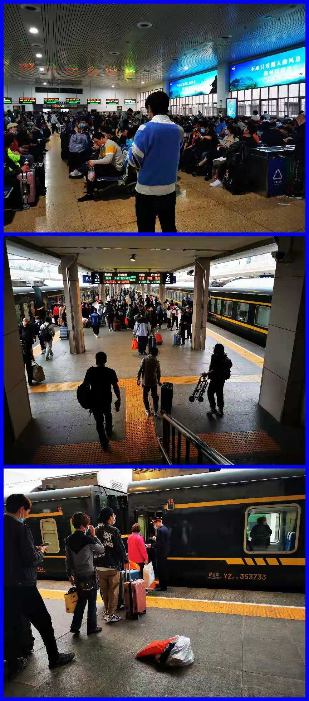
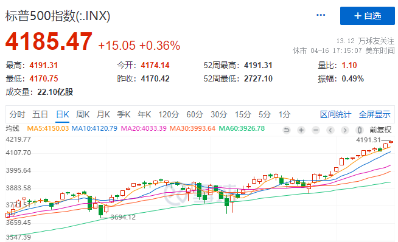
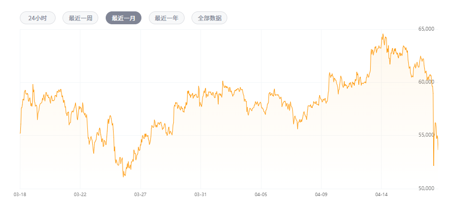

### 白马祭天周

本周参加一个活动去了趟杭州，学会了一种在中东那边比较受欢迎的叫Domino的棋牌游戏，光看照片是不是有种“共推牌九”的感觉？

和朋友吃过晚饭，在运河边走走也是蛮好的，河面的晚风吹着挺宜人。

当然最搞笑的就是周五返沪，因为种种原因高铁票出了问题，然后实在没票了就转战杭州站挤绿皮车回了上海南站。唉，说多了都是泪。

闲话结束，开始我们的一周回顾：

**1、本周就是白马股祭天周。**因为业绩问题，最近被按在跌停板上的大白马是真不少：顺丰控股、中国中免、美年健康等；还有不少大跌的浓眉大眼股：万华化学、中远海控、三一重工、紫金矿业等。对于这类新闻我就看一点：股价有没提前大跌、**机构等大资金是否提前抢跑？**对于抢跑明显的个股，例如美年健康我建议大家可以安心的放入黑名单了。我曾经有过一段时间还是挺关注美年健康的，但后来总觉得这个票怪怪的，现在终于可以笃定的拉黑了。同时也要表扬下顺丰控股，业绩预亏但就是没机构抢跑，单从这点看顺丰还是值得关注的，股价从高点下来也已经对折了。

**2、美股又是节节新高。**本周要不是周五拉升下，又会是阴跌的一周，反观美股却是一直在拉新高，‘万恶’的美帝呀。

**3、日本决定核污水排放入海。**日本政府正式决定将东京电力公司福岛第一核电站内储存的核污水排放入海。据悉，开始排放前需要大约两年时间开展设备施工。喊了这么多年终于定下来了，可今年还有个东京奥运会呢，**为啥日本非要在这个节点搞这种事呢？**是不是其实一直有慢慢在倒污水，现在已经到了无法掩盖的时候了？

周边国家里中国和韩国是很坚决的反对，可美国老大哥已经明确表示支持这一决定，认为这符合全球公认核安全标准。我看新闻说如果废水真倒入太平洋，根据洋流其实美国和加拿大会率先被影响到，所以也就不难理解美国口上说支持，行动上却已经开始限制日本的食物进入美国了。其中包括奶制品，鱼、海胆、蛤蜊等海产品，肉制品和蔬菜等，产地涉及青森县、福岛县、茨城县、岩手县、新泻县等日本多地。**美帝再一次娴熟的展示了他那套“嘴上说不要，身体很诚实”的骚操作，以及与日本深厚的“塑料”兄弟情。**

另外日本计划向太平洋倾倒核废水的消息出来后，国内养殖板块连续上涨（含水产养殖和牧畜养殖），上涨的逻辑貌似是消费替代。简单说就是大家都不吃海鲜了，肯定利好河鲜和肉蛋这些养殖为主的食物。但新奇的事情总能在A股上演，养殖板块的奇葩选手：獐子岛，也上演了涨停潮。这种垃圾股也能跟着炒一把？中国的赌性真是没得治，甚至有段子手说：因为海洋污染了，之前逃跑的扇贝又逃回来了，獐子岛业绩大涨，理应涨停。我只想说：自古评论出人才。

**4、珍爱生命、远离币圈。**本周币圈也是很热闹，前几天突破6.3万美元，今天又跌破5.2万美元，真是很刺激呀。币圈的大哥们都很牛啊，大哥霸气外露、大哥来根华子，大哥请喝阔乐。再次提醒大家，炒币还是要克制，珍爱生命、远离杠杆。

**5、本钢转债起死回生。**本钢转债和正股本周还停牌了一天，原因就是筹划与鞍钢集团的重组问题，这个也解释了之前为何本钢连续暴涨，甚至好几次都是直接涨停。去年我一直认为本钢转债是2020年最失败的一笔投资，却在今年春节后低迷的行情里给我带来了一丝丝温暖，真是三十年河东、三十年河西。周五收盘已经是96.24元了，我这种在73元附近都扛过来的人，这个价格让我很舒适。