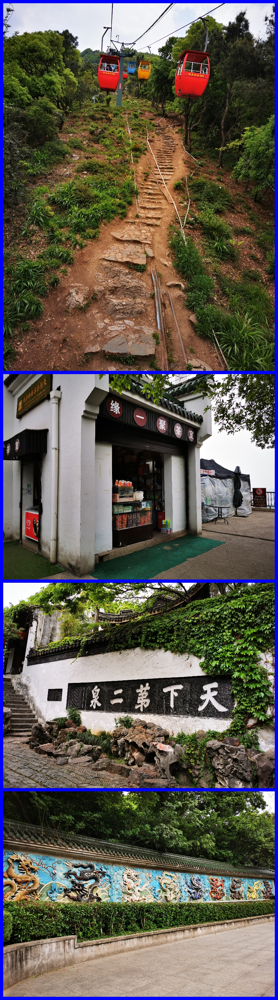
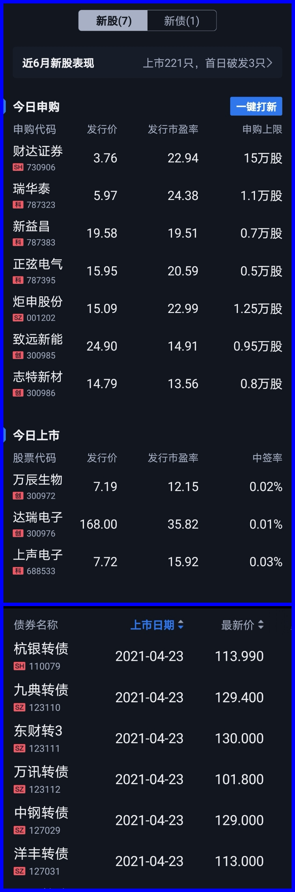
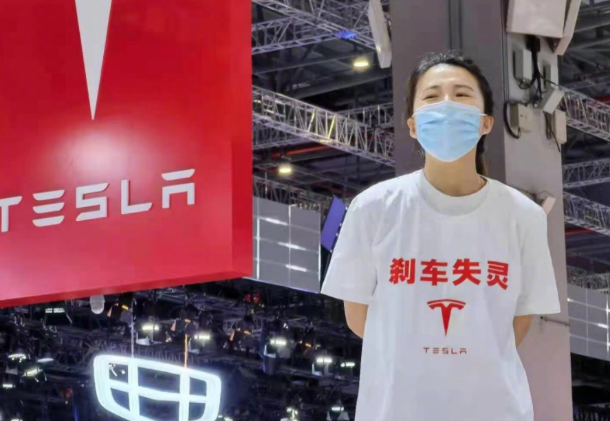
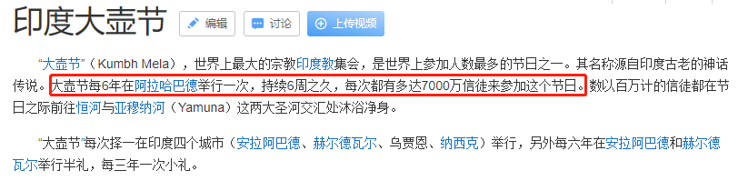
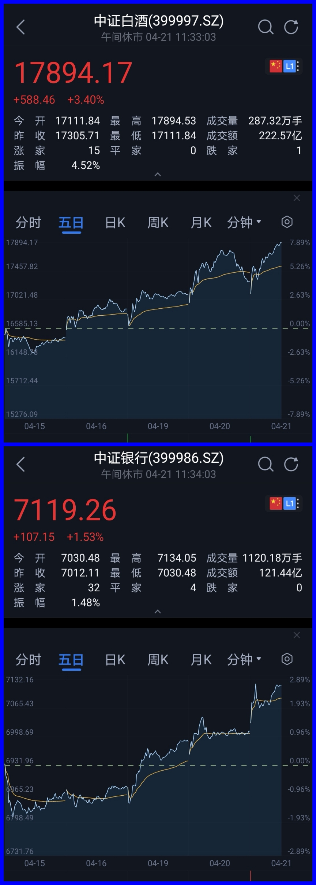

### 余额宝规模首次跌破万亿

本周有个活动就去了趟无锡，我虽然是江苏人，高铁也经常路过无锡，但上一次踏上无锡这块土地还是二十一年前了，那是2000年春节的锡惠公园。20多年过去了，缆车依然是30元、山顶的茶叶蛋也还是2元，这就让我有了一种惠山顶上没有通胀的错觉。去了儿时回忆里的天下第二泉和惠山九龙壁，满满的都是回忆！

闲话完毕，开始一周的市场事件盘点：

**1、周一7只新股申购打新热、周五6只转债上市有大肉。**本周一7只新股申购、外带一只可转债申购，其中财达证券申购上限是15万股，按概率算是比较舒适的一天。更实惠的是周五有6只可转债上市，收盘价除了万讯转债是101.8元外，其余两只113元、两只129元、一只130元。这种盛况即便在可转债很热门的时候都很难看到，何况去年下半年开始可转债市场一直略显凄凉。最近几乎每周复盘我们都有聊到可转债，行情上确实也比去年要好了很多，虽说可转债偏小众了点，但好好玩还是有不少肉可以吃的。

**2、上海车展特斯拉女车主车顶维权。**这周特斯拉多次上热搜，都是因为质量问题导致的事故以及维权。一开始特斯拉方面还是一如既往的强势，官媒点评了后就秒怂（特斯拉向维权车主深表歉意，尊重并坚定服从政府各相关部门的决定，尊重消费者，遵守法律法规，坚决坚定地积极配合政府各相关部门的所有调查），呵呵。当晚特斯拉股票也跌了差不多200亿市值，但是你会发现身边买特斯拉车的人依然不少，所以有时候身体才是最诚实的。何况五月开始上海内环外牌限制会相当严苛，这也导致近半年上海马路上的电动车越来越多，而特斯拉也确实是电动车里乘驾体验不错的。

维权事件里闹得最大的就是4月19日在2021上海车展上，特斯拉女车主车顶维权了，独特的维权方式最后的结果就是女车主被拘留5日。当然特斯拉股价下跌主要还是美国相关机构在调查一辆特斯拉汽车于德克萨斯州发生的车祸，该车祸导致两人死亡。

**3、印度因“大壶节”连续三天单日新增新冠病例30万以上。**恕我无知，要不是这次印度疫情爆发，我都不知道还有这么大的一个印度节日。百度百科的解释里说道“大壶节每6年在阿拉哈巴德举行一次，持续6周之久，每次都有多达7000万信徒来参加这个节日”，这句让我看了背后一凉，6年一次意味着信徒们是不会轻易放弃这个盛典的，而持续6周还是7000多万人的超级大规模集会意味着互相感染的影响极大。

截至4月24日8时，过去24小时内，印度新增确诊34万6786例。超过美国单日31万例的最高纪录，这是印度连续第三天单日新增病例保持在30万例以上了。首都新德里当天报告超过26000例新增确诊病例、306例死亡病例，新德里所有医院不堪重负，多数医院已满员，氧气即将耗尽，一些病人还没被送进医院就已死亡。印度的新冠病毒在双重变种之后，出现了三重变种，会对全球防疫提出新的压力。我不知道除了“崩溃”还有什么词汇可以形容这种“盛况”？三哥永远是能给你带来惊喜的那个人。

印度一直是欧美国家的铁杆小弟，通过人口流动迟早影响到欧美，所以欧美资本市场就有点慌了。德国暂停印度旅客入境，伊朗暂停往返印度巴基斯坦航班。印度疫情这么猛，各国为了防止疫情输入，大概率会限制或暂停印度旅客入境。

最后关于印度的这次骚操作还有一个启发就是：科学克制疫情、疫情克制宗教、宗教克制科学，真是相生相克！

**4、余额宝规模首次跌破万亿。**天弘余额宝货币的一季报显示，截止3月31日余额宝规模较2020年底下降2184.01亿元，最新规模为9724.15亿元。天弘基金表示，余额宝规模的下降，变动比例在正常范围内，不会对基金运作产生影响。这也是跨时代庞然大物余额宝上了万亿规模后第一次下滑到万亿以下，我觉得没啥大问题。监管降温了那么久才缩减到万亿以下，只能说明支付宝这流量粘性真的太可怕了。因为余额宝的诞生让基金圈排名的时候多了一个限制（打不过就剔除在外）：非货币基金规模排名。而且余额宝确实也做到了一个产品养活了一家基金公司，现在天弘基金在余额宝这棵大树下渐渐有了自己的立足之地。

**5、本周白酒、医药、银行等板块都有了较大程度的反弹。**不仅如此，因为现在创业板权重里含医疗成分高，本周创业板也是不断上涨。而银行板块的上涨是源于平安银行优秀的一季度报，盈利101亿，同比增长18.5%，这业绩太亮眼了，还带动了银行业的复苏。然后回头看张坤一季度大幅加仓平安银行，不禁感叹大机构的投研确实是有信息优势呀。我周三那天还开玩笑说：为啥张坤降了白酒、增了银行，但是近期白酒和银行都是逆市上涨？

**6、老阿姨08年买的5万股票变500万了。**这个新闻本周好多人说了，所以我就简单了聊下吧。有位阿姨因常年在国外，所以2008年买的5万长春高新一直没动，现在准备销户的时候发现资产已经500多万了。这个呢大家就当新闻看看好了，就是典型的幸存者偏差，如果是500万变5万还会这样传播到你耳朵里吗？这种有点像中彩票式的暴富新闻，我希望不要成为大家YY的素材，听着图个乐就行，可千万别上头。

**7、哈啰出行正式在纳斯达克递交招股书赴美上市**，瑞信、摩根士丹利及中金公司为联席保荐人。招股书显示，哈啰出行2018年、2019年、2020年营收分别为21.14亿元、48.23亿元、60.44亿元（约9.26亿美元）；毛利分别为-11.47亿元、4.19亿元、7.15亿元（约1.1亿美元）。蚂蚁集团全资子公司Antfin (Hong Kong) Holding Limited为哈啰第一大股东，持有公司36.3%的股份。蚂蚁国内上市短期是无望了，那就先让部分小儿子在美股上市吧。
