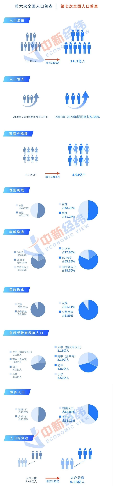

### 周五券商暴涨，下周能否继续？

前面因为五一假期，偷懒少写了两次周报回顾。好在这周劲爆的事情不少，我们好好和大家一起聊聊：

1、本周最大热门应该是叶飞**实名举报中源家居与盘方合谋进行市值管理、“坐庄赖账”等情况。**这个瓜在周五盘后证监会官方给了回答，相关单位周末“被迫”加班，在发稿前官微又发布说：**根据交易所核查情况，证监会决定对相关账户涉嫌操纵利通电子、中源家居等股票价格立案调查。**（详见下图）

这个事情我周末也发了几个短帖，我觉得就大家可能比较关心的几个点还是和大家说一下：

①、既然监管方面已经立案了，那么事实真相一切以官方解答为准。

②、今年年后散户或者基民亏钱的不在少数，而叶飞这次举报的正是公募、资管用着投资人的钱去市值管理，这就给大家一个很好的宣泄点：“原来我们散户亏钱就是你们再拿我们钱搞内幕，最后还巨亏了”。

③、叶飞这次跳出来大概率也是被下家追债逼得没办法了，这不来了招鱼死网破嘛。

④、任何行业多少都有一些灰色链条，之所以能平稳运行是大部分人都能有钱拿且大部分人能守规矩。即便叶飞这次举报属实，也收获了极高的关注度，但他在这个链条上日后很难再有立足地了。

⑤、对接的下家公募和资管若真存在，极大概率也都是些不入流的小公司，所以大家买基金还是选择一些耳熟能详的基金公司会更好。

⑥、我的直觉告诉我，相关上市公司是经不起查的。而举报人叶飞也不是什么善茬，昨晚看了他十几分钟的直播，反正大家也别太替他担心，他可是社会气息极重的人精。

⑦、奉劝大家围观吃瓜可以，叶飞直播间搞什么集资入股，这种大家还是要高度警惕哈。

**2、周五券商板块暴涨+7.41%，大盘距3500点一步之遥。**周五的证券板块涨得是毫无征兆且“蛮不讲理”，以至于整个周末都没人讲出为什么会突然涨那么多（我盲猜是GJD拉了下）。我们的基金定投组合【薪火相传】也是上周刚把券商指数再次归入低估买入阶段，没想到根本不给我们低价吸收筹码的机会呀（只恨才买了一点点），直接强力反弹了。至于后期能否持续发力，我觉得短期持续大涨概率不大。

**3、本周全国第七次人口普查结果揭晓。**最大感受就是全国人民“生不动”了，而人是国家一切行为的基础，也是经济最大的供给和需求来源。为了直观且较为全面的展示相关数据， 我引用了中新经纬的一组图：

**4、中基协披露一季度基金销售行业数据。**中国证券投资基金业协会近日在官网公布了基金销售行业数据，这也是历史上首次披露该类数据。此次披露口径是行业前100名的股票+混合基金保有量以及非货币基金保有量（详见下图，21~100名数据可自行官网查阅）：

![销售数据]](../img/week20210515-4.png)

这个数据的定期披露对行业发展是利大于弊的，基金销售渠道不需要那么多（服务高度同质化），该数据的发布有利于推进头部代销机构的强化（基民和基金公司都会优先选择头部渠道）。

在数据中我们发现银行渠道依然是老大哥，前十名内只有蚂蚁和天天基金为独立基金销售机构，剩下的清一色是商业银行。另一个角度看蚂蚁和天天基金作为互联网第三方基金销售平台也是非常彪悍，都直接和银行渠道肩并肩了，而且大家的共识就是互联网平台中蚂蚁和天天会更上一层楼（后面还有腾安、盈米、基煜、同花顺、蛋卷、陆金所、好买、京东肯特瑞等新势力）。

那有人就是要问了：银行依然强势、互金平台强势发展，那挤压的是谁的份额呢？没错，就是我们标题中提到上周五暴涨的券商！