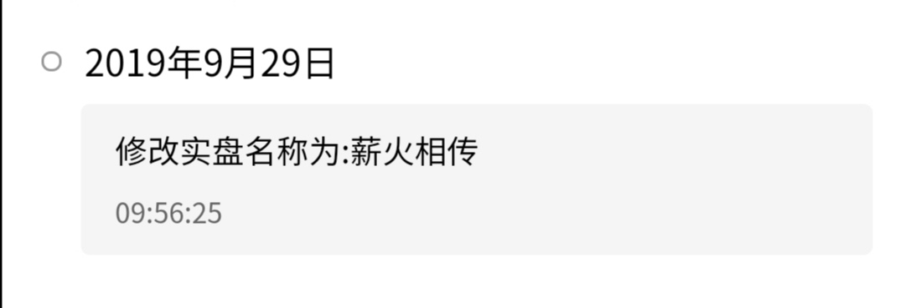
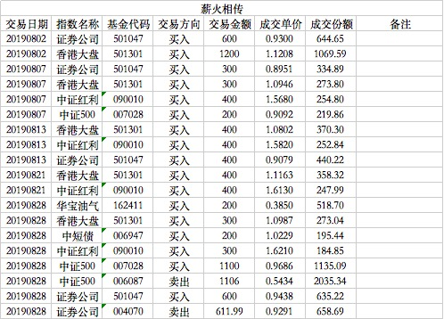

### 薪火相传（常规汇报 004）

在开始8月份的汇报之前，先解释下组合改名这件事吧。

组合起初的名字叫：**老豆-Y计划2019版**，这个在第一次汇报的时候做了比较详细的说明。但我一直想起一个有点寓意的名字，之前的总感觉很随性、很流水账的感觉，今天早上起来突然脑子里就蹦出了这个词，一个让我满意的名字。

【薪火相传】出自《庄子.养生主》，"穷于为薪，火传也，不知其尽也。" 古时候比喻形骸有尽而精神不灭，后人用来比喻学问和技艺代代相传。我想赋予它一个新的含义：**每周定投一点点的薪水，年复一年，最后传承下来的不仅仅有丰厚的投资利润，还有这种简约而不简单的投资技艺。**

我们看下文末的本月交易明细就会发现：8月份其实是纯买入，仅有的月底两次卖出也是分别置换中证500和券商，把C类换成A类。原因上次汇报也有说到过，长期持有肯定是A类的费用更划算，但是起初先买C类是预防短期反弹，现在反弹期已过，而且两只C类均已正收益，所以果断置换成A类。

8月份继续放缓买入中证500的节奏，整个月就在8月7日买了200元的中证500指数基金。如我们上期预告的，本月不但继续大幅度买入中证红利，还加了香港大盘来缓解中证500仓位占比过大的问题。

香港大盘的详细介绍前面有一篇[《找一个安全垫够厚的大盘基埋伏起来》](financing/xgdp-buy.md)专门聊过，有兴趣的可以去翻阅下。这里就简单的再重申下我买入、卖出的界定。**AH溢价大于125分批买入，AH溢价到125附近卖出一半仓位，在120附近择机清仓卖出。**

华宝的香港大盘对应的25只成分股也是大陆优质企业，几乎都是各行业的龙头，金融占比也高，还含有约10%的腾讯控股。所以在港股大环境低价的情况，我们叠加AH溢价130这个因子，可以安心的持有，这显然是一笔收益大于风险的投资。

券商指数在8月初买了两次，后期指数估值修复，亦不再继续买入，改为耐心持有。我们后面在9月份也看到券商高估后卖出了一小部分份额，这就是很好的波段收益，为我们总收益贡献了一点点绩效。

再说下本月新买入的华宝油气，因为国际油价在8月份再次逼近极低区间，从8月份多次国内油价下调就感受到了。外加华宝油气的特殊性，指数一路下跌，跌到无路可跌的情况，所以我从短期波段的角度少量买入，赌三个月内油价会有一定幅度的上涨。并且预期10%的波段收益就可以获利卖出，此短期波段仅做增强组合收益之用，所以买入的仓位占比不算很大。9月油价事件很明显是超出我预期的，具体等9月份汇报中展开细说吧。

最后说下均衡每周投资额度的债券基金，本月只买入了一次，是因为本月多次都是单周超额买入了，实在没有多余的额度再买入债券基金了，而且基于整个8月超额买入偏多，会在9月份有些均衡的举措，这个也等九月份具体操作的时候再详细展开聊吧。

