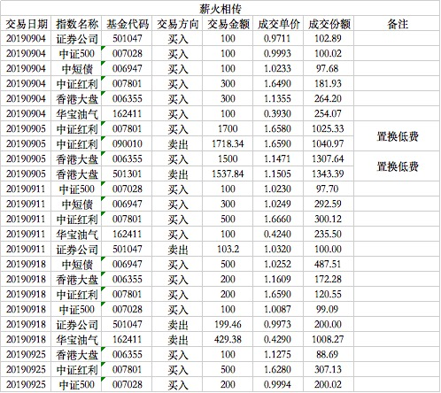

### 薪火相传（常规汇报 005）

本期是9月份的操作汇报，9月4日操作比较多，我们来看下：

- 券商、中证500、债基、油气各买入100元。

券商的本次买入也是本月唯一的一次买入，后期券商一直在上涨，甚至有了少量卖出操作。中证500和债基为常规买入操作，油气的买入逻辑上次已经讲过了，就是觉得当下油价以及油气都是历史极低点位，博取短期反弹。

- 中证红利、香港大盘各买入300元。

中证红利和香港大盘的持续大额买入，就是为了均衡中证500的占比问题，而且确实这两个指数也处于比较低估的区间，这种均衡在组合后续的稳定性上做了不小的贡献。

9月5日做了两个置换操作：置换中证红利和香港大盘，都是卖出A类买入对应的C类。中证红利的C类费用很友好，所以这次一到盈利就换成了C类；香港大盘本身就是赌短期AH差价收敛，所以肯定C类更合适，也在大涨盈利后做了置换操作。

9月11日买入中证500和油气各100元属于常规操作；买入中证红利500元和债券基金300元，在券商迅速恢复估值后，卖出了近100元的券商。因为券商的卖出，所以中证红利和债券的投入比就变大了。但是本周净投入是不足1000元的，这是为了弥补前期的买入额度不均衡，从10月起我们引入了嘉实超短债，也是为了让每周的额度稳定在1000元。

9月18日加倍卖出了券商约200元，是因为券商又暴涨了一周，机械的执行卖出操作。让我意外的是沙特油田被袭后油气暴涨2天约16%，这个收益率已经完成了当初买入的预期，毫不犹豫卖出。后面即使再涨，也不符合我们的当初的设定，这钱我们不赚。本次短暂的油气买卖是很出乎我意料的，所以也很遗憾买入的总量很少，略可惜，但知行合一对我们来说更重要。

本月最后一次操作是9月25日：中证红利买入500元、中证500买入200元、香港大盘买入100元。同样本周净买入依然不足1000元，经过9月份的几次均衡，前面的平衡基本恢复，下个月开始会严格执行每周1000元净投入的策略（除非债基占比超过30%极限，到时会有另外的均衡策略）。

本月末券商又回落了，导致月底那次没能继续卖出券商。但也突出了我们月中两次在估值回复后，机械的执行卖出是比较好的策略。等于做了一个小小的波段，降低了持仓成本，因为每一次剩下的钱最后都会体现在总收益上面。

同样油气这种底部有明显支撑的产品，可以在极低点位赌它触底反弹，事实也证明了是有效的。伴随着油气的清仓，那一点点的收益也就永远的被纳入了组合的总收益中。

我会在保证组合总体稳定的基础上尽量给大家带来一点类似这种超额的收益，比如我在10月份我极可能考虑做一个基于中概互联指数的极简定投增益，敬请期待。

---
**组合常见问题集锦：**

1、在哪可以看到组合的操作？

天天基金APP内搜索‘薪火相传’即可查到实盘组合，关注后就能跟着大家一起买入卖出了。

2、组合操作的频率是？

原则上每周三定期定总额（1000元）买入，若遇到极端情况则可能会随时买入临时仓位；卖出尽量也在周三操作，但也常会临时卖出。

3、组合操作是否有提醒？

天天基金APP内会有提醒，推荐把APP通知设置打开以避免错过发车时间，同时也建议大家每周定期看下我的操作与跟踪误差。（实时提醒买卖的实盘组合详见星球‘老豆-Y计划’）
