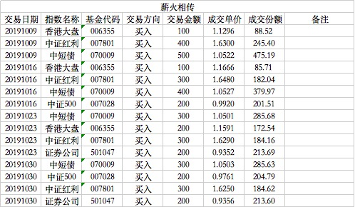

### 薪火相传（常规汇报 006）

10月因为有7天的国庆假期，所以只有4周发车机会，我们先快速的过一遍：

10月9日买入100元香港大盘、买入400元的中证红利、多余的钱买了500元的中短债基金。本月开始中短债基金转换成嘉实超短债（070009
），是一款超强的货基替代物。10月中下旬债券市场的整体表现也持续疲软，可见我提前换成超短债的预见性。华宝中短债在之前给大家带来了惊艳的收益，但是盈亏同源，10月份的业绩不是很理想，在11月初也因故清仓并置换成嘉实超短债了。这个我前面也说过：如果哪天华宝中短债基金的业绩不行了，我还是会毫不犹豫的换掉的。因为今天券商还是略贵，故暂时没买入，中证500也因占比过大暂缓一周。

10月16日买入香港大盘100元、中证500指数买入200元、中证红利买入300元，剩余400买入债券基金。本周券商还是没进入低估，再次暂缓买入，3000点附近有很多不确定因素，还是尽可能配置债券基金。

10月23日买入香港大盘200元、中证红利买入300元、债券基金300元、买入券商指数200元。本周券商终于跌下来了，立马买入200元，中证500以后基本上2周买一次且量为一点点。

10月30日买入中证500指数200元、买入中证红利300元、买入债券基金300元、买入券商指数200元。

最后说下上一期预告的：**“在保证组合总体稳定的基础上尽量给大家带来一点类似这种超额的收益，比如我在10月份我极可能考虑做一个基于中概互联指数的极简定投增益”**。这个10月底的时候我还是纠结了下，因为我发现中概互联对于这个模型有一定的不足（不是标的不好，只是不适合这个模式，但我在Y计划里是有加入这个中国互联的），所以换成了易方达的沪深300医药指数基金，具体操作会在11月的报告中有所阐述，尽请期待。

---
**【薪火相传】组合常见问题集锦：**

1、在哪可以看到组合的操作？

天天基金APP内搜索‘薪火相传’即可查到实盘组合，关注后就能跟着大家一起买入卖出了。

2、组合操作的频率是？

原则上每周三定期定总额（比如1000元）买入，若遇到极端情况则可能会随时买入临时仓位；卖出尽量也在周三操作，但也常会临时卖出。

3、组合操作是否有提醒？

天天基金APP内会有提醒，推荐把APP通知设置打开以避免错过发车时间，同时也建议大家每周定期看下我的操作与跟踪误差。（实时提醒买卖的实盘组合详见星球‘老豆-Y计划’）
