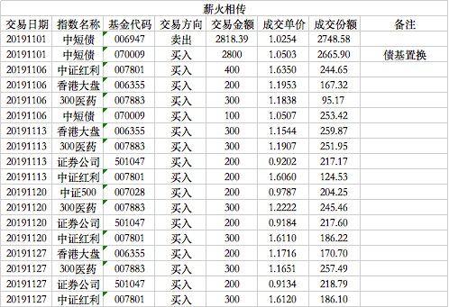

### 薪火相传（常规汇报 007）

11月除月初置换了一次债券基金，其余均为买入操作，也是挺低迷的一个月，下面我们看下具体操作。

11月1日清仓了华宝中短债，换成了嘉实超短债，这在上个月已经预告过。基于对稳定性的要求，我们换成了更稳定的嘉实超短债，但也牺牲了一点点收益率，加上我们的债基可能会频繁进出（充当货基的替代物），所以现阶段嘉实超短债更合适。

11月6日买入中证红利400元、香港大盘200元、债券100元，300医药300元。这里着重讲下沪深300医药指数，我发现我们的债券持仓比重已经超过15%，为了更好的利用这部分非权益类资金（毕竟现在3000点下方还算安全），我一直想怎么能在组合可操作范围内增加一点点收益？

受支付宝**目标投**的启发，即机械的每周定投一定金额，一旦总收益满足则清仓卖出。目标投的标的是天弘沪深300基金，这种策略想要更有效就得找一个长期大概率上涨的指数，如果短期能更稳定那就更好了。所以我选择了沪深300医药指数，这个指数的成分股顾名思义：沪深300权重股中属于医药行业的股票，当前最大权重是恒瑞医药。

我之前是想过另外一个指数的：中概互联，但是两者相比较后对于我当下这个组合，300医药指数可能更适合（交易成本更低、交易效率更高），长期看涨不埋人。我设定的目标是5%，一旦触发则机械卖出换成对应金额的债券基金。具体的基金是易方达沪深300医药联接C，这个C类费用还算良心（0.7%/年、7天后免赎回费），也适合我们可能会随时清仓卖出。

11月13日买入香港大盘300元、券商200元、中证红利200元、300医药300元。我映像中这是组合成立以来第一次没买入债券基金，因为现在目标投会占用掉300元额度，如果后续低估指数很多的时候，不排除卖出一部分债券基金来均衡每周1000元的总额度。这段时间港股继续杀跌，所以肯定加足马力买入，300医药也是逆势翻红，起到了组合内均衡的作用。

11月20日买入中证红利300元、券商200元、中证500指数200元、300医药300元。细心的朋友发现如今中证500指数的买入节奏比较缓慢，整个11月也就这次买入了200元。我多次说了，中证500的单一指数比重已经很大了，而且当下低估的产品很多：券商、中证红利、香港大盘...所以我11月稍微偏向了中证红利指数，当下中证红利和中500指数低估区间差不多，这样的话中证红利更有优势。还有本周香港大盘没买入是因为AH溢价率已经是127了，稍微暂缓一下。

11月27日买入中证红利300元、香港大盘200元、券商200元、300医药300元。对，这是连续第三周没买入债券基金了，下月考虑择机稍微补偿一次债券基金，但金额和频率应该还是很低的。

2019年还剩最后一个月了，薪火相传组合也伴随了大家大半年，即便股市如此恶劣我们的组合也做到了稳中有升，今年正收益是没问题了。我有信心经过几轮大的涨跌后，我们组合的净值会更值得期待。

---
**【薪火相传】组合常见问题集锦：**

1、在哪可以看到组合的操作？

天天基金APP内搜索‘薪火相传’即可查到实盘组合，关注后就能跟着大家一起买入卖出了。

2、组合操作的频率是？

原则上每周三定期定总额（比如1000元）买入，若遇到极端情况则可能会随时买入临时仓位；卖出尽量也在周三操作，但也常会临时卖出。

3、组合操作是否有提醒？

天天基金APP内会有提醒，推荐把APP通知设置打开以避免错过发车时间，同时也建议大家每周定期看下我的操作与跟踪误差。（实时提醒买卖的实盘组合详见星球‘老豆-Y计划’）