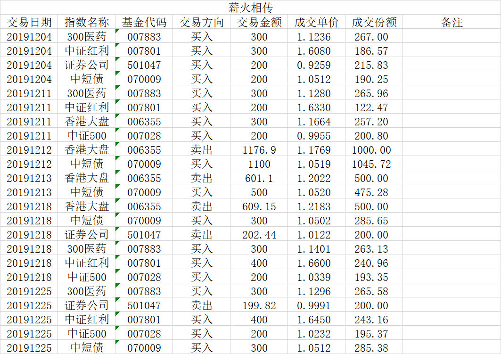

### 薪火相传（常规汇报 008）

12月还是有一些卖出操作的，我们先看下具体的情况吧。

12月4日：买入300医药300元、中证红利300元、券商200元、债基200元。当时是12月初，延续了11月低迷的行情，该周也加买了一次债券基金，这也是对11月买入债基较少的一个补偿，这事情在上个月的报告里预告过了。

12月11日：买入300医药300元、中证红利200元、中证500指数200元、香港大盘300元。依然是平淡的一个星期，可是谁会想到下半月就会出现强力反弹的行情，所以我们永远不知道明天和牛市哪个先到来。

12月12日：当时港股有了回暖迹象，AH溢价也到了126附近，外加考虑香港大盘的赎回周期较长，也想在元旦前守住一部分收益。多方考虑后就决定卖出1/4仓位，即卖出香港大盘1000份，置换成债券基金（买入1100元债基，稍小于卖出金额是因为当前债券的整体仓位也不小了）。

12月13日：我承认没想到港股继续强势上涨，晚上突然说贸易问题也有所缓和，叠加上昨日卖出的相同理由，今天再额外卖500份香港大盘，置换成债券基金500元（买入金额略小理由同上）。

12月18日：买入中证500指数200元、中证红利400元、300医药300元、债券买300元；卖出券商200份、香港大盘500份。在券商的暴力带领下，大盘短期突破了3000点，根据定投计划卖出了500份的香港大盘和200份的券商。看着我喜欢的券商再次进入卖出区间，很开心，也很自豪。

12月25日：买入中证红利400元、300医药指数300元、中证500指数200元、债券基金300元；卖出券商200份，因为圣诞节港股休市，所以香港大盘没法卖出，元旦后择机再考虑。

其实本月还是有一定的卖出操作的，但每周的总金额还是控制在1000元左右。另外要预告下，因为现在债券基金占比已经超过了20%，而300医药指数作为债券基金增益操作标的也超过6%了。不出意外我们会在2020年的一季度，择机卖出部分债券基金来均衡下股债比例。

2019年就将这么过去了，薪火相传组合也陪伴了大家两百多天。虽然没有给大家带来什么大富大贵，但是在足够稳健（大半年破净值的天数小于5）的前提下给大家带来了远高于理财产品的收益。这也符合我们设定这个组合的初衷的，我相信在后面的日子里基本上是看不到负净值的情况了，在老司机我的带领下大家都能收获稳稳的幸福。

最后再次感谢大家这么久的陪伴和支持，2020年我们一起努力前行！

---
**【薪火相传】组合常见问题集锦：**

1、在哪可以看到组合的操作？

天天基金APP内搜索‘薪火相传’即可查到实盘组合，关注后就能跟着大家一起买入卖出了。

2、组合操作的频率是？

原则上每周三定期定总额（比如1000元）买入，若遇到极端情况则可能会随时买入临时仓位；卖出尽量也在周三操作，但也常会临时卖出。

3、组合操作是否有提醒？

天天基金APP内会有提醒，推荐把APP通知设置打开以避免错过发车时间，同时也建议大家每周定期看下我的操作与跟踪误差。（实时提醒买卖的实盘组合详见星球‘老豆-Y计划’）