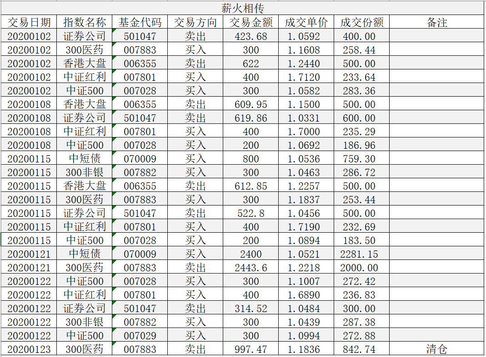

### 薪火相传（常规汇报 009）

1月份的卖出还不少，除了卖出恢复估值的券商指数和香港大盘外，目标投的沪深300医药也第一次达到5%的涨幅，所以卖出止盈，下面我来仔细回顾下1月份的操作吧。

1月2日：买入中证500指数300元、买入中证红利400元、买入沪深300医药指数300元，卖出香港大盘500份、卖出券商指数400份。券商指数突破800点，估值已经挺高了，故卖400份券商；香港大盘经过连续的上涨也可以卖出了，故卖出500份。买入的沪深300医药为目标投，中证500和中证红利因为市场当前低估，定投买入。本周未做债券买入来调节总金额，是因为当前债券比例已经很接近30%了，暂且记着，后续通过增加目标投组合来进一步优化这个问题。

1月8日：买入中证500指数200元、买入中证红利400元、买入沪深300医药指数300元；卖出券商600份、卖出香港大盘500份。本周的买卖逻辑基本雷同与上周，本周券商继续上涨所以卖出600份，再次卖出香港大盘500份；买沪深300医药为目标投，买入低估的中证红利和中证500指数，本周依旧未调节债券基金。

1月15日：买入中证红利400元、买入中证500指数200元、买入沪深300医药300元、买入沪深300非银300元、买入债券基金800元；卖出券商和香港大盘各500份。前面说过，为了缓解债券日益过大的问题，要逐步增加目标投的标的，本周开始新增沪深300非银指数，并且本周买了800元的债券基金，已经2周没平衡了所以本周操作下，之前累积的余额会在后续逐渐消化掉。本周其余的操作逻辑类似前两周，故不再累述，需要额外说明的是：经过多次的卖出香港大盘，剩下一点点的份额会在下次卖出，初步定于春节后，随着清仓后，香港大盘这个品种会暂时告别组合，如果后续有好的买入机会再说吧。

1月21日：沪深300医药的目标投达到了指标，所以卖出2000份，对应的是买入2400元的短债基金来均衡。因为考虑费用的问题，所以剩余的沪深300医药在1月23日进行彻底的清仓操作，但是这次也给了我一点教训：以后达标的目标投计划原则上一次性、第一时间清仓止盈，不要太过纠结不足7天赎回的惩罚费率。

1月22日：春节前的最后一次常规操作，本周新增一个目标（易方达中证500指数联接C）。买入中证500A指数300元、买入中证500C指数300元、买入中证红利400元、买入沪深300非银指数300元；卖出券商300份。因为沪深300医药刚完成目标投，还处于清仓阶段，所以本周暂停一次；券商因为收下跌影响估值略有下降，只卖300份。本周需要说明的是目标投的中证500指数基金是C类，和估值定投的中证500指数A类不冲突，大家也不必要混淆。

1月23日：清仓沪深300医药的目标投尾仓，因为现在债券比例依然接近28%，所以本次赎回不再补充债券基金。本次目标投耗时2.5个月样子，达成了5%的实际收益我还是比较满意的。这个模式既简单易懂，又能充分利用组合多余的债券占比问题，后续会进一步增加目标投的标的。

---

【薪火相传】组合常见问题集锦：

1、在哪可以看到组合的操作？

在天天基金APP内搜索‘薪火相传’（或扫描上方图中的二维码）即可查看实盘组合信息，关注后就能跟着大家一起买入卖出了。

2、组合发车时间是？

每周一定期定总额（约1000元）买入，若遇极端情况则可能买入临时仓位；卖出原则上也在周一操作，但也可能会临时卖出。

3、组合操作是否有提醒？

每次的发车记录关注组合后天天基金APP内都会有提醒（建议把APP通知设置为打开），在组合的调仓记录里也是均可查（含临时发车）。

4、有时候错过了发车时间怎么办？

万一错过发车时间也不要太紧张，发现后可以立马补上操作即可，长期的定投偶尔一次操作慢一两天问题不大，同时也建议大家每周定期看下我的操作以及与实盘组合的跟踪误差。