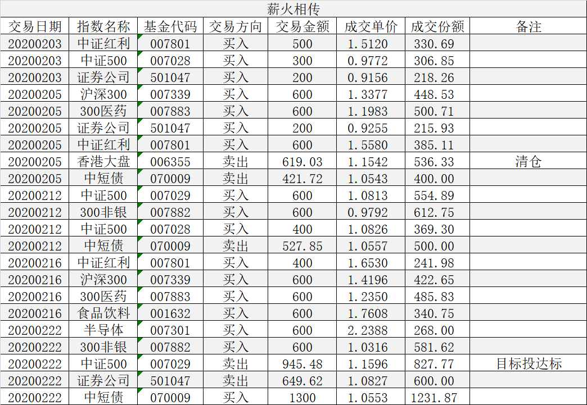

### 薪火相传（常规汇报 010）

2月还是有少量卖出的，月初清仓了香港大盘稍有获利，月末的时候中证500的目标投达成后清仓卖出，证券指数回到高估少量卖出。组合净值得到了稳步增长，下面我们来具体看下每周的操作。

因疫情关系，2月3日成了春节后的第一个交易日，应对暴跌我们临时加车一次，买入中证红利500元、买入中证500指数300元、买入券商200元。2月3日A股三千股跌停，异常惨烈，回头看我们这次临时发车是及时的。

3月5日：本周目标投新增标的沪深300指数，上一轮收割完毕的300医药本周再次回归。因目标投标的数量变多，本周起为单双周定投，每次额度翻倍，本周目标投买入沪深300医药和沪深300指数各600元。估值定投里的中证红利和中证500指数也开始单双周轮流，这样做为了减少每周交易的条目，便于跟车。买入低估的券商200元、买入中证红利600元。本周清仓香港大盘536.33份，这个其实节前就有打算，只是等不到一个好的价格，所以干脆本次清仓。最后是债券调节卖出400份。

3月12日：本周目标投中证500指数和沪深300非银各买入600元，买入低估中证500指数400元，调节额度卖出债券500份。

3月16日：本周开始薪火相传与我之前每周一的定投计划合并，所以调整为每周一发车，但是为了方便大家有更多的时间跟车，我通常会在周末就提前发车完毕。本周目标投买入食品饮料、300医药、沪深300指数各600元，买入中证红利400元，调节额度卖债券1000份，本周券商恢复合理估值无操作。

3月22日：本周目标投买入沪深300非银600元，新增目标投半导体买入600元，目标投的中证500C达到5%目标后本周止盈清仓卖出827.77份。本周中证500A指数估值合理无操作,调节额度债券买1300元。

之前有朋友问：既然每周都贴交易记录了，为什么每个月还要发帖说下？我觉得一个是梳理下实际成交的份额和金额情况，二是给大家一个回顾操作的过程，每个月审视下自己的操作是否有偏离预设的计划。我这个公开的组合其实逻辑很简单，没什么花里胡哨的东西，但就是需要知行合一的坚持下去，也希望大家通过组合的跟车能赚点零花钱。

---

【薪火相传】组合常见问题集锦：

1、在哪可以看到组合的操作？

在天天基金APP内搜索‘薪火相传’（或扫描上方图中的二维码）即可查看实盘组合信息，关注后就能跟着大家一起买入卖出了。

2、组合发车时间是？

每周一定期定总额（约1000元）买入，若遇极端情况则可能买入临时仓位；卖出原则上也在周一操作，但也可能会临时卖出。

3、组合操作是否有提醒？

每次的发车记录关注组合后天天基金APP内都会有提醒（建议把APP通知设置为打开），在组合的调仓记录里也是均可查（含临时发车）。

4、有时候错过了发车时间怎么办？

万一错过发车时间也不要太紧张，发现后可以立马补上操作即可，长期的定投偶尔一次操作慢一两天问题不大，同时也建议大家每周定期看下我的操作以及与实盘组合的跟踪误差。