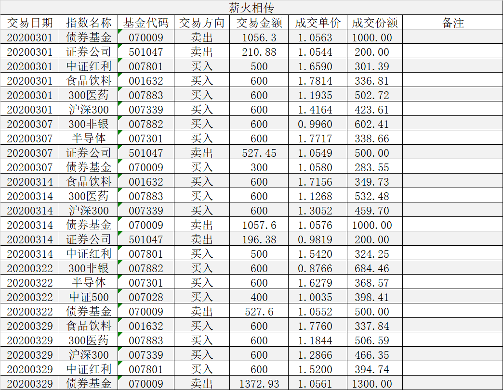

### 薪火相传（常规汇报 011）

3月份除了调节用的债券基金外，卖出的只有证券指数。前三周都有卖出操作，严格按着估值执行，分别是200份、500份、200份。伴随着的是券商的走强后再次回调，每次类似的走势都能很舒服的做到区间内的低吸高抛，组合的收益再次增厚。

现在我们快速的看下每周具体的操作：

3月1日，目标投：沪深300、300医药、食品饮料各买入600元；中证红利买入500元，券商卖出200份，债券调节卖出1000份。上周大幅调整，市场降温不少，但券商依然不便宜，稍微卖出200份。

3月7日，目标投：300非银、半导体各买入600元；中证500本周估值合理不操作，券商本周上涨后卖出500份，债券调节买入300元。本周需要说明的是，本周目标投本该还有一个中证500指数， 但是上次止盈后就决定不再续期该标的，主要还是避免混淆估值定投里的中证500指数，后期沪深300达标后也会如此操作。

3月14日，目标投，沪深300、300医药、食品饮料各买入600元；中证红利买入500元，本周券商又回调了点，卖出少一点200份，债券调节卖出1000份。

3月22日，目标投：300非银、半导体各买入600元；中证500指数低估买入400元，券商处于合理估值无操作，调节卖出债券500份。

3月29日，目标投，沪深300、300医药、食品饮料各买入600元；中证红利买入600元，债券调节卖出1300份，券商本周无操作。本周需要注意的是沪深300可能会有买入的时机。

最后再和大家说几句吧。因为疫情的影响，今年的经济肯定是下滑的很厉害的，而且国外的疫情一直没有明显的好转，甚至连拐点都没出现。这就导致了国内的边境防控还是不能放松，海外订单急速缩减，内需也因为就业收入问题而很难有质的提升。所以我觉得今年还是保守稳健打法，安全第一。

---

【薪火相传】组合常见问题集锦：

1、在哪可以看到组合的操作？

在天天基金APP内搜索‘薪火相传’（或扫描上方图中的二维码）即可查看实盘组合信息，关注后就能跟着大家一起买入卖出了。

2、组合发车时间是？

每周一定期定总额（约1000元）买入，若遇极端情况则可能买入临时仓位；卖出原则上也在周一操作，但也可能会临时卖出。

3、组合操作是否有提醒？

每次的发车记录关注组合后天天基金APP内都会有提醒（建议把APP通知设置为打开），在组合的调仓记录里也是均可查（含临时发车）。

4、有时候错过了发车时间怎么办？

万一错过发车时间也不要太紧张，发现后可以立马补上操作即可，长期的定投偶尔一次操作慢一两天问题不大，同时也建议大家每周定期看下我的操作以及与实盘组合的跟踪误差。