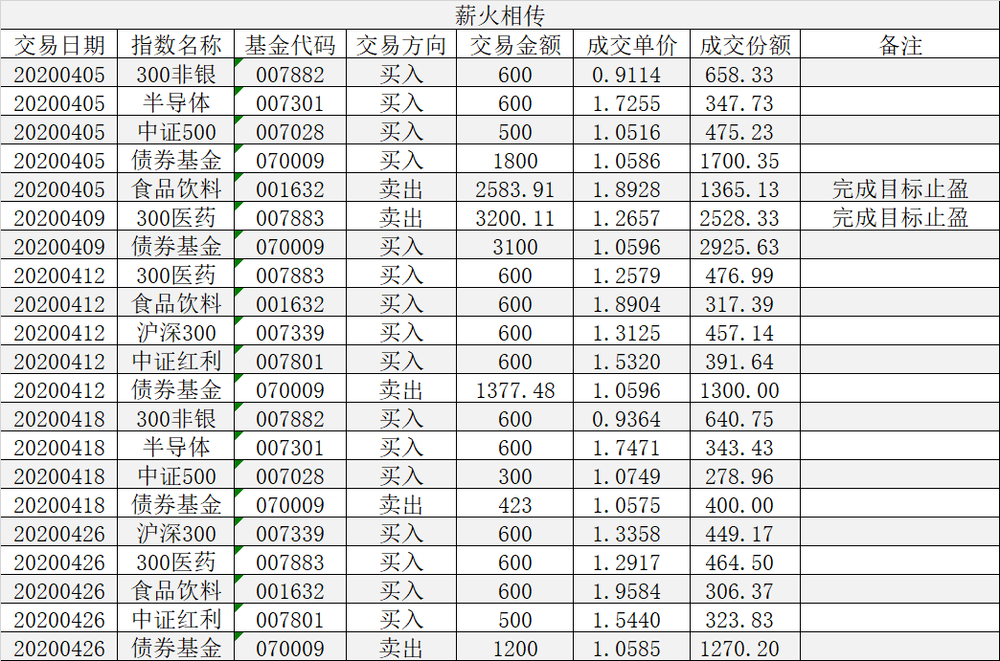

### 薪火相传（常规汇报 012）

这次是薪火相传常规汇报的最后一期了，早先每月弄一期汇报是有多方面的原因。现在薪火相传和每周定投计划合并后，每周一都会贴出操作记录，这种月底的汇报会略显冗余。这样已经有2~3个月的过渡期了，组合正好也满一年了，就借这个时间点和大家说下。

当然这些内容都还是会存在的，比如每次的操作内容会分散到每周一的发车文章里，而每月的列表统计则放到次月的首周发车文章里，另外关于操作的一些思路也会分散到每周一的文章里。做这些调整是因为有部分朋友说，周一的文章基本上就是直白的操作，对应的操作分析略少，所以这样调整后既解决了公告的冗余，又能让大家及时的了解为何如此操作。

所以本次的流水账就不再累述了，前面的每周一文章里都已经有说明。需要稍微讲下的点有：本月4月5日食品饮料达成目标止盈，4月9日沪深300医药完成目标止盈，其中4月9日的还是临时发车。

最后预告下就是组合成立了一周年，下周会发一篇周年报告，结合一年来的组合业绩（+8.26%），再聊一些这一年来的投资感悟以及后续的投资展望。

---

【薪火相传】组合常见问题集锦：

1、在哪可以看到组合的操作？

在天天基金APP内搜索‘薪火相传’（或扫描上方图中的二维码）即可查看实盘组合信息，关注后就能跟着大家一起买入卖出了。

2、组合发车时间是？

每周一定期定总额（约1000元）买入，若遇极端情况则可能买入临时仓位；卖出原则上也在周一操作，但也可能会临时卖出。

3、组合操作是否有提醒？

每次的发车记录关注组合后天天基金APP内都会有提醒（建议把APP通知设置为打开），在组合的调仓记录里也是均可查（含临时发车）。

4、有时候错过了发车时间怎么办？

万一错过发车时间也不要太紧张，发现后可以立马补上操作即可，长期的定投偶尔一次操作慢一两天问题不大，同时也建议大家每周定期看下我的操作以及与实盘组合的跟踪误差。