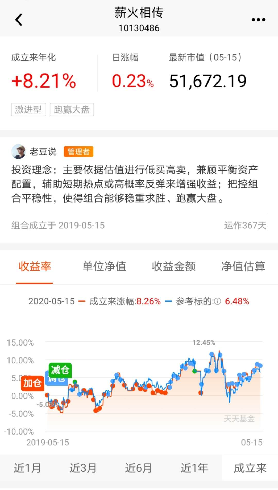

### 薪火相传（一周年汇报）

抱歉因为个人原因，【薪火相传】组合的一周年汇报拖到现在才和大家见面。闲话不多说我们先看下组合这一整年的业绩表现，然后我再谈一谈这一年来对于组合投资的一些想法以及后续的展望。

**先说明下**：文章虽然今天才写，但本文所有数据截图都是5月16日（周六）截取的。

首先我们看到上面这幅是组合的总览图，因为今年是闰年所以共366天，外加截图日是16日，所以显示组合已经运行了367天。图中组合的净值都在1元上方，平台给的打分是72分（这块后面还有具体讲解），但这只是展示了最近三个月，如果有兴趣的朋友可以去翻看下这一整年的净值走势，几乎都是在1元上面，仅在组合的早期极个别天数是破净值的，但也都在0.9元以上。

这幅截图是对上面的一个补充，可以看到最新的净值是1.0826元，即一年的收益率为8.26%，这个收益基本上达到了M2的水平，结合回撤控制的比较好，我认为总体看去年至少算是及格了。

我们组合每周定投约1000元（净投入），所以一年下来总资产约5.5万（偶有临时发车或股债比的调节），其中含累计收益2852.35元。也有朋友问过：你怎么每周才买一千啊？因为这只是我组合的展示，考虑到大部分投资者的资金量，所以才有了每周1000元的设定。如果真的有朋友需要操作更多的资金量，自行等比例缩放即可。

然后我们看到的是最新持仓表，当然这一年来也有很多已经清仓的基金，顺带说下我做组合还有一个原则，清仓的基金肯定是赚的（除非是不可抗拒的因素导致的清仓，当然至今没出现过这类情况）。

表中显示中证500指数和中证红利指数两个就占了近50%的仓位，然后用于调节的债券基金也有16%左右的仓位，还有极少的3.64%占比的券商（因为这部分还没卖完，且当前估值也处于合理区间）。剩下的都是目标投的仓位，这些都是辅助组合获得更多收益的操作，但也正因为是辅助，所以仓位即便加起来也不算多。

上图是成立一年来每个持有过的基金的累计收益，可以看到除了沪深300非银和中证红利暂为亏损，其余都是有赚的（亏损这2个也还处于持有操作状态，所以盈利只是时间问题）。

1、看到4个收益很少的短债基金，这个是当初为了选择债券基金组合淘汰下来的四个，还有一个是华宝中短债，也就是当时的胜出者。但后期考虑稳定性和流动性，所以牺牲了一部分收益，换成了现在的嘉实超短债（极佳的货基替代物）。

2、也有很多朋友之前问为什么要加一个债券基金呢？虽然加入债券基金会降低组合的整体收益，但是可以帮助组合控制回撤，也利于调节每周1000元的净投入规模。初学者也可以通过学着配置一部分流动性较好的资产，养成保持一个好的现金流管理的习惯，我相信这会对你一生的投资生涯都很有帮助。

3、在已经清仓的标的中值得说下的有这么几个：华宝油气，我们庆幸在大幅度暴跌前盈利清仓，主要因为交易时效弱，还时常限购，这就不利于我们组合的运行，所以只能放弃。香港大盘，当初选择它是因为看上了AH的溢价，虽然最后也赚了，但还是考虑到交易时效的问题，还考虑当地的各方面不确定性较大，所以最后在精简标的时候被筛出去了。当然不是说清仓的就不好哈，只是不适合我们这个组合的风格，不管怎么说我们在这个两个产品上都是有赚到的（特别是香港大盘）。同样的原因我们放弃了很多我认为还不错的标的：中概互联、标普500等，即便现在回头看依然觉得有点可惜，但没办法。

4、还有些朋友问：你怎么那么多目标投的标的？主要还是考虑分散对冲（减少组合的波动），当然我们也采取了一些缓解措施，比如单双周轮动方法。但目标投毕竟是辅助策略，虽然标的多，但总收益还是不如中证500和券商来得多，所以主次之分我们还是一直如既往的贯彻了。当然在2020年剩下的日子里，我们也在考虑适当精简目标投，因为有了一年的净值积累，我们可以适当承受更大的波动，赚取更多的收益。

上图是平台方给组合的全方位评测和打分，综合评分虽然只能显示最近3个月的，但你只要长期观察就知道我常年维持在70~75分之间，而且对于回撤的控制、组合的平衡性一直处于满分状态。这个基本上符合我们组合最初的定位：稳稳的幸福。

最后我们看到这幅图又是组合的一个梗概，在建立组合之初编写的投资理念：“主要依据估值进行低买高卖，兼顾平衡资产配置，辅助短期热点或高概率反弹来增强收益；把控组合平稳性，使得组合能够稳中求胜、跑赢大盘”。组合一年跑下来我们也是如此去执行的，这个也是我一直和大家说的‘知行合一’。我们还可以看到一年下来总收益是跑赢的了同期的参考标的的（80%的中证800指数收益率+20%中债综合财富指数收益率）。

今年已经完成了【薪火相传】和周定投的整合，后期如果上涨到3200点附近还会把Y计划也给收编了，到时候我全网就这一个组合，这样会有更多的精力去打理这个组合。而且组合的构建也不是一层不变， 随着市场的变化，我们也会稍微做一些调整，但终极目标还是把收益做得更大，把回撤做得更小。还有说下今年的目标吧，我们还是以8%作为及格线，力争有10%以上的收益，若想再往上那就得看大环境有没改善了。

最后感谢一年来陪伴我一起成长的小伙伴们，感谢你们的信任和支持，2020年我们一同前行，一起探寻这稳稳的幸福。