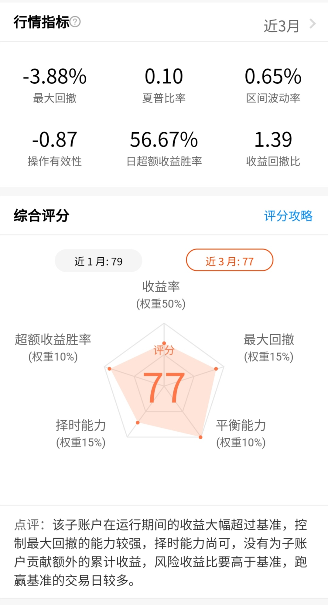

### 薪火相传（年度汇报 2019年）

年前公司的事情一直很忙，趁现在有大把时间窝在家里，把这个【薪火相传】组合的2019年盈亏情况和大家简单汇报下，也算是自己组合的一个小结和展望。

这个组合创建于2019年5月15日，截至元旦组合运行了231天，成立至今（元旦）的收益为6.64%，同期参考标的收益5.99%（80%的中证800指数收益率+20%中债综合财富指数收益率），我自己对于这个组合的稳定性和收益性比较满意。

接着看下平台给的打分（因为成立不满一年，只能显示最近一个月和三个月的打分情况），近三个月综合评分77分，收益率和择时能力稍弱，平衡性和回撤控制很强。因为我这个组合是面向绝大部分初级投资人的，稳定是他们最需要的，我组合的收益都是基于稳定低回撤的前提下，我一直倡导稳稳的幸福！

再看下截止元旦组合的**持仓情况：**【指数基金80.09%、债券基金19.91%】

- 易方达中证500联接A 27.72%

- 大成中证红利C 23.34%

- 嘉实超短债 19.91% 

- 汇添富全指证券A 14.83%

- 华宝香港大盘C 7.34%

- 易方达沪深300医药C 6.86% 

这些持仓符合**我对组合的构想：**

- **主要依据估值进行低卖高买**：这个理念源自于我每周一公布的老豆周计划定投，相对周期在1~3年的一个买卖策略。

- **兼顾平衡资产配置，辅助短期热点和高概率反弹来增强收益**：这个理念源自于星球的Y计划的一部分，所以薪火相传最早也叫“Y计划2019版”。

- **加入组合目标投，提升类现金资金的利用效率**：这个是考虑到跟投薪火相传的很多小伙伴是入门级，所以利用这种最基础的小技巧帮助大家获得更稳健的收益。

【薪火相传】组合吸收了周定投和Y计划的的精华部分，也做了一些更适用于小白用户的改良。我之前也提到过，因为薪火相传更透明，数据更详实，组合的管理和跟投也更方便，后期我会择机把Y计划和周定投都合并到薪火相传内。周定投2020年应该会合并完成，Y计划因为是星球的收费组合，我最晚在下一轮牛市前完成合并工作，因为我深知只有把有限的精力集中到1~2个组合才是对自己和小伙伴负责。

**对于2020年组合的规划：**

- 尽快完成和老豆周计划的合并，预计把现在每周三发车改成每周一。而且我尽量会在周末把操作完成，平台会实时同步，这样大家就有足够的时间去跟车买入卖出。

- 目标投增益策略很有效，在春节前完成了沪深300医药的第一次5%达标卖出。2020年后续会加入中证500和沪深300非银两个标的（沪深300也可择机考虑），做到目标投的组合化，可以进一步提升组合的稳定性。

- 对组合2020年收益的要求，如果市场环境整体不是很恶劣，那么跑赢M2是大概率。

最后感谢2019年陪伴我们一起成长的小伙伴们，感谢你们的信任和支持，2020年我们一同前行，一起探寻这稳稳的幸福。