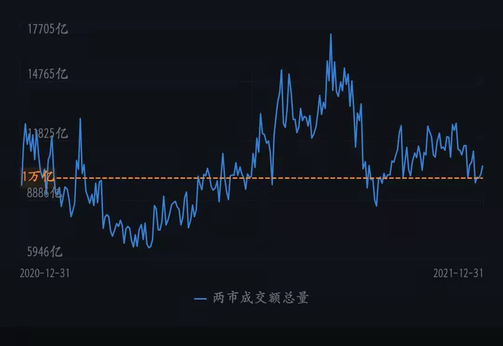
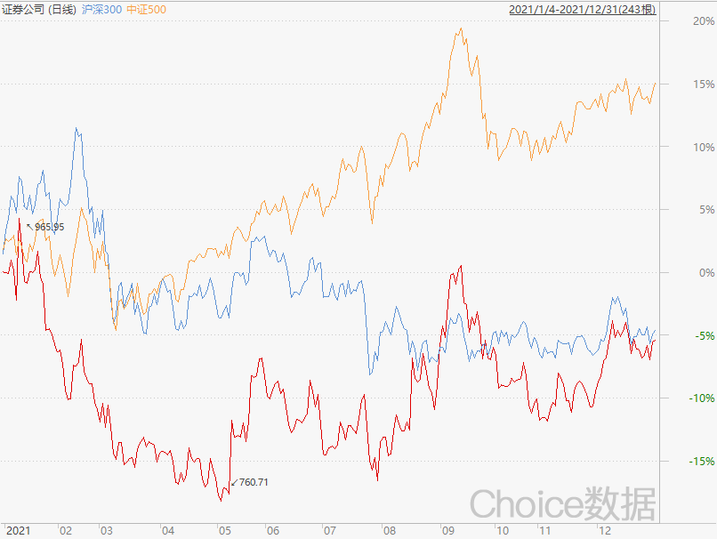

### 2022年券商能否纠正估值与业绩的错配？

岁末年初很多朋友都在盘点，看了下主要集中在“碳中和”、煤炭有色、中概股等热门行业，但我今天想和大家聊聊券商板块。先说我的理解：**券商板块的基本面和政策面均与当下的估值产生了较大反差，在可预见的未来极大概率会给与其估值修复。**下面就围绕这个观点和大家一起回顾下证券行业今年的表现，以及我个人对其2022年的一些展望。

> 日均万亿成交常态化

今年沪深两市成交额显著放大，万亿成交已成常态。9月17日两市成交额连续第43个交易日超过1万亿，追平2015年；9月29日两市成交额更是连续第49个交易日超过1万亿，刷新历史纪录；紧接着第二轮连续交易日的累积在12月底也止步于第46日。两次的中断主要还是受放长假（国庆和元旦）的“假期交易惰性”影响，但我相信随着市场整体交投的进一步活跃，2022年还是极有可能刷新这49个连续交易日纪录的。再看一整年沪深两市成交额超250万亿元，这也刷新了2015年的全年成交额纪录。

交投活跃是多方因素的合力，比如：全面注册制的持续推进、机构量化高频交易的助推、新股和解禁股的增量让市场总量显著增长、互联互通持续推进下的海外资金加速入场等。这些因素在2022年还会进一步推进市场的活跃度，而且从大家计数连续万亿日子的热情度变化我们也看得出，投资者们已经开始逐渐习惯万亿成交了。

> 居民财富向权益市场转移

随着百姓财富的不断积累，大家对于投资意识也有所觉醒，加上政府对“房住不炒”的决心非常决绝。所以在资管新规后银行理财预期收益率又不断下降的大趋势之下，现有的居民资产配置存在较大的优化空间，权益类风险资产日益受到投资者的青睐。近几年公募、私募基金的规模持续加速增长，基金话题也频繁地出圈上了热搜，这些现象都是我国居民财富管理转型进展显著的佐证。

那这个过程中证券公司承担了哪些角色呢？首先是券商经纪业务，因为权益类资产以股票为首，体现在业绩上就是2021年前三季度证券公司经纪业务收入总计1047.91亿元，同比增长10.23%（数据来源：证券业协会）。要知道这增速还是基于券商佣金水平持续下降的大背景下，经纪业务的成长也离不开我们上面提到的万亿成交常态化。接着是券商控股、参股的公募基金公司给券商提供了丰厚的利润，且在放宽了公募牌照“一参一控”后，券商也有在积极的申请公募牌照，多措并举之下也加快了资管业务的转型。

其次是代销金融产品业务，上半年证券公司在代销金融产品上净收入100.5亿，同比增幅达117.56%，我们今年谈论比较多的是，互联网基金代销平台中的老大老二已经可以和传统银行渠道比肩，但以整个行业看券商也依然是一个不容忽视的渠道（三季度末基金业协会公布的公募基金销售保有规模百强里券商有49家入围）。基金公司和券商积极探索的券结模式也很大程度丰富了券商参与基金销售可获取的收入，缓解了传统基金产品代销佣金收入的瓶颈。而基金投顾已发的57张牌照中券商占据了27家，基金投顾需要提供专业的投资建议和陪伴式服务，相对而言券商在这些方面是具备一定先发优势的，随着11月监管层对投资组合策略建议活动的业务界定以及规范整改后，利好具有基金投顾牌照的机构，相关业务也值得持续关注。

在大家投资意识觉醒后，券商获益的不仅有这些，股市整体交投活跃后带来的其余业务都有不同程度的提升。上市券商前三季度投行业务收入为408.12亿，同比+0.6%；信用业务受益于两融新开户数和两融余额的持续增长，前三季度实现利息收入463亿元，同比+15.12%；自营业务前三季度收入1244亿元，同比增长10% 。

> 健全多层次资本市场，推进全面实行注册制

健全多层次资本市场体系这方面2021年最大的举措就是设立了北京证券交易所，旨在支持中小企业创新发展、深化新三板改革，打造服务创新型中小企业主阵地。9月2日宣布设立北交所、次日完成工商注册、11月15日北交所正式开市，这迅猛的速度也是中国政府健全多层次资本市场体系决心的体现。

对很多投资者而言股市是一个低买高卖赚钱的地方，但在国家层面股市的最大功能还是给企业提供直接融资。全面实行注册制、拓宽直接融资入口，健全多层次资本市场体系、增强直接融资包容性，这些也都是“十四五”期间资本市场改革的重点任务。在刚过去的中央经济工作会议中，再次强调要全面实行股票发行注册制，看得出监管层一直在鼓励各类中长期资金入市，只有池子里的水多了、鱼多了，才能让池子更好地发挥其应有的功能。

> 业绩估值背离

2021年证券公司指数的涨跌幅为-4.95%，同期沪深300指数为-5.2%、中证500指数为+15.58%，券商指数勉强跑赢了沪深300，但大幅度跑输于中证500指数。券商板块估值又存在PB和ROE的明显错配，近三年行业平均净资产收益率稳步上升，从2017年的6.11%升至2020年的6.83%，最新券商板块的PB为1.71（2021/12/31），历史百分位为34.92% 。再看看行业营收与净利润增速保持在20%~30%，综合下来我认为当下的券商板块安全边际高、存在低估的情况。

> 对券商板块在2022年的小期许

2021年A股万亿成交额常态化也无法扭转券商低估值的疲态，是我等看好券商板块的投资者们所困惑的。我们知道现在的券商行情不是唯交易量论英雄，但不可否认整个市场的交投是活跃的，券商板块的业绩也是稳中有升的。居民财富管理转型已成共识，利好政策不断加码推进行业发展，即便2022年依然平平无奇我们也能享受到这可观且稳定的增长。何况我们坚信券商板块极大概率能在2022年会出现估值修复，也应该能迎来至少一波喜人的中线行情。

当然预测总是困难的，就如2021年初很多人喊着要南下夺回港股定价权，那时候大家也没想到中概股能跌跌不休至大面积腰斩。我理解的投资就是寻找“确定性”，那些2021年已经火了一年的行业我不太清楚，但我知道券商板块的估值修复是个极大概率事件。最后要申明：投资还是一件有风险的事，以上的观点也仅是我的个人看法。

                                                                                                                 

